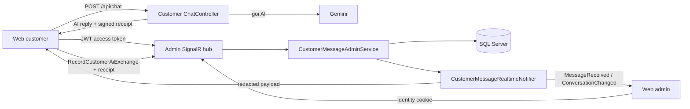
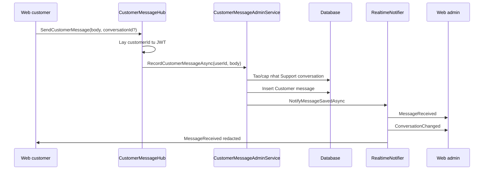
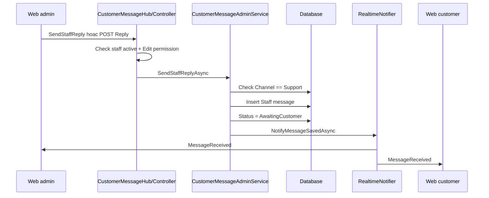
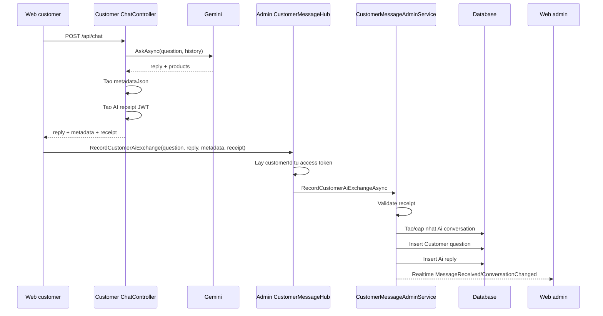

# Quan ly tin nhan khach hang

Tai lieu nay mo ta day du module quan ly tin nhan giua khach hang, admin va tro ly AI trong TechStore. Pham vi bao gom web admin, web customer, realtime SignalR/WebSocket, database, JWT, AI receipt, phan quyen va cac luat bao mat bat buoc giu khi bao tri.

## 1. Muc tieu module

Module duoc thiet ke de giai quyet ba nhu cau rieng biet:

1. Khach hang nhan tin truc tiep voi admin.
2. Khach hang hoi tro ly AI tren web customer.
3. Admin xem duoc toan bo noi dung hoi thoai, bao gom cau hoi cua khach hang va cau tra loi AI da tra.

Diem quan trong: tin nhan voi admin va tin nhan AI la hai luong tach biet ve nghiep vu, nhung duoc luu trong cung mot cap bang de admin theo doi tap trung.

## 2. Tong quan kien truc



Thanh phan chinh:

| Thanh phan | Duong dan | Vai tro |
| --- | --- | --- |
| Admin controller | `Controllers/CustomerMessagesController.cs` | Render giao dien Messenger-like, lay danh sach hoi thoai, chi tiet, tin nhan cu, gui reply, cap nhat trang thai. |
| SignalR hub | `Hubs/CustomerMessageHub.cs` | Kenh realtime cho admin va customer. Kiem tra quyen truoc khi join/send/mark read. |
| Admin service | `Services/CustomerMessages/CustomerMessageAdminService.cs` va `.Commands.cs` | Xu ly query, ghi tin nhan, ghi AI exchange, danh dau da doc, cap nhat trang thai. |
| Realtime notifier | `Services/CustomerMessages/CustomerMessageRealtimeNotifier.cs` | Tao payload va phat su kien den dung group realtime. |
| Security/JWT | `Services/CustomerMessages/CustomerMessageSecurity.cs` | Dinh nghia claim, cau hinh JWT, validate AI receipt. |
| Entity | `Models/Entities/MessageEntities.cs` | Khai bao `CustomerConversation` va `CustomerMessage`. |
| Customer token service | `../e-commerce-web-customer/Application/CustomerMessages/CustomerMessageTokenService.cs` | Tao access token cho realtime va AI receipt JWT. |
| Customer AI API | `../e-commerce-web-customer/Controllers/ChatController.cs` | Goi AI, tao metadata an toan, ky receipt cho cau tra loi AI. |

## 3. Phan tach luong Support va AI

Module dung enum `CustomerConversationChannel`:

| Gia tri | Y nghia |
| --- | --- |
| `Support` | Khach hang nhan tin truc tiep voi admin. Admin duoc phep phan hoi. |
| `Ai` | Khach hang hoi AI. Admin chi xem, khong duoc phan hoi vao luong nay. |

Rang buoc quan trong:

- `SendStaffReplyAsync` chi cho phep reply khi `conversation.Channel == Support`.
- Neu admin co gang reply vao hoi thoai `Ai`, service tra ve loi nghiep vu.
- `RecordCustomerMessageAsync` chi ghi tin nhan khach hang vao kenh `Support`.
- `RecordCustomerAiExchangeAsync` chi ghi cau hoi/cau tra loi vao kenh `Ai`.

Ly do tach kenh:

- UI phan biet ro "nhan admin" va "hoi AI".
- Admin khong vo tinh tra loi vao hoi thoai AI.
- Du lieu AI van duoc luu de kiem toan va cai thien chatbot.
- Loc "Co AI" hoac thong ke AI khong bi lan voi hoi thoai support.

## 4. Database

Module them hai bang chinh:

1. `customer_conversations`
2. `customer_messages`

Hai bang nay lien ket voi bang co san:

- `users`
- `staff`

### 4.1. Bang `customer_conversations`

Bang nay dai dien cho mot luong hoi thoai cua mot khach hang. Moi hoi thoai co kenh rieng: `Support` hoac `Ai`.

| Cot | Kieu SQL | Null | Mo ta |
| --- | --- | --- | --- |
| `Id` | `bigint identity` | No | Khoa chinh hoi thoai. |
| `UserId` | `bigint` | No | Khach hang so huu hoi thoai, FK den `users.Id`. |
| `AssignedStaffId` | `bigint` | Yes | Admin/nhan vien dang phu trach, FK den `staff.Id`. |
| `Subject` | `nvarchar(255)` | Yes | Tieu de/tom tat hoi thoai. Neu rong co the lay tu tin nhan dau tien. |
| `Channel` | `nvarchar(30)` | No | `Support` hoac `Ai`. Default hien tai la `Support`. |
| `Status` | `nvarchar(30)` | No | Trang thai hoi thoai: `Open`, `AwaitingCustomer`, `Closed`. |
| `LastMessageAt` | `datetime2` | No | Thoi diem tin nhan moi nhat trong hoi thoai. |
| `LastCustomerMessageAt` | `datetime2` | Yes | Thoi diem tin nhan moi nhat cua khach hang. |
| `LastStaffMessageAt` | `datetime2` | Yes | Thoi diem tin nhan moi nhat cua staff/admin. |
| `LastAiMessageAt` | `datetime2` | Yes | Thoi diem cau tra loi AI moi nhat. |
| `CreatedAt` | `datetime2` | No | Thoi diem tao hoi thoai. |
| `UpdatedAt` | `datetime2` | Yes | Thoi diem cap nhat metadata/trang thai. |
| `ClosedAt` | `datetime2` | Yes | Thoi diem dong hoi thoai. |

### 4.2. Index cua `customer_conversations`

| Index | Cot | Muc dich |
| --- | --- | --- |
| `IX_customer_conversations_UserId_Status` | `UserId`, `Status` | Truy van hoi thoai cua khach theo trang thai. |
| `IX_customer_conversations_UserId_Channel_LastMessageAt` | `UserId`, `Channel`, `LastMessageAt` | Tim hoi thoai moi nhat cua khach theo tung kenh `Support`/`Ai`. |
| `IX_customer_conversations_AssignedStaffId` | `AssignedStaffId` | Loc hoi thoai theo admin phu trach. |
| `IX_customer_conversations_LastMessageAt` | `LastMessageAt` | Sap xep danh sach hoi thoai theo tin moi nhat. |

### 4.3. Bang `customer_messages`

Bang nay luu tung tin nhan trong hoi thoai. Tin nhan co the do khach hang, staff/admin hoac AI tao ra.

| Cot | Kieu SQL | Null | Mo ta |
| --- | --- | --- | --- |
| `Id` | `bigint identity` | No | Khoa chinh tin nhan. |
| `ConversationId` | `bigint` | No | FK den `customer_conversations.Id`. |
| `Sender` | `nvarchar(30)` | No | `Customer`, `Staff` hoac `Ai`. |
| `UserId` | `bigint` | Yes | Khach hang gui tin. Thuong co gia tri khi `Sender = Customer`. |
| `StaffId` | `bigint` | Yes | Staff/admin gui tin. Thuong co gia tri khi `Sender = Staff`. |
| `ClientMessageId` | `varchar(64)` | Yes | Ma idempotency do client tao cho tin support/admin. Dung de retry an toan, tranh luu trung khi realtime/HTTP fallback bi ngat. |
| `Body` | `nvarchar(max)` | No | Noi dung tin nhan hien thi. |
| `IsReadByAdmin` | `bit` | No | Admin da doc tin nhan khach hang hay chua. |
| `AiProvider` | `nvarchar(80)` | Yes | Provider AI, vi du `Gemini`. |
| `AiModel` | `nvarchar(120)` | Yes | Model AI, vi du `gemini-2.5-flash`. |
| `AiPrompt` | `nvarchar(max)` | Yes | Prompt/cau hoi da dung de tao cau tra loi AI. |
| `AiResponseId` | `nvarchar(160)` | Yes | ID duy nhat cua AI receipt JWT, lay tu claim `jti`. |
| `AiMetadataJson` | `nvarchar(max)` | Yes | Metadata cua cau tra loi AI, vi du san pham goi y. |
| `CreatedAt` | `datetime2` | No | Thoi diem tao tin nhan. |

### 4.4. Index cua `customer_messages`

| Index | Cot | Muc dich |
| --- | --- | --- |
| `IX_customer_messages_ConversationId_CreatedAt` | `ConversationId`, `CreatedAt` | Load timeline theo hoi thoai. |
| `IX_customer_messages_ConversationId_Sender_IsReadByAdmin` | `ConversationId`, `Sender`, `IsReadByAdmin` | Dem tin chua doc cua admin theo hoi thoai. |
| `IX_customer_messages_Sender` | `Sender` | Loc theo nguoi gui, thong ke AI/customer/admin. |
| `IX_customer_messages_UserId` | `UserId` | Truy vet tin nhan theo khach hang. |
| `IX_customer_messages_StaffId` | `StaffId` | Truy vet tin nhan theo staff/admin. |
| `IX_customer_messages_AiResponseId` | `AiResponseId`, unique, filtered `IS NOT NULL` | Chong luu trung cung mot cau tra loi AI da duoc ky. |
| `IX_customer_messages_UserId_Sender_ClientMessageId` | `UserId`, `Sender`, `ClientMessageId`, unique filtered | Chong luu trung tin customer khi retry/fallback. |
| `IX_customer_messages_StaffId_Sender_ClientMessageId` | `StaffId`, `Sender`, `ClientMessageId`, unique filtered | Chong luu trung reply admin khi retry realtime/form. |

### 4.5. Quan he khoa ngoai

| Bang con | Cot | Bang cha | Y nghia |
| --- | --- | --- | --- |
| `customer_conversations` | `UserId` | `users.Id` | Hoi thoai thuoc ve mot khach hang. |
| `customer_conversations` | `AssignedStaffId` | `staff.Id` | Staff/admin phu trach hoi thoai. |
| `customer_messages` | `ConversationId` | `customer_conversations.Id` | Tin nhan thuoc ve mot hoi thoai. |
| `customer_messages` | `UserId` | `users.Id` | Tin nhan do khach hang tao. |
| `customer_messages` | `StaffId` | `staff.Id` | Tin nhan do staff/admin tao. |

Tat ca foreign key hien tai bi cau hinh `DeleteBehavior.Restrict`, tranh xoa cascade lam mat lich su hoi thoai.

### 4.6. Cac cot dem da bi loai bo

Ban dau bang `customer_conversations` co:

- `MessageCount`
- `UnreadCustomerMessageCount`

Hai cot nay da bi xoa trong migration `NormalizeCustomerMessageStorage`.

Ly do:

- De lech so neu co nhieu client realtime ghi cung luc.
- Phai cap nhat counter o nhieu noi, de tao bug.
- Query dem truc tiep tu `customer_messages` on-demand chinh xac hon.

Hien tai cac so sau duoc tinh truc tiep:

- Tong so tin: `conversation.Messages.Count`
- Tin khach chua doc: `Sender == Customer && !IsReadByAdmin`
- So tin AI: `Sender == Ai`

## 5. Migration da them

| Migration | Muc dich |
| --- | --- |
| `20260626150822_AddCustomerMessageModule` | Tao `customer_conversations`, `customer_messages`, FK va index co ban. |
| `20260627060953_AddCustomerConversationChannel` | Them cot `Channel` de tach `Support` va `Ai`. |
| `20260627061259_FixCustomerConversationChannelDefault` | Chuan hoa gia tri rong/null cua `Channel` ve `Support`, dat default `Support`. |
| `20260627151303_NormalizeCustomerMessageStorage` | Xoa counter denormalized, chuan hoa `AiResponseId`, tao unique index cho AI receipt va index unread. |

Luu y migration cuoi co hai lenh SQL chuan hoa:

1. Doi `AiResponseId` rong thanh `NULL`.
2. Neu co nhieu message trung `AiResponseId`, chi giu ban dau, cac ban trung doi ve `NULL`.

Muc dich la tao unique index an toan tren du lieu da ton tai.

## 6. Enum va trang thai

### 6.1. `CustomerConversationStatus`

| Gia tri | Y nghia |
| --- | --- |
| `Open` | Hoi thoai dang mo, thuong co tin khach moi can admin xem. |
| `AwaitingCustomer` | Admin hoac AI da tra loi, dang cho khach phan hoi tiep. |
| `Closed` | Hoi thoai da dong. |

### 6.2. `CustomerMessageSender`

| Gia tri | Y nghia |
| --- | --- |
| `Customer` | Tin nhan do khach hang tao. |
| `Staff` | Tin nhan do staff/admin tao. |
| `Ai` | Tin nhan do AI tao va da duoc validate receipt truoc khi luu. |

### 6.3. `CustomerConversationChannel`

| Gia tri | Y nghia |
| --- | --- |
| `Support` | Hoi thoai truc tiep voi admin. |
| `Ai` | Hoi thoai AI, admin chi xem. |

## 7. Realtime qua SignalR/WebSocket

Hub realtime nam tai:

```text
/hubs/customer-messages
```

Admin va customer cung ket noi vao mot hub, nhung dung authentication va group khac nhau.

### 7.1. Authentication cua hub

Hub chap nhan hai loai auth:

| Doi tuong | Auth scheme | Ghi chu |
| --- | --- | --- |
| Admin/staff | `IdentityConstants.ApplicationScheme` | Cookie dang nhap admin. |
| Customer | `CustomerMessageBearer` | JWT access token do web customer cap. |

Route hub yeu cau:

- Authenticated user.
- CORS policy `CustomerMessageRealtime`.
- Token customer duoc truyen qua query `access_token` cho SignalR WebSocket negotiation.

### 7.2. SignalR groups

| Group | Format | Ai duoc vao | Muc dich |
| --- | --- | --- | --- |
| Admin global | `customer-message-admins` | Admin co quyen view | Nhan cap nhat danh sach hoi thoai. |
| Admin conversation | `customer-message-admin-conversation:{conversationId}` | Admin co quyen view | Nhan tin moi/status cua mot hoi thoai dang mo. |
| Customer global | `customer-message-customer:{customerId}` | Customer dung JWT hop le | Nhan cap nhat danh sach hoi thoai cua chinh minh. |
| Customer conversation | `customer-message-customer-conversation:{conversationId}` | Customer so huu hoi thoai | Nhan tin moi/status cua hoi thoai do. |

### 7.3. Hub methods

| Method | Ai goi | Dieu kien | Ket qua |
| --- | --- | --- | --- |
| `JoinConversation(long conversationId)` | Admin/customer | Admin co view permission hoac customer so huu hoi thoai | Them connection vao group hoi thoai. |
| `SendCustomerMessage(input)` | Customer | JWT hop le, user con active | Luu tin nhan customer vao kenh `Support`. |
| `SendStaffReply(input)` | Admin | Staff active va co edit permission | Luu reply admin vao kenh `Support`. |
| `RecordCustomerAiExchange(input)` | Customer | JWT hop le, receipt AI hop le | Luu cau hoi customer va cau tra loi AI vao kenh `Ai`. |
| `MarkConversationRead(long conversationId)` | Admin | Staff active va co view permission | Danh dau tin customer chua doc thanh da doc. |

### 7.4. Hub events

| Event | Noi dung | Gui den |
| --- | --- | --- |
| `MessageReceived` | Tin nhan moi kem conversation payload | Admin conversation group va customer conversation group. |
| `ConversationChanged` | Metadata hoi thoai, counter, preview | Admin global group va customer global group. |
| `ConversationStatusChanged` | Trang thai/conversation payload | Admin conversation group va customer conversation group. |

### 7.5. Redacted payload cho customer

Admin payload co the nhan:

- `CustomerEmail`
- `CustomerPhone`
- `UnreadCustomerMessageCount`
- `TotalUnreadCustomerMessageCount`
- `AiPrompt`
- `AiResponseId`
- `AiMetadataJson` day du

Customer payload bi rut gon:

- Khong gui email/phone rieng tu theo admin payload.
- Khong gui `UnreadCustomerMessageCount` cua admin.
- Khong gui `AiPrompt`.
- Khong gui `AiResponseId`.
- `AiMetadataJson` duoc sanitize, chi giu field san pham an toan.

Ham sanitize chi cho phep:

- `id`
- `name`
- `price`
- `imageUrl`
- `categoryName`
- `detailUrl`

Va gioi han toi da 12 san pham.

## 8. Bao mat JWT

Module co hai loai JWT khac nhau:

1. Customer realtime access token.
2. AI receipt token.

Hai token dung chung signing key nhung khac audience va scope.

### 8.1. Cau hinh JWT

Nam trong:

```json
{
  "CustomerMessages": {
    "Jwt": {
      "Issuer": "TechStore.CustomerWeb",
      "AccessAudience": "TechStore.CustomerMessages",
      "AiReceiptAudience": "TechStore.CustomerMessages.AiReceipt",
      "SigningKey": "CHANGE_ME_MINIMUM_32_BYTES_LONG_SECRET",
      "AccessTokenMinutes": 60,
      "AiReceiptMinutes": 5
    }
  }
}
```

Rang buoc startup:

- `Issuer` khong duoc rong.
- `AccessAudience` khong duoc rong.
- `AiReceiptAudience` khong duoc rong.
- `SigningKey` toi thieu 32 byte.

Trong `appsettings.json` production, `SigningKey` de rong co chu y. Khi deploy phai cau hinh qua secret/env var/user secret. Neu khong cau hinh, app fail startup de tranh chay voi key yeu hoac key mac dinh.

### 8.2. Customer realtime access token

Token nay duoc tao o web customer boi `CustomerMessageTokenService.CreateAccessToken`.

Muc dich:

- Xac thuc customer khi ket noi hub admin.
- Thay the cach cu truyen `customerUserId` tu client.
- Ngan customer gia mao user khac bang cach sua query/body.

Claims chinh:

| Claim | Gia tri | Y nghia |
| --- | --- | --- |
| `techstore:customer_id` | ID khach hang | Customer dang dang nhap. |
| `sub` | ID khach hang | Subject cua token. |
| `jti` | GUID ngau nhien | ID token. |
| `scope` | `customer_messages` | Chi dung cho realtime customer message. |

Validation tai admin:

- Dung scheme `CustomerMessageBearer`.
- Validate issuer.
- Validate audience = `AccessAudience`.
- Validate signing key.
- Validate lifetime.
- Clock skew 30 giay.
- Hub chi tin `customer_id` trong JWT sau khi kiem tra `scope`.
- Hub kiem tra user ton tai, role la `Customer`, va `IsActive = true`.

Quan trong: hub khong nhan `customerUserId` tu query string hoac client body nua. `UserId` duoc lay tu JWT da ky.

### 8.3. AI receipt JWT

AI receipt la token ngan han dung de chung minh cau tra loi AI thuc su duoc server customer tao ra sau khi goi AI.

Luot tao:

1. Customer goi `POST /api/chat`.
2. `ChatController` goi AI provider.
3. Server tao `reply`, `metadataJson`.
4. Server tim customer dang active tu session.
5. Server tao receipt JWT voi audience rieng `AiReceiptAudience`.
6. Response tra ve client kem:
   - `Reply`
   - `Products`
   - `PersistenceReceipt`
   - `PersistenceMetadataJson`
7. Client goi hub `RecordCustomerAiExchange`.
8. Admin hub/service validate receipt truoc khi luu AI message.

Claims trong AI receipt:

| Claim | Gia tri | Muc dich |
| --- | --- | --- |
| `techstore:customer_id` | ID khach hang | Receipt chi dung cho dung khach hang do. |
| `sub` | ID khach hang | Subject. |
| `jti` | GUID ngau nhien | ID duy nhat cua receipt, luu vao `AiResponseId`. |
| `scope` | `customer_messages.ai_receipt` | Phan biet receipt voi access token. |
| `question_hash` | SHA-256 base64url cua cau hoi | Chong sua cau hoi sau khi ky. |
| `reply_hash` | SHA-256 base64url cua cau tra loi | Chong sua cau tra loi AI sau khi ky. |
| `metadata_hash` | SHA-256 base64url cua metadata JSON | Chong sua metadata san pham/goi y sau khi ky. |
| `ai_provider` | Vi du `Gemini` | Luu vet provider. |
| `ai_model` | Vi du `gemini-2.5-flash` | Luu vet model. |

Validation AI receipt tai admin:

- Validate issuer.
- Validate audience = `AiReceiptAudience`.
- Validate signing key.
- Validate lifetime.
- Clock skew 30 giay.
- Check `scope == customer_messages.ai_receipt`.
- Check `techstore:customer_id` trung voi customer trong JWT realtime.
- Hash lai `question`, `reply`, `metadataJson` gui len.
- So sanh hash bang `CryptographicOperations.FixedTimeEquals`.
- Lay `jti` lam `AiResponseId`.
- Check DB chua co message nao cung `AiResponseId`.
- Unique index tren `AiResponseId` la lop phong thu cuoi cung cho race condition.

Thoi han mac dinh:

- Access token: 60 phut.
- AI receipt: 5 phut.

Ly do AI receipt ngan han:

- Receipt chi can du thoi gian de client luu hoi thoai AI ngay sau khi nhan reply.
- Giam rui ro replay neu token bi lo.
- Ket hop voi unique `AiResponseId` de ngan luu trung.

### 8.4. Vi sao can AI receipt

Neu khong co receipt, client co the goi hub va gui bat ky:

- `Question`
- `Reply`
- `AiMetadataJson`

Luc do admin se thay du lieu AI gia nhu la AI that da tra loi.

Receipt giai quyet bang cach:

- Chi server customer moi co signing key.
- Noi dung cau hoi, cau tra loi va metadata da duoc hash trong JWT.
- Admin khong tin noi dung client gui neu hash khong khop.
- Moi receipt chi duoc luu mot lan bang `jti` + unique index.

## 9. RBAC va quyen admin

Admin controller duoc gan:

```csharp
[RbacAuthorize("CustomerMessages", Permissions.View)]
```

Quyen chinh:

| Quyen | Dung o dau | Muc dich |
| --- | --- | --- |
| `CustomerMessages.View` | Xem trang, join hub, mark read | Xem danh sach/chi tiet hoi thoai. |
| `CustomerMessages.Edit` | Reply, cap nhat status, hub reply | Phan hoi customer va xu ly hoi thoai. |

Trong hub:

- Admin role `Admin` duoc xem/sua mac dinh.
- Staff khac phai co role claim permission phu hop.
- Hub lay staff tu Identity cookie, khong dung claim customer JWT de tranh nham danh tinh.

## 10. Luong nghiep vu chi tiet

### 10.1. Khach hang nhan tin voi admin



Trang thai duoc cap nhat:

- Hoi thoai `Support` moi co `Status = Open`.
- Khi khach gui tin vao hoi thoai cu, `Status = Open`.
- `LastCustomerMessageAt`, `LastMessageAt`, `UpdatedAt` duoc cap nhat.
- Tin customer moi co `IsReadByAdmin = false`.

### 10.2. Admin tra loi khach hang



Neu `Channel = Ai`, admin reply bi tu choi.

### 10.3. Khach hang hoi AI va luu lich su cho admin xem



Hai message duoc luu:

1. `Sender = Customer`, body la cau hoi.
2. `Sender = Ai`, body la cau tra loi AI.

Message AI co them:

- `AiProvider`
- `AiModel`
- `AiPrompt`
- `AiResponseId`
- `AiMetadataJson`

Trong luong AI, ca customer question va AI reply duoc mark `IsReadByAdmin = true` vi day la luong theo doi, khong phai hang doi can admin tra loi.

### 10.4. Admin mo hoi thoai va danh dau da doc

Khi admin mo chi tiet hoi thoai:

1. `GetDetailsAsync` lay metadata hoi thoai.
2. Service goi `MarkConversationReadAsync`.
3. Chi cac message co:
   - `ConversationId` trung
   - `Sender = Customer`
   - `IsReadByAdmin = false`
   moi duoc doi thanh da doc.
4. Neu co thay doi, notifier phat `ConversationChanged`.

## 11. Giao dien admin

Trang admin:

```text
/CustomerMessages/Index
```

Dac diem:

- Layout theo phong cach Messenger:
  - Sidebar danh sach hoi thoai.
  - Khung chat chinh.
  - Panel thong tin hoi thoai.
- Responsive cho man hinh nho.
- Co filter:
  - Tat ca
  - Chua doc
  - Co AI
- So chua doc duoc tinh tu message thuc te.
- Tin AI co style rieng va hien metadata cho admin.
- Hoi thoai AI khong hien composer reply cho admin theo luat nghiep vu.

Endpoint load tin cu:

```text
GET /CustomerMessages/Messages?id={conversationId}&beforeId={messageId}&take=50
```

Co che paging:

- Lay tin nhan co `Id < beforeId`.
- Mac dinh 50 tin.
- Toi da 100 tin.
- Sap xep lay tu moi den cu trong query, sau do reverse de render timeline dung thu tu.

## 12. Giao dien customer va token refresh

Web customer goi:

```text
GET /api/customer-messages/bootstrap
GET /api/customer-messages/access-token
POST /api/chat
```

Bootstrap tra ve:

- Thong tin dang nhap.
- Conversation hien co theo channel.
- Tin gan nhat.
- Hub URL.
- AI provider/model.
- Realtime access token.
- Thoi diem het han token.

Khi access token sap het han, frontend customer goi `/api/customer-messages/access-token` de lay token moi. SignalR client dung `accessTokenFactory` de dua token vao ket noi.

## 13. Gioi han va validation

| Noi dung | Gioi han | Noi validate |
| --- | --- | --- |
| Noi dung message/reply/question | 4000 ky tu | `ValidateMessage` |
| AI prompt luu DB | 8000 ky tu | `TrimText(question, PromptMaxLength)` |
| AI metadata JSON | 16000 ky tu | `ValidateMetadata` |
| Subject | 255 ky tu | `NormalizeSubject` |
| Client message id | 64 ky tu, bat buoc voi support/admin message | DTO validation + `ValidateClientMessageId` |
| SignalR message receive size | 64 KB | `AddSignalR` trong `Program.cs` |
| SignalR parallel invocation | 1 per client | `AddSignalR` trong `Program.cs` |

Metadata AI phai la JSON object hop le. Neu metadata khong hop le hoac qua dai, AI exchange bi tu choi.

## 14. CORS va moi truong

Admin cau hinh CORS policy:

```text
CustomerMessageRealtime
```

Origins mac dinh:

```text
http://localhost:5132
https://localhost:7124
```

Co the cau hinh qua:

```json
{
  "CustomerMessages": {
    "AllowedCustomerOrigins": [
      "https://customer.techstore.vn"
    ]
  }
}
```

Chi cac origin nay duoc phep ket noi realtime cross-site voi credentials.

## 15. Cau hinh can dong bo giua admin va customer

Admin va customer phai dung chung:

- `CustomerMessages:Jwt:Issuer`
- `CustomerMessages:Jwt:AccessAudience`
- `CustomerMessages:Jwt:AiReceiptAudience`
- `CustomerMessages:Jwt:SigningKey`

Neu khac signing key:

- Customer connect hub se bi 401.
- AI receipt validate fail.
- Tin AI se khong duoc luu.

Neu khac audience:

- Access token hoac AI receipt se bi reject tuy loai audience sai.

Khuyen nghi production:

- Dat `SigningKey` bang secret manager/env var.
- Dung key dai, ngau nhien, toi thieu 32 byte.
- Khong commit production signing key vao git.
- Neu rotate key, can co ke hoach ho tro song song old/new key neu muon token cu tiep tuc song trong thoi gian ngan.

## 16. Cac co che chong loi va chong gia mao

| Rui ro | Co che xu ly |
| --- | --- |
| Customer gia mao user khac | Hub khong nhan `customerUserId` tu client, chi lay `techstore:customer_id` trong JWT. |
| Customer join hoi thoai khong thuoc ve minh | `JoinConversation` check `conversation.UserId == customerId`. |
| Client gia mao cau tra loi AI | AI reply phai co AI receipt JWT hop le, hash khop noi dung. |
| Client sua metadata AI | `metadata_hash` trong receipt phai khop `AiMetadataJson`. |
| Replay cung mot AI receipt | Unique index `IX_customer_messages_AiResponseId` va pre-check trong service. |
| Retry/fallback lam trung tin support/admin | `ClientMessageId` bat buoc, unique index theo customer/staff, service tra ve message cu neu retry cung noi dung. |
| Notify realtime loi sau DB commit | Service commit DB trong retry strategy truoc, sau do moi notify. Neu notify loi, retry cung `ClientMessageId` khong tao trung. |
| Customer spam hub/API | Rate limit handshake/API va in-memory limiter trong hub method theo customer id. |
| Admin reply vao luong AI | `SendStaffReplyAsync` chan neu `Channel == Ai`. |
| Lo thong tin admin-only cho customer | Notifier tao customer payload rieng, bo prompt/response id va sanitize metadata. |
| Counter unread bi lech | Khong luu counter tren conversation, dem truc tiep tu `customer_messages`. |
| Race condition khi luu duplicate AI | DB unique index la lop phong thu cuoi cung. |
| Staff khong co quyen van goi hub | Hub check active staff va RBAC permission truoc khi thuc hien. |

## 17. Testing da them

Project test lien quan:

```text
../e-commerce-web-admin-test
```

File test:

```text
src/CustomerMessageAdminServiceTests.cs
```

Test hien co bao phu:

| Test | Muc dich |
| --- | --- |
| Receipt validator rejects tampered AI reply | Receipt bi sua reply thi validate fail. |
| Record AI exchange saves customer question and signed AI reply | Luu dung hai message va tao conversation `Ai`. |
| Record AI exchange rejects missing/tampered receipts | Khong co receipt hoac receipt khong khop thi khong luu. |
| Send staff reply blocks AI conversations | Admin khong reply duoc luong AI. |
| Mark conversation read marks only unread customer messages | Chi message customer chua doc moi bi mark read. |
| Get index calculates all/unread badges from messages | Badge "Tat ca/Chua doc" tinh tu message thuc te. |

Lenh chay:

```powershell
dotnet test --no-restore --logger "console;verbosity=minimal"
```

## 18. Checklist khi deploy

1. Apply migration moi nhat cho admin database.
2. Cau hinh `CustomerMessages:Jwt:SigningKey` o admin va customer cung mot gia tri.
3. Dam bao signing key toi thieu 32 byte.
4. Cau hinh `CustomerMessages:AllowedCustomerOrigins` o admin dung domain customer.
5. Cau hinh `CustomerMessages:HubUrl` o customer tro ve hub admin public URL.
6. Kiem tra admin staff co permission `CustomerMessages.View` va `CustomerMessages.Edit`.
7. Kiem tra HTTPS cho moi truong production.
8. Chay smoke test:
   - Customer gui tin admin.
   - Admin nhan realtime.
   - Admin reply, customer nhan realtime.
   - Customer hoi AI.
   - Admin thay luong AI nhung khong reply duoc.
   - Filter "Chua doc" va "Co AI" dung so.

## 19. Checklist khi bao tri code

Khi sua module nay, khong duoc pha cac invariant sau:

- Khong dua `customerUserId` tro lai client payload/hub input.
- Khong cho admin reply vao `Channel = Ai`.
- Khong luu AI reply neu receipt fail.
- Khong gui `AiPrompt` va `AiResponseId` ve customer payload.
- Khong bo unique index cua `AiResponseId` neu con dung AI receipt.
- Khong them lai counter denormalized neu khong co co che transaction/lock ro rang.
- Khong mo CORS `AllowAnyOrigin` voi credentials cho hub.
- Khong commit production signing key vao repository.

## 20. Goi y mo rong sau nay

Mot so huong co the phat trien tiep:

- Them bang `customer_message_attachments` neu can gui anh/file.
- Them bang `customer_message_read_receipts` neu can doc theo tung admin.
- Them audit log cho thao tac update status/assign staff.
- Them key rotation cho JWT bang `kid`.
- Them rate limit cho `SendCustomerMessage` va `RecordCustomerAiExchange`.
- Them moderation cho noi dung tin nhan truoc khi phat realtime.
- Them search full-text neu khoi luong tin nhan lon.

## 21. Tom tat ngan gon

Module tin nhan hien tai dung hai bang `customer_conversations` va `customer_messages` de luu ca support chat va AI chat. Kenh `Support` cho phep admin tra loi, kenh `Ai` chi cho admin xem. Realtime dung SignalR hub tren admin, customer ket noi bang JWT access token. Cau tra loi AI chi duoc luu neu co AI receipt JWT do server customer ky, trong do hash cau hoi, cau tra loi va metadata phai khop. Du lieu realtime gui ve customer duoc rut gon va sanitize de khong lo thong tin admin-only.
