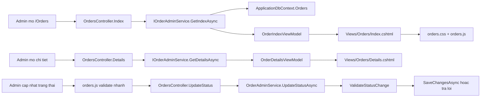

# Tai lieu module quan ly don hang

## 1. Tong quan

Module quan ly don hang duoc tach thanh 4 lop ro rang:

- `Controller`: nhan request tu admin, goi service va tra view/redirect.
- `Service`: chua logic nghiep vu, truy van database, validate rang buoc trang thai.
- `ViewModel`: gom du lieu da duoc chuan hoa cho giao dien, giup view khong phu thuoc truc tiep vao entity EF.
- `Frontend`: Razor chi render HTML, `orders.css` chi lo giao dien, `orders.js` chi lo tuong tac va validate nhanh tren trinh duyet.

Backend van la noi quyet dinh cuoi cung ve rang buoc don hang. JavaScript chi lap lai mot phan validate de nguoi dung thay loi ngay, khong can doi backend reload trang.

## 2. Danh sach file lien quan

### Backend

- `Program.cs`
- `Controllers/OrdersController.cs`
- `Services/Orders/IOrderAdminService.cs`
- `Services/Orders/OrderServiceResults.cs`
- `Services/Orders/OrderAdminService.cs`
- `ViewModels/Orders/OrderViewModels.cs`

### Frontend

- `Views/Orders/Index.cshtml`
- `Views/Orders/Details.cshtml`
- `wwwroot/css/orders.css`
- `wwwroot/js/orders.js`

## 3. Luong chay tong quat



Y nghia:

- Danh sach don hang di qua `Index -> GetIndexAsync -> OrderIndexViewModel -> Index.cshtml`.
- Chi tiet don hang di qua `Details -> GetDetailsAsync -> OrderDetailsViewModel -> Details.cshtml`.
- Cap nhat trang thai di qua `orders.js` truoc de canh bao nhanh, sau do backend `ValidateStatusChange` van kiem tra lai de dam bao an toan du lieu.

## 4. Program.cs

Code lien quan:

```csharp
using e_commerce_web_admin.Services.Orders;
```

Giai thich tung dong:

- `using e_commerce_web_admin.Services.Orders;`: import namespace cua service don hang de `Program.cs` co the dang ky dependency injection cho interface va class xu ly don hang.

Code dang ky service:

```csharp
builder.Services.AddScoped<IOrderAdminService, OrderAdminService>();
```

Giai thich tung dong:

- `builder.Services`: truy cap container DI cua ASP.NET Core.
- `AddScoped<...>()`: moi request HTTP se co mot instance service rieng.
- `IOrderAdminService`: controller chi phu thuoc vao interface, khong phu thuoc truc tiep vao class.
- `OrderAdminService`: implementation that su duoc tao khi controller can `IOrderAdminService`.

Ly do dung `Scoped`:

- `OrderAdminService` dung `ApplicationDbContext`.
- `DbContext` thuong duoc dang ky theo scope request.
- Dung `Scoped` giup tranh viec share DbContext qua nhieu request.

## 5. Controllers/OrdersController.cs

### 5.1. Phan using va namespace

```csharp
using e_commerce_web_admin.Services.Orders;
using e_commerce_web_admin.ViewModels.Orders;
using Microsoft.AspNetCore.Mvc;

namespace e_commerce_web_admin.Controllers;
```

Giai thich tung dong:

- `using e_commerce_web_admin.Services.Orders;`: lay `IOrderAdminService` va `OrderValidationError`.
- `using e_commerce_web_admin.ViewModels.Orders;`: lay cac ViewModel nhu `OrderIndexQuery`, `OrderStatusUpdateViewModel`.
- `using Microsoft.AspNetCore.Mvc;`: lay `Controller`, `IActionResult`, attribute MVC.
- `namespace e_commerce_web_admin.Controllers;`: dat controller vao namespace controller chung cua project.

### 5.2. Khai bao controller va inject service

```csharp
public sealed class OrdersController : Controller
{
    private readonly IOrderAdminService _orderService;

    public OrdersController(IOrderAdminService orderService)
        => _orderService = orderService;
}
```

Giai thich tung dong:

- `public sealed class OrdersController : Controller`: tao controller quan ly don hang, `sealed` giup class khong bi ke thua ngoai y muon.
- `: Controller`: ke thua MVC Controller de dung `View()`, `RedirectToAction()`, `NotFound()`, `ModelState`, `TempData`.
- `private readonly IOrderAdminService _orderService;`: bien service noi bo, chi gan trong constructor.
- `public OrdersController(...)`: constructor nhan service tu DI.
- `=> _orderService = orderService;`: gan service vao field de cac action su dung.

### 5.3. Action Index

```csharp
public async Task<IActionResult> Index(
    string? search,
    string? dateRange,
    string? orderStatus,
    string? paymentStatus,
    long? paymentMethodId,
    int page = 1,
    CancellationToken ct = default)
```

Giai thich tung dong:

- `public`: action co the duoc route MVC goi.
- `async Task<IActionResult>`: action co truy van bat dong bo va tra ve ket qua MVC.
- `string? search`: tu khoa tim ma don, khach hang, email, so dien thoai.
- `string? dateRange`: bo loc thoi gian, hien co `today` va `last7days`.
- `string? orderStatus`: bo loc trang thai don.
- `string? paymentStatus`: bo loc trang thai thanh toan.
- `long? paymentMethodId`: bo loc phuong thuc thanh toan.
- `int page = 1`: trang hien tai, mac dinh trang 1.
- `CancellationToken ct = default`: token huy request neu client ngat ket noi.

Phan tao query:

```csharp
var viewModel = await _orderService.GetIndexAsync(
    new OrderIndexQuery
    {
        Search = search,
        DateRange = dateRange,
        OrderStatus = orderStatus,
        PaymentStatus = paymentStatus,
        PaymentMethodId = paymentMethodId,
        Page = page,
    },
    ct);
```

Giai thich tung dong:

- `var viewModel = await ...`: goi service bat dong bo va doi ket qua.
- `_orderService.GetIndexAsync(...)`: day logic truy van danh sach sang service.
- `new OrderIndexQuery`: gom tat ca tham so filter vao mot object ro nghia.
- `Search = search`: giu tu khoa tim kiem.
- `DateRange = dateRange`: giu bo loc ngay.
- `OrderStatus = orderStatus`: giu trang thai don.
- `PaymentStatus = paymentStatus`: giu trang thai thanh toan.
- `PaymentMethodId = paymentMethodId`: giu phuong thuc thanh toan.
- `Page = page`: giu trang hien tai.
- `ct`: truyen cancellation token vao service.

Phan tra view:

```csharp
return View(viewModel);
```

Giai thich:

- Tra `Views/Orders/Index.cshtml`.
- Truyen `OrderIndexViewModel` cho Razor render bang don hang, thong ke, filter va phan trang.

### 5.4. Action Details

```csharp
public async Task<IActionResult> Details(long id, CancellationToken ct)
{
    var viewModel = await _orderService.GetDetailsAsync(id, ct);
    return viewModel is null ? NotFound() : View(viewModel);
}
```

Giai thich tung dong:

- `Details(long id, CancellationToken ct)`: nhan id don hang tu route.
- `_orderService.GetDetailsAsync(id, ct)`: service lay chi tiet don hang.
- `viewModel is null`: neu khong co don hang.
- `NotFound()`: tra HTTP 404.
- `View(viewModel)`: neu co du lieu thi render `Views/Orders/Details.cshtml`.

### 5.5. Action UpdateStatus

```csharp
[HttpPost, ValidateAntiForgeryToken]
public async Task<IActionResult> UpdateStatus(
    long id,
    OrderStatusUpdateViewModel form,
    CancellationToken ct)
```

Giai thich tung dong:

- `[HttpPost]`: action chi nhan request POST.
- `ValidateAntiForgeryToken`: bat buoc token chong CSRF tu form Razor.
- `long id`: id don hang tren route.
- `OrderStatusUpdateViewModel form`: du lieu form gom `Id`, `OrderStatus`, `PaymentStatus`.
- `CancellationToken ct`: token huy request.

Kiem tra id:

```csharp
if (id != form.Id)
{
    return BadRequest();
}
```

Giai thich:

- So sanh id route voi id hidden field.
- Neu khac nhau thi request co dau hieu sai/bi sua, tra HTTP 400.

Goi service:

```csharp
var result = await _orderService.UpdateStatusAsync(id, form, ct);
if (!result.Found)
{
    return NotFound();
}
```

Giai thich:

- `UpdateStatusAsync`: backend validate va cap nhat trang thai.
- `!result.Found`: don hang khong ton tai.
- `NotFound()`: tra HTTP 404.

Xu ly loi validate:

```csharp
if (!result.Succeeded)
{
    AddErrors(result.Errors);

    var viewModel = await _orderService.GetDetailsAsync(id, ct);
    if (viewModel is null)
    {
        return NotFound();
    }

    viewModel.StatusForm = form;
    return View("Details", viewModel);
}
```

Giai thich tung dong:

- `if (!result.Succeeded)`: service tim thay don hang nhung validate that bai.
- `AddErrors(result.Errors)`: dua loi vao `ModelState` de Razor hien duoi field.
- `GetDetailsAsync(id, ct)`: load lai du lieu chi tiet de render lai trang.
- `if (viewModel is null)`: phong truong hop don hang bi xoa giua request.
- `viewModel.StatusForm = form`: giu lai gia tri admin vua chon.
- `return View("Details", viewModel)`: render lai man chi tiet, khong redirect, de hien loi.

Xu ly thanh cong:

```csharp
TempData["Success"] = result.Message;
return RedirectToAction(nameof(Details), new { id });
```

Giai thich:

- `TempData["Success"]`: luu thong bao thanh cong qua lan redirect.
- `RedirectToAction(...)`: dung PRG pattern, tranh submit lai form khi refresh.

### 5.6. AddErrors

```csharp
private void AddErrors(IEnumerable<OrderValidationError> errors)
{
    foreach (var error in errors)
    {
        ModelState.AddModelError(error.FieldName, error.Message);
    }
}
```

Giai thich tung dong:

- `private`: chi controller nay dung.
- `IEnumerable<OrderValidationError>`: danh sach loi tu service.
- `foreach`: duyet tung loi.
- `ModelState.AddModelError(...)`: gan loi vao field tuong ung, vi du `OrderStatus` hoac `PaymentStatus`.

## 6. Services/Orders/IOrderAdminService.cs

Code:

```csharp
public interface IOrderAdminService
{
    Task<OrderIndexViewModel> GetIndexAsync(OrderIndexQuery query, CancellationToken ct = default);
    Task<OrderDetailsViewModel?> GetDetailsAsync(long id, CancellationToken ct = default);
    Task<OrderStatusUpdateResult> UpdateStatusAsync(long id, OrderStatusUpdateViewModel form, CancellationToken ct = default);
}
```

Giai thich tung dong:

- `public interface IOrderAdminService`: hop dong cua service don hang.
- `GetIndexAsync`: tra du lieu cho trang danh sach.
- `OrderIndexQuery query`: gom search, filter va page.
- `CancellationToken ct = default`: moi method ho tro huy truy van.
- `GetDetailsAsync`: tra chi tiet mot don hang theo id.
- `OrderDetailsViewModel?`: co the null neu khong tim thay.
- `UpdateStatusAsync`: cap nhat trang thai don va thanh toan.
- `OrderStatusUpdateResult`: tra ve ket qua thanh cong, loi validate hoac khong tim thay.

Loi ich:

- Controller chi biet interface.
- Neu sau nay doi cach truy van, test mock, cache hoac tach service khac thi controller it bi anh huong.

## 7. Services/Orders/OrderServiceResults.cs

### 7.1. OrderValidationError

```csharp
public sealed record OrderValidationError(string FieldName, string Message);
```

Giai thich tung dong:

- `record`: kieu du lieu gon cho object chi mang data.
- `sealed`: khong cho ke thua.
- `FieldName`: ten field trong form can gan loi.
- `Message`: noi dung loi tieng Viet hien thi tren UI.

### 7.2. OrderStatusUpdateResult

```csharp
public sealed class OrderStatusUpdateResult
{
    public bool Found { get; init; }
    public bool Succeeded { get; init; }
    public string? Message { get; init; }
    public IReadOnlyCollection<OrderValidationError> Errors { get; init; } = [];
}
```

Giai thich tung dong:

- `Found`: service co tim thay don hang hay khong.
- `Succeeded`: co cap nhat thanh cong hay khong.
- `Message`: thong bao thanh cong hoac thong bao khong co thay doi.
- `Errors`: danh sach loi validate, mac dinh la list rong.
- `init`: chi gan khi khoi tao object, giup ket qua khong bi sua tuy tien.

Factory methods:

```csharp
public static OrderStatusUpdateResult NotFound() => new() { Found = false };

public static OrderStatusUpdateResult Success(string message) =>
    new() { Found = true, Succeeded = true, Message = message };

public static OrderStatusUpdateResult Failed(IReadOnlyCollection<OrderValidationError> errors) =>
    new() { Found = true, Succeeded = false, Errors = errors };
```

Giai thich tung dong:

- `NotFound()`: tao ket qua cho truong hop khong co don hang.
- `Success(message)`: tao ket qua thanh cong va kem thong bao.
- `Failed(errors)`: tao ket qua co don hang nhung sai rang buoc.
- Cach tao static nay giup controller doc code ro hon, khong phai tu gan tung bool.

## 8. Services/Orders/OrderAdminService.cs

### 8.1. Using, class va constructor

```csharp
using e_commerce_web_admin.Data;
using e_commerce_web_admin.Models.Entities;
using e_commerce_web_admin.Models.Enums;
using e_commerce_web_admin.ViewModels.Orders;
using Microsoft.EntityFrameworkCore;
```

Giai thich:

- `Data`: lay `ApplicationDbContext`.
- `Models.Entities`: lay entity `Order`.
- `Models.Enums`: lay `OrderStatus`, `PaymentStatus`.
- `ViewModels.Orders`: tao ViewModel tra ve cho controller.
- `Microsoft.EntityFrameworkCore`: dung `AsNoTracking`, `CountAsync`, `ToListAsync`, `SaveChangesAsync`.

```csharp
public sealed class OrderAdminService : IOrderAdminService
{
    private const int DefaultPageSize = 20;

    private readonly ApplicationDbContext _db;

    public OrderAdminService(ApplicationDbContext db) => _db = db;
}
```

Giai thich tung dong:

- `OrderAdminService : IOrderAdminService`: class thuc hien hop dong service.
- `DefaultPageSize = 20`: moi trang danh sach hien 20 don.
- `_db`: DbContext de truy van database.
- Constructor nhan `ApplicationDbContext` tu DI.

### 8.2. GetIndexAsync

```csharp
var page = Math.Max(1, query.Page);
var dbQuery = ApplyFilters(_db.Orders.AsNoTracking(), query);
```

Giai thich tung dong:

- `Math.Max(1, query.Page)`: chan page nho hon 1.
- `_db.Orders`: bat dau query tu bang don hang.
- `AsNoTracking()`: chi doc du lieu, khong can EF track entity, nhanh va nhe hon.
- `ApplyFilters(...)`: tach logic filter ra ham rieng de de bao tri.

Phan thong ke:

```csharp
var totalCount = await dbQuery.CountAsync(ct);
var pendingCount = await _db.Orders.AsNoTracking().CountAsync(order => order.OrderStatus == OrderStatus.Pending, ct);
var shippingCount = await _db.Orders.AsNoTracking().CountAsync(order => order.OrderStatus == OrderStatus.Shipping, ct);
var completedCount = await _db.Orders.AsNoTracking().CountAsync(order => order.OrderStatus == OrderStatus.Completed, ct);
var completedRevenue = await _db.Orders
    .AsNoTracking()
    .Where(order => order.OrderStatus == OrderStatus.Completed && order.PaymentStatus == PaymentStatus.Paid)
    .SumAsync(order => (decimal?)order.TotalAmount, ct) ?? 0m;
```

Giai thich tung dong:

- `totalCount`: tong so don sau khi ap dung bo loc hien tai.
- `pendingCount`: tong don dang cho xac nhan tren toan bo he thong.
- `shippingCount`: tong don dang giao tren toan bo he thong.
- `completedCount`: tong don hoan tat tren toan bo he thong.
- `completedRevenue`: doanh thu cua don hoan tat va da thanh toan.
- `(decimal?)order.TotalAmount`: ep nullable de `SumAsync` khong loi khi khong co dong nao.
- `?? 0m`: neu khong co doanh thu thi tra 0.

Phan lay dong danh sach:

```csharp
var rows = await dbQuery
    .OrderByDescending(order => order.CreatedAt)
    .ThenByDescending(order => order.Id)
    .Skip((page - 1) * DefaultPageSize)
    .Take(DefaultPageSize)
    .Select(order => new OrderRowViewModel
    {
        Id = order.Id,
        OrderCode = order.OrderCode,
        CustomerName = order.User != null ? order.User.FullName : order.ShippingContactName,
        CustomerEmail = order.User != null ? order.User.Email : null,
        ShippingPhone = order.ShippingPhone,
        PaymentMethodName = order.PaymentMethod != null ? order.PaymentMethod.Name : "Khong ro",
        ItemCount = order.OrderItems.Sum(item => item.Quantity),
        TotalAmount = order.TotalAmount,
        OrderStatus = order.OrderStatus,
        PaymentStatus = order.PaymentStatus,
        CreatedAt = order.CreatedAt,
    })
    .ToListAsync(ct);
```

Giai thich tung dong:

- `OrderByDescending(CreatedAt)`: don moi nhat len dau.
- `ThenByDescending(Id)`: neu trung thoi gian thi id lon hon len truoc.
- `Skip(...)`: bo qua cac dong cua trang truoc.
- `Take(DefaultPageSize)`: chi lay 20 dong.
- `Select(...)`: project truc tiep sang ViewModel, khong tra entity len view.
- `CustomerName`: uu tien ten user neu don co user, fallback sang ten nguoi nhan.
- `CustomerEmail`: chi co email neu don gan voi user.
- `PaymentMethodName`: neu missing relation thi hien `Khong ro`.
- `ItemCount`: tong so luong san pham trong don.
- `ToListAsync(ct)`: chay SQL va lay danh sach.

Phan tra ViewModel:

```csharp
return new OrderIndexViewModel
{
    Orders = rows,
    Search = query.Search,
    DateRange = NormalizeDateRange(query.DateRange),
    OrderStatus = query.OrderStatus,
    PaymentStatus = query.PaymentStatus,
    PaymentMethodId = query.PaymentMethodId,
    Page = page,
    PageSize = DefaultPageSize,
    TotalCount = totalCount,
    PendingCount = pendingCount,
    ShippingCount = shippingCount,
    CompletedCount = completedCount,
    CompletedRevenue = completedRevenue,
    DateRangeOptions = BuildDateRangeOptions(query.DateRange),
    OrderStatusOptions = BuildOrderStatusOptions(query.OrderStatus),
    PaymentStatusOptions = BuildPaymentStatusOptions(query.PaymentStatus),
    PaymentMethodOptions = await BuildPaymentMethodOptionsAsync(query.PaymentMethodId, ct),
};
```

Giai thich:

- Khoi tao day du du lieu cho `Index.cshtml`.
- Giu lai gia tri filter cu de UI hien dung trang thai dang loc.
- Tao danh sach option cho cac dropdown.
- Khong de Razor tu truy van database.

### 8.3. GetDetailsAsync

```csharp
var viewModel = await _db.Orders
    .AsNoTracking()
    .Where(order => order.Id == id)
    .Select(order => new OrderDetailsViewModel
    {
        ...
    })
    .FirstOrDefaultAsync(ct);
```

Giai thich tung dong:

- `_db.Orders`: query bang don hang.
- `AsNoTracking()`: chi doc chi tiet, khong cap nhat entity trong method nay.
- `Where(order => order.Id == id)`: chi lay dung don hang can xem.
- `Select(order => new OrderDetailsViewModel)`: project sang ViewModel chi tiet.
- `FirstOrDefaultAsync(ct)`: lay mot don hoac null.

Cac truong chinh trong projection:

```csharp
Id = order.Id,
OrderCode = order.OrderCode,
CustomerName = order.User != null ? order.User.FullName : order.ShippingContactName,
CustomerEmail = order.User != null ? order.User.Email : null,
CustomerPhone = order.User != null ? order.User.Phone : null,
PaymentMethodName = order.PaymentMethod != null ? order.PaymentMethod.Name : "Khong ro",
VoucherCode = order.Voucher != null ? order.Voucher.Code : null,
ShippingContactName = order.ShippingContactName,
ShippingPhone = order.ShippingPhone,
ShippingProvince = order.ShippingProvince,
ShippingWard = order.ShippingWard,
ShippingDetail = order.ShippingDetail,
SubtotalAmount = order.SubtotalAmount,
ShippingFee = order.ShippingFee,
VoucherDiscount = order.VoucherDiscount,
TotalAmount = order.TotalAmount,
OrderStatus = order.OrderStatus,
PaymentStatus = order.PaymentStatus,
CreatedAt = order.CreatedAt,
UpdatedAt = order.UpdatedAt,
```

Giai thich:

- Nhom `Customer...`: thong tin khach hang.
- Nhom `Shipping...`: thong tin giao hang.
- Nhom tien: tam tinh, phi ship, giam gia, tong tien.
- `OrderStatus`, `PaymentStatus`: trang thai hien tai de render badge va form.
- `CreatedAt`, `UpdatedAt`: moc thoi gian hien tren hero chi tiet.

Projection item:

```csharp
Items = order.OrderItems
    .OrderBy(item => item.Id)
    .Select(item => new OrderItemViewModel
    {
        Id = item.Id,
        ProductName = item.ProductVariant != null && item.ProductVariant.Product != null
            ? item.ProductVariant.Product.Name
            : "San pham khong xac dinh",
        VariantCode = item.ProductVariant != null ? item.ProductVariant.Code : "N/A",
        Quantity = item.Quantity,
        UnitPrice = item.UnitPrice,
        LineTotal = item.UnitPrice * item.Quantity,
    })
    .ToList(),
```

Giai thich:

- `order.OrderItems`: lay cac dong san pham trong don.
- `OrderBy(item.Id)`: giu thu tu on dinh.
- `ProductName`: lay ten san pham qua variant, fallback neu relation khong co.
- `VariantCode`: ma bien the/SKU, fallback `N/A`.
- `Quantity`: so luong mua.
- `UnitPrice`: don gia tai thoi diem mua.
- `LineTotal`: thanh tien tung dong.
- `ToList()`: gom item vao list con cua ViewModel.

Sau khi query:

```csharp
if (viewModel is null)
{
    return null;
}
```

Giai thich:

- Neu khong tim thay don, tra null de controller tra 404.

Gan option va form:

```csharp
viewModel.OrderStatusOptions = BuildOrderStatusOptions(viewModel.OrderStatus.ToString());
viewModel.PaymentStatusOptions = BuildPaymentStatusOptions(viewModel.PaymentStatus.ToString());
viewModel.StatusForm = new OrderStatusUpdateViewModel
{
    Id = viewModel.Id,
    OrderStatus = viewModel.OrderStatus,
    PaymentStatus = viewModel.PaymentStatus,
};

return viewModel;
```

Giai thich:

- Build options cho dropdown trang thai don.
- Build options cho dropdown thanh toan.
- Tao form mac dinh bang trang thai hien tai.
- Tra ViewModel cho controller.

### 8.4. UpdateStatusAsync

```csharp
var order = await _db.Orders.FirstOrDefaultAsync(item => item.Id == id, ct);
if (order is null)
{
    return OrderStatusUpdateResult.NotFound();
}
```

Giai thich:

- Lay entity co tracking vi method nay can sua du lieu.
- Neu khong thay, tra result not found.

Validate:

```csharp
var errors = ValidateStatusChange(order, form);
if (errors.Count > 0)
{
    return OrderStatusUpdateResult.Failed(errors);
}
```

Giai thich:

- Goi ham validate nghiep vu tap trung.
- Neu co loi, khong sua database.
- Tra loi ve controller de gan vao `ModelState`.

Khong co thay doi:

```csharp
if (order.OrderStatus == form.OrderStatus && order.PaymentStatus == form.PaymentStatus)
{
    return OrderStatusUpdateResult.Success("Don hang chua co thay doi trang thai.");
}
```

Giai thich:

- Neu admin bam cap nhat nhung gia tri khong doi, khong can save.
- Van tra thanh cong de UI thong bao nhe nhang.

Cap nhat database:

```csharp
order.OrderStatus = form.OrderStatus;
order.PaymentStatus = form.PaymentStatus;
order.UpdatedAt = DateTime.UtcNow;

await _db.SaveChangesAsync(ct);
```

Giai thich tung dong:

- Gan trang thai don moi.
- Gan trang thai thanh toan moi.
- Cap nhat moc thoi gian bang UTC.
- Luu thay doi vao database.

Tra ket qua:

```csharp
return OrderStatusUpdateResult.Success(
    $"Da cap nhat don hang {order.OrderCode} sang {OrderDisplay.GetOrderStatusLabel(order.OrderStatus).ToLowerInvariant()}.");
```

Giai thich:

- Tra thong bao thanh cong co ma don.
- Dung `OrderDisplay` de hien label nguoi dung doc duoc.

### 8.5. ApplyFilters

```csharp
private static IQueryable<Order> ApplyFilters(IQueryable<Order> query, OrderIndexQuery filters)
```

Giai thich:

- Nhan query EF ban dau.
- Nhan object filter tu controller.
- Tra ve query da them dieu kien, chua chay SQL ngay.

Tim kiem:

```csharp
if (!string.IsNullOrWhiteSpace(filters.Search))
{
    var term = filters.Search.Trim();
    query = query.Where(order =>
        order.OrderCode.Contains(term) ||
        order.ShippingContactName.Contains(term) ||
        order.ShippingPhone.Contains(term) ||
            (order.User != null &&
            (order.User.FullName.Contains(term) || order.User.Email.Contains(term))));
}
```

Giai thich tung dong:

- Chi loc khi co tu khoa.
- `Trim()`: bo khoang trang dau cuoi.
- `OrderCode.Contains(term)`: tim theo ma don.
- `ShippingContactName.Contains(term)`: tim theo ten nguoi nhan.
- `ShippingPhone.Contains(term)`: tim theo so dien thoai.
- `order.User != null`: tranh truy cap user null.
- `FullName` hoac `Email`: tim theo tai khoan neu don co user.

Loc theo ngay:

```csharp
var dateRange = GetDateRange(filters.DateRange);
if (dateRange is not null)
{
    query = query.Where(order => order.CreatedAt >= dateRange.Value.StartUtc &&
        order.CreatedAt < dateRange.Value.EndUtc);
}
```

Giai thich:

- Chuyen `today`/`last7days` thanh moc UTC.
- Loc theo `CreatedAt >= StartUtc`.
- Dung `< EndUtc` de khong bi lap ngay ke tiep.

Loc enum:

```csharp
if (TryParseOrderStatus(filters.OrderStatus, out var orderStatus))
{
    query = query.Where(order => order.OrderStatus == orderStatus);
}

if (TryParsePaymentStatus(filters.PaymentStatus, out var paymentStatus))
{
    query = query.Where(order => order.PaymentStatus == paymentStatus);
}
```

Giai thich:

- Chi loc neu gia tri query string parse duoc thanh enum hop le.
- Gia tri sai se bi bo qua, tranh loi request.

Loc phuong thuc thanh toan:

```csharp
if (filters.PaymentMethodId is > 0)
{
    query = query.Where(order => order.PaymentMethodId == filters.PaymentMethodId.Value);
}
```

Giai thich:

- Chi loc khi id lon hon 0.
- So sanh voi `PaymentMethodId` cua don hang.

### 8.6. ValidateStatusChange

Ham nay la noi chua rang buoc nghiep vu quan trong nhat cua module.

```csharp
var errors = new List<OrderValidationError>();
```

Giai thich:

- Tao danh sach loi rong.
- Moi vi pham se duoc add vao list, co the tra nhieu loi cung luc.

Rang buoc chuyen trang thai don:

```csharp
if (!CanChangeOrderStatus(order.OrderStatus, form.OrderStatus))
{
    errors.Add(new OrderValidationError(
        nameof(form.OrderStatus),
        $"Khong the chuyen don tu \"{OrderDisplay.GetOrderStatusLabel(order.OrderStatus)}\" sang \"{OrderDisplay.GetOrderStatusLabel(form.OrderStatus)}\"."));
}
```

Giai thich:

- Kiem tra trang thai don hien tai co duoc phep sang trang thai moi khong.
- Neu khong, gan loi vao field `OrderStatus`.
- Message dung label tieng Viet de admin de hieu.

Rang buoc chuyen trang thai thanh toan:

```csharp
if (!CanChangePaymentStatus(order.PaymentStatus, form.PaymentStatus))
{
    errors.Add(new OrderValidationError(
        nameof(form.PaymentStatus),
        $"Khong the chuyen thanh toan tu \"{OrderDisplay.GetPaymentStatusLabel(order.PaymentStatus)}\" sang \"{OrderDisplay.GetPaymentStatusLabel(form.PaymentStatus)}\"."));
}
```

Giai thich:

- Kiem tra trang thai thanh toan hien tai co duoc phep sang trang thai moi khong.
- Neu khong, gan loi vao field `PaymentStatus`.

Don hoan tat bat buoc da thanh toan:

```csharp
if (form.OrderStatus == OrderStatus.Completed && form.PaymentStatus != PaymentStatus.Paid)
{
    errors.Add(new OrderValidationError(
        nameof(form.PaymentStatus),
        "Don hoan tat phai co trang thai thanh toan la da thanh toan."));
}
```

Giai thich:

- Don `Completed` khong the van `Unpaid`, `Failed` hoac `Refunded`.
- Loi gan vao `PaymentStatus` vi can sua thanh toan.

Hoan tien chi cho don huy/tra hang:

```csharp
if (form.PaymentStatus == PaymentStatus.Refunded &&
    form.OrderStatus is not OrderStatus.Cancelled and not OrderStatus.Returned)
{
    errors.Add(new OrderValidationError(
        nameof(form.PaymentStatus),
        "Chi hoan tien cho don da huy hoac da tra hang."));
}
```

Giai thich:

- Neu chon `Refunded` thi don phai o `Cancelled` hoac `Returned`.
- Tranh hoan tien cho don dang xu ly/dang giao/hoan tat binh thuong.

Don huy/tra hang khong giu `Paid`:

```csharp
if (form.OrderStatus is OrderStatus.Cancelled or OrderStatus.Returned &&
    form.PaymentStatus == PaymentStatus.Paid)
{
    errors.Add(new OrderValidationError(
        nameof(form.PaymentStatus),
        "Don da huy hoac tra hang khong the giu trang thai da thanh toan."));
}
```

Giai thich:

- Neu don da huy hoac tra hang thi khong nen con la `Paid`.
- Admin can chuyen sang `Refunded` neu da thanh toan, hoac trang thai phu hop neu chua thanh toan.

Don da thanh toan khi huy/tra hang phai hoan tien:

```csharp
if (form.OrderStatus is OrderStatus.Cancelled or OrderStatus.Returned &&
    order.PaymentStatus == PaymentStatus.Paid &&
    form.PaymentStatus != PaymentStatus.Refunded)
{
    errors.Add(new OrderValidationError(
        nameof(form.PaymentStatus),
        "Don da thanh toan khi huy hoac tra hang phai chuyen sang da hoan tien."));
}
```

Giai thich:

- Xet trang thai thanh toan hien tai trong database.
- Neu dang `Paid` ma don bi huy/tra hang, bat buoc payment moi la `Refunded`.
- Rang buoc nay tranh mat dau vet hoan tien.

Ket thuc validate:

```csharp
return errors;
```

Giai thich:

- Tra list loi cho `UpdateStatusAsync`.
- List rong nghia la co the cap nhat.

### 8.7. CanChangeOrderStatus

```csharp
private static bool CanChangeOrderStatus(OrderStatus current, OrderStatus next) =>
    current switch
    {
        OrderStatus.Pending => next is OrderStatus.Pending or OrderStatus.Confirmed or OrderStatus.Cancelled,
        OrderStatus.Confirmed => next is OrderStatus.Confirmed or OrderStatus.Processing or OrderStatus.Cancelled,
        OrderStatus.Processing => next is OrderStatus.Processing or OrderStatus.Shipping or OrderStatus.Cancelled,
        OrderStatus.Shipping => next is OrderStatus.Shipping or OrderStatus.Completed or OrderStatus.Returned,
        OrderStatus.Completed => next is OrderStatus.Completed or OrderStatus.Returned,
        OrderStatus.Cancelled => next is OrderStatus.Cancelled,
        OrderStatus.Returned => next is OrderStatus.Returned,
        _ => false,
    };
```

Giai thich tung dong:

- `Pending`: co the giu cho xac nhan, xac nhan, hoac huy.
- `Confirmed`: co the giu da xac nhan, sang dang xu ly, hoac huy.
- `Processing`: co the giu dang xu ly, sang dang giao, hoac huy.
- `Shipping`: co the giu dang giao, sang hoan tat, hoac tra hang.
- `Completed`: chi giu hoan tat hoac sang tra hang.
- `Cancelled`: da huy thi khong mo lai trong module nay.
- `Returned`: da tra hang thi khong mo lai trong module nay.
- `_ => false`: enum la/khong hop le thi chan.

### 8.8. CanChangePaymentStatus

```csharp
private static bool CanChangePaymentStatus(PaymentStatus current, PaymentStatus next) =>
    current switch
    {
        PaymentStatus.Unpaid => next is PaymentStatus.Unpaid or PaymentStatus.Paid or PaymentStatus.Failed,
        PaymentStatus.Failed => next is PaymentStatus.Failed or PaymentStatus.Unpaid or PaymentStatus.Paid,
        PaymentStatus.Paid => next is PaymentStatus.Paid or PaymentStatus.Refunded,
        PaymentStatus.Refunded => next is PaymentStatus.Refunded,
        _ => false,
    };
```

Giai thich tung dong:

- `Unpaid`: co the giu chua thanh toan, sang da thanh toan, hoac thanh toan loi.
- `Failed`: co the giu loi, quay ve chua thanh toan, hoac sang da thanh toan.
- `Paid`: chi giu da thanh toan hoac sang hoan tien.
- `Refunded`: da hoan tien thi khong chuyen nguoc trong module nay.
- `_ => false`: gia tri la bi chan.

### 8.9. Parse enum an toan

```csharp
private static bool TryParseOrderStatus(string? value, out OrderStatus status) =>
    Enum.TryParse(value, ignoreCase: true, out status) && Enum.IsDefined(status);

private static bool TryParsePaymentStatus(string? value, out PaymentStatus status) =>
    Enum.TryParse(value, ignoreCase: true, out status) && Enum.IsDefined(status);
```

Giai thich:

- `Enum.TryParse`: chuyen string query thanh enum.
- `ignoreCase: true`: khong phan biet hoa thuong.
- `Enum.IsDefined`: dam bao gia tri nam trong enum that, khong nhan so la.
- Tra `true` thi moi dung de loc.

### 8.10. BuildDateRangeOptions

```csharp
private static List<OrderFilterOption> BuildDateRangeOptions(string? selectedValue)
{
    var selected = NormalizeDateRange(selectedValue);
    return
    [
        new OrderFilterOption
        {
            Value = "today",
            Text = "Hom nay",
            Selected = selected == "today",
        },
        new OrderFilterOption
        {
            Value = "last7days",
            Text = "7 ngay qua",
            Selected = selected == "last7days",
        },
    ];
}
```

Giai thich:

- Chuan hoa gia tri dang duoc chon.
- Tao 2 option thoi gian.
- `Selected` giup Razor render dropdown dung gia tri dang loc.

### 8.11. BuildOrderStatusOptions va BuildPaymentStatusOptions

```csharp
Enum.GetValues<OrderStatus>()
    .Select(status => new OrderFilterOption
    {
        Value = status.ToString(),
        Text = OrderDisplay.GetOrderStatusLabel(status),
        Selected = string.Equals(selectedValue, status.ToString(), StringComparison.OrdinalIgnoreCase),
    })
    .ToList();
```

Giai thich:

- Lay tat ca gia tri `OrderStatus`.
- `Value`: gia tri gui len query/form.
- `Text`: label tieng Viet hien tren UI.
- `Selected`: danh dau option dang chon.

Phan `PaymentStatus` tuong tu, nhung dung enum `PaymentStatus` va `OrderDisplay.GetPaymentStatusLabel`.

### 8.12. GetDateRange

```csharp
var normalizedValue = NormalizeDateRange(value);
if (normalizedValue is null)
{
    return null;
}
```

Giai thich:

- Neu filter rong hoac khong hop le thi khong loc ngay.

```csharp
var timeZone = GetVietnamTimeZone();
var today = TimeZoneInfo.ConvertTimeFromUtc(DateTime.UtcNow, timeZone).Date;
var localStart = normalizedValue == "last7days"
    ? today.AddDays(-6)
    : today;
var localEnd = today.AddDays(1);
```

Giai thich:

- Lay timezone Viet Nam.
- Tinh ngay hien tai theo Viet Nam, khong phu thuoc timezone server.
- `last7days`: tinh tu 6 ngay truoc den het hom nay, tong 7 ngay.
- `today`: bat dau tu 00:00 hom nay.
- `localEnd`: dau ngay ke tiep.

```csharp
return (
    TimeZoneInfo.ConvertTimeToUtc(DateTime.SpecifyKind(localStart, DateTimeKind.Unspecified), timeZone),
    TimeZoneInfo.ConvertTimeToUtc(DateTime.SpecifyKind(localEnd, DateTimeKind.Unspecified), timeZone));
```

Giai thich:

- Chuyen moc local Viet Nam sang UTC de so voi `CreatedAt`.
- `DateTimeKind.Unspecified` giup .NET hieu day la gio local cua timezone truyen vao, khong phai local server.
- Tra tuple `(StartUtc, EndUtc)`.

### 8.13. NormalizeDateRange

```csharp
private static string? NormalizeDateRange(string? value)
{
    if (string.IsNullOrWhiteSpace(value))
    {
        return null;
    }

    return value.Trim().ToLowerInvariant() switch
    {
        "today" => "today",
        "last7days" => "last7days",
        _ => null,
    };
}
```

Giai thich:

- Rong/null/khoang trang thi tra null.
- Trim va lowercase de nhan input on dinh.
- Chi chap nhan `today` va `last7days`.
- Gia tri la tra null de bo qua filter.

### 8.14. GetVietnamTimeZone

```csharp
foreach (var timeZoneId in new[] { "SE Asia Standard Time", "Asia/Ho_Chi_Minh" })
{
    try
    {
        return TimeZoneInfo.FindSystemTimeZoneById(timeZoneId);
    }
    catch (TimeZoneNotFoundException)
    {
    }
    catch (InvalidTimeZoneException)
    {
    }
}

return TimeZoneInfo.Utc;
```

Giai thich:

- Thu timezone Windows truoc: `SE Asia Standard Time`.
- Thu timezone Linux/macOS: `Asia/Ho_Chi_Minh`.
- Neu OS khong co timezone hoac timezone loi, bo qua va thu cai tiep.
- Fallback UTC de app khong crash.

### 8.15. BuildPaymentMethodOptionsAsync

```csharp
return await _db.PaymentMethods
    .AsNoTracking()
    .OrderBy(method => method.Name)
    .Select(method => new OrderFilterOption
    {
        Value = method.Id.ToString(),
        Text = method.Name,
        Selected = selectedId.HasValue && method.Id == selectedId.Value,
    })
    .ToListAsync(ct);
```

Giai thich:

- Lay danh sach phuong thuc thanh toan tu database.
- `AsNoTracking`: chi doc option.
- Sap xep theo ten de dropdown de tim.
- `Value`: id gui len query.
- `Text`: ten hien tren UI.
- `Selected`: option dang duoc loc.
- `ToListAsync(ct)`: chay query bat dong bo.

## 9. ViewModels/Orders/OrderViewModels.cs

### 9.1. OrderIndexQuery

```csharp
public sealed class OrderIndexQuery
{
    public string? Search { get; set; }
    public string? DateRange { get; set; }
    public string? OrderStatus { get; set; }
    public string? PaymentStatus { get; set; }
    public long? PaymentMethodId { get; set; }
    public int Page { get; set; } = 1;
}
```

Giai thich tung dong:

- `OrderIndexQuery`: object gom tham so dau vao cua trang danh sach.
- `Search`: tu khoa tim kiem.
- `DateRange`: `today`, `last7days` hoac null.
- `OrderStatus`: string tu query, se parse sang enum trong service.
- `PaymentStatus`: string tu query, se parse sang enum trong service.
- `PaymentMethodId`: id phuong thuc thanh toan can loc.
- `Page`: trang hien tai, mac dinh 1.

### 9.2. OrderIndexViewModel

```csharp
public List<OrderRowViewModel> Orders { get; set; } = [];
public List<OrderFilterOption> DateRangeOptions { get; set; } = [];
public List<OrderFilterOption> OrderStatusOptions { get; set; } = [];
public List<OrderFilterOption> PaymentStatusOptions { get; set; } = [];
public List<OrderFilterOption> PaymentMethodOptions { get; set; } = [];
```

Giai thich:

- `Orders`: cac dong hien trong bang.
- `DateRangeOptions`: option hom nay/7 ngay qua.
- `OrderStatusOptions`: option trang thai don.
- `PaymentStatusOptions`: option thanh toan.
- `PaymentMethodOptions`: option phuong thuc thanh toan.
- `= []`: khoi tao list rong, tranh null reference trong Razor.

```csharp
public string? Search { get; set; }
public string? DateRange { get; set; }
public string? OrderStatus { get; set; }
public string? PaymentStatus { get; set; }
public long? PaymentMethodId { get; set; }
```

Giai thich:

- Cac property nay giu lai filter hien tai de input/select tren UI hien dung gia tri.

```csharp
public int Page { get; set; } = 1;
public int PageSize { get; set; } = 20;
public int TotalCount { get; set; }
public int PendingCount { get; set; }
public int ShippingCount { get; set; }
public int CompletedCount { get; set; }
public decimal CompletedRevenue { get; set; }
```

Giai thich:

- `Page`: trang hien tai.
- `PageSize`: so dong moi trang.
- `TotalCount`: tong don sau bo loc.
- `PendingCount`: so don cho xac nhan.
- `ShippingCount`: so don dang giao.
- `CompletedCount`: so don hoan tat.
- `CompletedRevenue`: doanh thu don hoan tat da thanh toan.

Computed properties:

```csharp
public int TotalPages => PageSize <= 0 ? 0 : (int)Math.Ceiling((double)TotalCount / PageSize);
public bool HasPrev => Page > 1;
public bool HasNext => Page < TotalPages;
public bool HasFilters =>
    !string.IsNullOrWhiteSpace(Search) ||
    !string.IsNullOrWhiteSpace(DateRange) ||
    !string.IsNullOrWhiteSpace(OrderStatus) ||
    !string.IsNullOrWhiteSpace(PaymentStatus) ||
    PaymentMethodId.HasValue;
```

Giai thich:

- `TotalPages`: tinh tong so trang, bao ve truong hop `PageSize <= 0`.
- `HasPrev`: co nut trang truoc hay khong.
- `HasNext`: co nut trang sau hay khong.
- `HasFilters`: co bat ky filter nao dang ap dung khong, dung de hien `Xoa loc`.

### 9.3. OrderRowViewModel

```csharp
public sealed class OrderRowViewModel
{
    public long Id { get; set; }
    public string OrderCode { get; set; } = string.Empty;
    public string CustomerName { get; set; } = string.Empty;
    public string? CustomerEmail { get; set; }
    public string ShippingPhone { get; set; } = string.Empty;
    public string PaymentMethodName { get; set; } = string.Empty;
    public int ItemCount { get; set; }
    public decimal TotalAmount { get; set; }
    public OrderStatus OrderStatus { get; set; }
    public PaymentStatus PaymentStatus { get; set; }
    public DateTime CreatedAt { get; set; }
}
```

Giai thich tung dong:

- `Id`: khoa chinh de link sang chi tiet.
- `OrderCode`: ma don hien trong bang.
- `CustomerName`: ten khach/nguoi nhan.
- `CustomerEmail`: email co the null.
- `ShippingPhone`: so dien thoai giao hang.
- `PaymentMethodName`: ten phuong thuc thanh toan.
- `ItemCount`: tong so luong san pham.
- `TotalAmount`: tong tien don.
- `OrderStatus`: enum trang thai don.
- `PaymentStatus`: enum trang thai thanh toan.
- `CreatedAt`: ngay tao don.

### 9.4. OrderDetailsViewModel

Nhom thong tin don:

```csharp
public long Id { get; set; }
public string OrderCode { get; set; } = string.Empty;
public OrderStatus OrderStatus { get; set; }
public PaymentStatus PaymentStatus { get; set; }
public DateTime CreatedAt { get; set; }
public DateTime? UpdatedAt { get; set; }
```

Giai thich:

- Dung cho hero, badge va form cap nhat trang thai.

Nhom khach hang:

```csharp
public string CustomerName { get; set; } = string.Empty;
public string? CustomerEmail { get; set; }
public string? CustomerPhone { get; set; }
```

Giai thich:

- Hien trong card khach hang ben phai.
- Email/phone co the null neu don khong co user.

Nhom giao hang:

```csharp
public string ShippingContactName { get; set; } = string.Empty;
public string ShippingPhone { get; set; } = string.Empty;
public string ShippingProvince { get; set; } = string.Empty;
public string ShippingWard { get; set; } = string.Empty;
public string ShippingDetail { get; set; } = string.Empty;
```

Giai thich:

- Hien nguoi nhan, phone va dia chi giao hang.

Nhom tien:

```csharp
public decimal SubtotalAmount { get; set; }
public decimal ShippingFee { get; set; }
public decimal VoucherDiscount { get; set; }
public decimal TotalAmount { get; set; }
```

Giai thich:

- Hien tam tinh, phi giao hang, giam gia va tong cong.

Nhom item va form:

```csharp
public List<OrderItemViewModel> Items { get; set; } = [];
public List<OrderFilterOption> OrderStatusOptions { get; set; } = [];
public List<OrderFilterOption> PaymentStatusOptions { get; set; } = [];
public OrderStatusUpdateViewModel StatusForm { get; set; } = new();
```

Giai thich:

- `Items`: cac san pham trong don.
- `OrderStatusOptions`: option dropdown trang thai don.
- `PaymentStatusOptions`: option dropdown thanh toan.
- `StatusForm`: du lieu bind vao form cap nhat.

Computed properties:

```csharp
public int TotalQuantity => Items.Sum(item => item.Quantity);
public string ShippingAddress => string.Join(", ", new[]
{
    ShippingDetail,
    ShippingWard,
    ShippingProvince,
}.Where(value => !string.IsNullOrWhiteSpace(value)));
```

Giai thich:

- `TotalQuantity`: tong so luong tat ca item.
- `ShippingAddress`: ghep dia chi chi tiet, phuong/xa, tinh/thanh.
- `Where(...)`: bo qua phan rong de khong tao dau phay thua.

### 9.5. OrderItemViewModel

```csharp
public sealed class OrderItemViewModel
{
    public long Id { get; set; }
    public string ProductName { get; set; } = string.Empty;
    public string VariantCode { get; set; } = string.Empty;
    public int Quantity { get; set; }
    public decimal UnitPrice { get; set; }
    public decimal LineTotal { get; set; }
}
```

Giai thich:

- `Id`: id dong order item.
- `ProductName`: ten san pham.
- `VariantCode`: ma bien the/SKU.
- `Quantity`: so luong mua.
- `UnitPrice`: gia mot don vi tai thoi diem dat.
- `LineTotal`: `UnitPrice * Quantity`.

### 9.6. OrderStatusUpdateViewModel

```csharp
public sealed class OrderStatusUpdateViewModel
{
    public long Id { get; set; }

    [Required(ErrorMessage = "Trang thai don hang la bat buoc.")]
    public OrderStatus OrderStatus { get; set; }

    [Required(ErrorMessage = "Trang thai thanh toan la bat buoc.")]
    public PaymentStatus PaymentStatus { get; set; }
}
```

Giai thich:

- `Id`: id don hang can cap nhat.
- `[Required]`: rang buoc field phai co gia tri khi model binding.
- `OrderStatus`: trang thai don moi.
- `PaymentStatus`: trang thai thanh toan moi.
- Luu y: enum select thuong luon co gia tri, nhung attribute giup backend co rule ro rang neu form bi sua.

### 9.7. OrderFilterOption

```csharp
public sealed class OrderFilterOption
{
    public string Value { get; set; } = string.Empty;
    public string Text { get; set; } = string.Empty;
    public bool Selected { get; set; }
}
```

Giai thich:

- `Value`: value cua option HTML.
- `Text`: label hien cho admin.
- `Selected`: co dang duoc chon hay khong.

### 9.8. OrderDisplay

```csharp
public static string GetOrderStatusLabel(OrderStatus status) => status switch
{
    OrderStatus.Pending => "Cho xac nhan",
    OrderStatus.Confirmed => "Da xac nhan",
    OrderStatus.Processing => "Dang xu ly",
    OrderStatus.Shipping => "Dang giao",
    OrderStatus.Completed => "Hoan tat",
    OrderStatus.Cancelled => "Da huy",
    OrderStatus.Returned => "Da tra hang",
    _ => "Khong xac dinh",
};
```

Giai thich:

- Chuyen enum backend sang label nguoi dung doc duoc.
- `_`: fallback khi gap gia tri la.

```csharp
public static string GetOrderStatusClass(OrderStatus status) => status switch
{
    OrderStatus.Pending => "is-pending",
    ...
};
```

Giai thich:

- Chuyen enum sang CSS class.
- Razor dung class nay de badge co mau phu hop.
- Payment status co 2 ham tuong tu: label va class.

## 10. Views/Orders/Index.cshtml

### 10.1. Khai bao model va helper

```cshtml
@model e_commerce_web_admin.ViewModels.Orders.OrderIndexViewModel
@using System.Globalization
@using e_commerce_web_admin.ViewModels.Orders
@{
    ViewData["Title"] = "Quan ly don hang";
    Layout = "_Layout";

    var vi = CultureInfo.GetCultureInfo("vi-VN");
    string Money(decimal value) => string.Concat(value.ToString("N0", vi), " d");
    string DateText(DateTime value) => value.ToLocalTime().ToString("dd/MM/yyyy HH:mm", vi);
}
```

Giai thich:

- `@model`: view nhan `OrderIndexViewModel`.
- `CultureInfo`: format tien/ngay theo Viet Nam.
- `ViewData["Title"]`: title trang.
- `Layout = "_Layout"`: dung layout admin chung.
- `Money`: format `34.463.000 d`.
- `DateText`: format ngay gio `dd/MM/yyyy HH:mm`.

Tinh so filter dang ap dung:

```cshtml
var activeFilterCount = new[]
{
    !string.IsNullOrWhiteSpace(Model.Search),
    !string.IsNullOrWhiteSpace(Model.DateRange),
    !string.IsNullOrWhiteSpace(Model.OrderStatus),
    !string.IsNullOrWhiteSpace(Model.PaymentStatus),
    Model.PaymentMethodId.HasValue,
}.Count(isActive => isActive);
```

Giai thich:

- Tao mang bool cho 5 filter.
- Filter nao co gia tri thi `true`.
- `Count(isActive => isActive)`: dem so filter active.
- Ket qua hien tren button `Loc`.

### 10.2. Load CSS rieng

```cshtml
@section Styles {
    <link rel="stylesheet" href="~/css/orders.css" asp-append-version="true" />
}
```

Giai thich:

- Chi trang Orders load CSS Orders.
- `asp-append-version`: them version hash de trinh duyet khong dung cache cu sau khi file doi.

### 10.3. Hero

```cshtml
<section class="order-hero order-anim" style="animation-delay:0.04s">
    <div>
        <p class="order-page-mark">Van hanh don hang</p>
        <div class="order-title-row">
            <div>
                <h1>Quan ly don hang</h1>
                <p>Theo doi don, khach mua, thanh toan va trang thai xu ly trong mot man hinh.</p>
            </div>
        </div>
    </div>
</section>
```

Giai thich:

- `order-hero`: vung tieu de.
- `order-anim`: animation nhe.
- `order-page-mark`: nhan nho phia tren.
- `h1`: ten module.
- `p`: mo ta ngan, khong tao card rieng theo yeu cau UI moi.

### 10.4. Toast TempData

```cshtml
@if (TempData["Success"] != null)
{
    <div id="toastSuccess" class="order-flash order-flash-success order-anim">
        ...
    </div>
}
```

Giai thich:

- Chi render toast khi controller set `TempData["Success"]`.
- `id="toastSuccess"` de JS tu dong dong sau 5 giay.
- `data-dismiss-target="toastSuccess"` de nut X xoa dung toast.
- Khoi Error tuong tu nhung dung `TempData["Error"]` va class `order-flash-error`.

### 10.5. Metrics

```cshtml
<section class="order-metrics" aria-label="Thong ke don hang">
    <article class="order-metric">
        <span class="order-metric-icon">
            <i data-lucide="shopping-bag" class="w-5 h-5"></i>
        </span>
        <div>
            <p>@Model.TotalCount</p>
            <span>Don trong bo loc</span>
        </div>
    </article>
    ...
</section>
```

Giai thich:

- `aria-label`: ho tro screen reader.
- Moi `article` la mot o thong ke.
- `data-lucide`: icon duoc thu vien lucide render.
- `Model.TotalCount`: lay du lieu backend da tinh.
- Cac metric con lai dung `PendingCount`, `ShippingCount`, `CompletedRevenue`.

### 10.6. Form filter

```cshtml
<form method="get" asp-action="Index" class="order-filter-grid">
```

Giai thich:

- `method="get"`: filter nam tren query string, co the bookmark/share.
- `asp-action="Index"`: submit ve action danh sach.
- `order-filter-grid`: CSS can cot search/select/button.

Search:

```cshtml
<input type="text"
       name="search"
       value="@Model.Search"
       placeholder="Tim ma don, khach hang hoac so dien thoai..." />
```

Giai thich:

- `name="search"` khop tham so `Index(string? search, ...)`.
- `value="@Model.Search"` giu tu khoa sau khi loc.
- Placeholder goi y cac truong co the tim.

Dropdown thoi gian:

```cshtml
<select name="dateRange">
    <option value="" selected="@(string.IsNullOrEmpty(Model.DateRange) ? "selected" : null)">Tat ca</option>
    @foreach (var option in Model.DateRangeOptions)
    {
        <option value="@option.Value" selected="@(option.Selected ? "selected" : null)">@option.Text</option>
    }
</select>
```

Giai thich:

- `name="dateRange"` khop query backend.
- Option rong nghia la khong loc ngay.
- `DateRangeOptions` den tu service, hien `Hom nay` va `7 ngay qua`.
- `Selected` giu trang thai dang chon.

Dropdown trang thai/thanh toan/phuong thuc:

- `orderStatus`: loc theo `OrderStatus`.
- `paymentStatus`: loc theo `PaymentStatus`.
- `paymentMethodId`: loc theo phuong thuc thanh toan trong database.
- Tat ca option deu duoc build san trong service.

Button loc:

```cshtml
<button type="submit" class="order-filter-submit">
    <i data-lucide="sliders-horizontal" class="w-4 h-4"></i>
    <span>Loc</span>
    @if (activeFilterCount > 0)
    {
        <span class="order-filter-count" aria-label="@activeFilterCount bo loc dang ap dung">
            @activeFilterCount
        </span>
    }
</button>
```

Giai thich:

- Submit form GET.
- Neu co filter active, hien so tren button.
- `aria-label`: noi ro y nghia so dem cho accessibility.

Nut xoa loc:

```cshtml
@if (Model.HasFilters)
{
    <a asp-action="Index" class="order-filter-clear">...</a>
}
```

Giai thich:

- Chi hien khi dang co filter.
- Link ve `Index` khong route param, tuc xoa toan bo filter.

### 10.7. Empty state

```cshtml
@if (!Model.Orders.Any())
{
    <div class="order-empty">
        ...
    </div>
}
```

Giai thich:

- Neu list rong thi khong render table.
- Neu rong do filter, hien nut xoa filter.
- Neu he thong chua co don, hien message rieng.

### 10.8. Table danh sach

```cshtml
@foreach (var order in Model.Orders)
{
    <article class="order-row order-index-grid order-anim">
        ...
    </article>
}
```

Giai thich:

- Duyet tung `OrderRowViewModel`.
- Moi row la mot `article`.
- `order-index-grid` dam bao cot header va row can nhau.

Badge:

```cshtml
<span class="order-badge @OrderDisplay.GetOrderStatusClass(order.OrderStatus)">
    @OrderDisplay.GetOrderStatusLabel(order.OrderStatus)
</span>
```

Giai thich:

- `GetOrderStatusClass`: mau badge theo trang thai.
- `GetOrderStatusLabel`: label tieng Viet.
- Payment badge tuong tu.

Link chi tiet:

```cshtml
<a asp-action="Details"
   asp-route-id="@order.Id"
   class="order-action-btn">
    <i data-lucide="eye" class="w-3.5 h-3.5"></i>
    <span>Chi tiet</span>
</a>
```

Giai thich:

- Link sang `/Orders/Details/{id}`.
- Truyen id bang tag helper.

### 10.9. Pagination

```cshtml
@if (Model.TotalPages > 1)
{
    <footer class="order-pagination">
        ...
    </footer>
}
```

Giai thich:

- Chi hien phan trang khi co hon 1 trang.
- Nut truoc/sau dua vao `HasPrev`, `HasNext`.
- Cac `asp-route-*` giu lai filter khi chuyen trang.
- Vong `for` chi hien toi da 5 page quanh trang hien tai.

### 10.10. Load JS rieng

```cshtml
@section Scripts {
    <script src="~/js/orders.js" asp-append-version="true"></script>
}
```

Giai thich:

- Chi load JS module don hang tren trang Orders.
- Dung cache busting bang `asp-append-version`.

## 11. Views/Orders/Details.cshtml

### 11.1. Model va helper

```cshtml
@model e_commerce_web_admin.ViewModels.Orders.OrderDetailsViewModel
@using System.Globalization
@using e_commerce_web_admin.ViewModels.Orders
@{
    ViewData["Title"] = $"Don hang {Model.OrderCode}";
    Layout = "_Layout";

    var vi = CultureInfo.GetCultureInfo("vi-VN");
    string Money(decimal value) => string.Concat(value.ToString("N0", vi), " d");
    string DateText(DateTime value) => value.ToLocalTime().ToString("dd/MM/yyyy HH:mm", vi);
    string DateTextNullable(DateTime? value) => value.HasValue ? DateText(value.Value) : "Chua cap nhat";
    var selectedOrderStatus = Model.StatusForm.OrderStatus.ToString();
    var selectedPaymentStatus = Model.StatusForm.PaymentStatus.ToString();
}
```

Giai thich:

- View nhan `OrderDetailsViewModel`.
- `DateTextNullable`: hien `Chua cap nhat` neu `UpdatedAt` null.
- `selectedOrderStatus` va `selectedPaymentStatus`: giu option form dang chon, ke ca khi post loi.

### 11.2. Hero chi tiet

```cshtml
<nav class="order-breadcrumb" aria-label="Dieu huong">
    <a asp-action="Index">Quan ly don hang</a>
    <i data-lucide="chevron-right" class="w-3.5 h-3.5"></i>
    <span>@Model.OrderCode</span>
</nav>
```

Giai thich:

- Breadcrumb giup quay ve danh sach.
- Icon chevron chi la trang tri dieu huong.
- Hien ma don hien tai.

```cshtml
<h1>@Model.OrderCode</h1>
<p>Tao luc @DateText(Model.CreatedAt) - Cap nhat @DateTextNullable(Model.UpdatedAt)</p>
```

Giai thich:

- Tieu de chinh la ma don.
- Mo ta moc tao va cap nhat.

### 11.3. Danh sach san pham

```cshtml
<p>@Model.TotalQuantity san pham tu @Model.Items.Count dong hang</p>
```

Giai thich:

- `TotalQuantity`: tong so luong.
- `Items.Count`: so dong item rieng.

```cshtml
@foreach (var item in Model.Items)
{
    <article class="order-item-row">
        <div>
            <h3>@item.ProductName</h3>
            <p>SKU @item.VariantCode</p>
        </div>
        <span class="order-quantity-pill">@item.Quantity</span>
        <span class="text-right">@Money(item.UnitPrice)</span>
        <strong class="text-right">@Money(item.LineTotal)</strong>
    </article>
}
```

Giai thich:

- Duyet tung san pham trong don.
- Hien ten san pham, SKU, so luong, don gia, thanh tien.
- Format tien bang helper `Money`.

### 11.4. Thong tin giao hang

```cshtml
<dl class="order-info-list">
    <div>
        <dt>Nguoi nhan</dt>
        <dd>@Model.ShippingContactName</dd>
    </div>
    ...
</dl>
```

Giai thich:

- Dung `dl/dt/dd` dung ngu nghia cho cap nhan-gia tri.
- `ShippingAddress` da duoc ghep trong ViewModel.

### 11.5. Khach hang va thanh toan

```cshtml
<dd>@(string.IsNullOrWhiteSpace(Model.CustomerEmail) ? "Chua co email" : Model.CustomerEmail)</dd>
```

Giai thich:

- Neu email rong, hien fallback than thien.
- Tranh UI bi trong.

```cshtml
<dl class="order-money-list">
    <div>
        <dt>Tam tinh</dt>
        <dd>@Money(Model.SubtotalAmount)</dd>
    </div>
    ...
</dl>
```

Giai thich:

- Hien chi tiet tien.
- `VoucherDiscount` hien dang tru tien.
- `TotalAmount` la dong tong cong.

### 11.6. Form cap nhat trang thai

```cshtml
<form asp-action="UpdateStatus"
      asp-route-id="@Model.Id"
      method="post"
      class="order-status-form"
      data-order-status-form
      data-current-order-status="@Model.OrderStatus"
      data-current-payment-status="@Model.PaymentStatus">
```

Giai thich tung dong:

- `asp-action="UpdateStatus"`: post ve action cap nhat.
- `asp-route-id="@Model.Id"`: id nam tren route.
- `method="post"`: thay doi du lieu nen dung POST.
- `class="order-status-form"`: CSS rieng cho form.
- `data-order-status-form`: JS dung de tim form.
- `data-current-order-status`: JS can trang thai hien tai de kiem tra transition.
- `data-current-payment-status`: JS can payment hien tai.

Bao mat va id:

```cshtml
@Html.AntiForgeryToken()
<input type="hidden" name="Id" value="@Model.Id" />
```

Giai thich:

- Anti-forgery token chong CSRF.
- Hidden `Id` bind vao `OrderStatusUpdateViewModel.Id`.
- Controller so sanh hidden id voi route id.

Thong bao loi chung:

```cshtml
<div data-order-form-alert class="order-form-alert @(ViewData.ModelState.IsValid ? "hidden" : "")">
    <i data-lucide="alert-triangle" class="w-4 h-4"></i>
    <div>
        <p>Vui long kiem tra lai trang thai.</p>
        <div asp-validation-summary="ModelOnly"></div>
    </div>
</div>
```

Giai thich:

- `data-order-form-alert`: JS bat/tat alert.
- Neu `ModelState` hop le thi an alert.
- Neu backend tra loi, alert hien ngay khi render lai view.
- `asp-validation-summary="ModelOnly"` hien loi cap model neu co.

Select trang thai don:

```cshtml
<select name="OrderStatus" data-order-status-select>
    @foreach (var option in Model.OrderStatusOptions)
    {
        <option value="@option.Value" selected="@(option.Value == selectedOrderStatus ? "selected" : null)">
            @option.Text
        </option>
    }
</select>
@Html.ValidationMessage("OrderStatus", null, new { @class = "order-field-error" })
```

Giai thich:

- `name="OrderStatus"` khop ViewModel post.
- `data-order-status-select`: JS tim field nay.
- Duyet options tu service.
- `selectedOrderStatus`: giu gia tri form sau khi post loi.
- `ValidationMessage("OrderStatus")`: hien loi rieng duoi field.

Select thanh toan tuong tu, nhung dung `PaymentStatus` va `data-payment-status-select`.

Submit:

```cshtml
<button type="submit" class="order-submit-btn">
    <i data-lucide="save" class="w-4 h-4"></i>
    <span>Cap nhat trang thai</span>
</button>
```

Giai thich:

- Gui form ve backend.
- JS se chan submit neu transition sai.
- Backend van validate lai de tranh bypass JS.

## 12. wwwroot/js/orders.js

### 12.1. Strict mode va khoi tao

```javascript
'use strict';

document.addEventListener('DOMContentLoaded', () => {
    bindToastDismiss();
    bindOrderStatusForm();
});
```

Giai thich:

- `'use strict'`: bat che do JS nghiem ngat, tranh loi bien global ngoai y muon.
- `DOMContentLoaded`: chi chay sau khi HTML da san sang.
- `bindToastDismiss()`: gan hanh vi dong toast.
- `bindOrderStatusForm()`: gan validate form cap nhat trang thai.

### 12.2. bindToastDismiss

```javascript
document.querySelectorAll('[data-dismiss-target]').forEach(button => {
    button.addEventListener('click', () => {
        document.getElementById(button.dataset.dismissTarget)?.remove();
    });
});
```

Giai thich:

- Tim tat ca button co `data-dismiss-target`.
- Moi button duoc gan click listener.
- `button.dataset.dismissTarget`: lay id toast can dong.
- `?.remove()`: neu tim thay element thi xoa, neu khong thi khong loi.

```javascript
setTimeout(() => {
    document.getElementById('toastSuccess')?.remove();
    document.getElementById('toastError')?.remove();
}, 5000);
```

Giai thich:

- Sau 5 giay tu dong xoa toast thanh cong va loi.
- Dung optional chaining de khong loi khi toast khong ton tai.

### 12.3. bindOrderStatusForm

```javascript
const form = document.querySelector('[data-order-status-form]');
if (!form) {
    return;
}
```

Giai thich:

- Chi trang chi tiet moi co form cap nhat.
- Trang index khong co form thi return som, JS khong gay loi.

```javascript
form.setAttribute('novalidate', 'novalidate');
```

Giai thich:

- Tat tooltip validate mac dinh cua browser.
- Giao dien loi se theo style rieng, giong cac module khac.

Lay element:

```javascript
const alertBox = form.querySelector('[data-order-form-alert]');
const orderSelect = form.querySelector('[data-order-status-select]');
const paymentSelect = form.querySelector('[data-payment-status-select]');
const currentOrderStatus = form.dataset.currentOrderStatus || '';
const currentPaymentStatus = form.dataset.currentPaymentStatus || '';
let hasSubmitted = !alertBox?.classList.contains('hidden');
```

Giai thich:

- `alertBox`: thong bao loi chung.
- `orderSelect`: dropdown trang thai don.
- `paymentSelect`: dropdown thanh toan.
- `currentOrderStatus`: trang thai hien tai tu HTML data attribute.
- `currentPaymentStatus`: payment hien tai tu HTML data attribute.
- `hasSubmitted`: neu backend da render loi thi true, de khi doi field se validate ngay.

Alert helper:

```javascript
const setAlertVisible = isVisible => {
    alertBox?.classList.toggle('hidden', !isVisible);
};
```

Giai thich:

- `isVisible = true`: bo class hidden.
- `isVisible = false`: them class hidden.
- Optional chaining tranh loi neu alertBox thieu.

Labels:

```javascript
const labels = {
    order: {
        Pending: 'Cho xac nhan',
        Confirmed: 'Da xac nhan',
        ...
    },
    payment: {
        Unpaid: 'Chua thanh toan',
        Paid: 'Da thanh toan',
        ...
    },
};
```

Giai thich:

- Map enum backend sang text hien thi trong loi JS.
- Can dong bo voi `OrderDisplay` o backend.

Allowed transitions:

```javascript
const allowedOrderTransitions = {
    Pending: ['Pending', 'Confirmed', 'Cancelled'],
    Confirmed: ['Confirmed', 'Processing', 'Cancelled'],
    Processing: ['Processing', 'Shipping', 'Cancelled'],
    Shipping: ['Shipping', 'Completed', 'Returned'],
    Completed: ['Completed', 'Returned'],
    Cancelled: ['Cancelled'],
    Returned: ['Returned'],
};
```

Giai thich:

- Quy tac UI cho phep chuyen trang thai don.
- Giong `CanChangeOrderStatus` trong service.
- Muc dich: canh bao nhanh truoc khi submit.

Payment transitions:

```javascript
const allowedPaymentTransitions = {
    Unpaid: ['Unpaid', 'Paid', 'Failed'],
    Failed: ['Failed', 'Unpaid', 'Paid'],
    Paid: ['Paid', 'Refunded'],
    Refunded: ['Refunded'],
};
```

Giai thich:

- Giong `CanChangePaymentStatus` trong service.
- Backend van la nguon an toan cuoi cung.

Lay label:

```javascript
const getLabel = (group, value) => labels[group]?.[value] || 'Khong xac dinh';
```

Giai thich:

- `group`: `order` hoac `payment`.
- Neu khong co label, fallback `Khong xac dinh`.

Tim element message:

```javascript
const getMessageElement = fieldName => Array.from(form.querySelectorAll('[data-valmsg-for]'))
    .find(element => element.dataset.valmsgFor === fieldName) ?? null;
```

Giai thich:

- Razor validation message render ra element co `data-valmsg-for`.
- Chuyen NodeList thanh Array de dung `.find`.
- Tim message dung field `OrderStatus` hoac `PaymentStatus`.

Set loi field:

```javascript
const setFieldError = (field, fieldName, message) => {
    const hasError = Boolean(message);
    const messageElement = getMessageElement(fieldName);

    field?.setAttribute('aria-invalid', hasError ? 'true' : 'false');
    field?.classList.toggle('input-validation-error', hasError);

    if (messageElement) {
        messageElement.textContent = message;
        messageElement.classList.toggle('field-validation-error', hasError);
        messageElement.classList.toggle('field-validation-valid', !hasError);
    }
};
```

Giai thich:

- `hasError`: co message thi field dang loi.
- `aria-invalid`: ho tro accessibility.
- `input-validation-error`: CSS doi vien do.
- `messageElement.textContent`: hien/xoa message duoi field.
- Toggle class validation de dong bo voi style ASP.NET.

Kiem tra transition:

```javascript
const canChangeOrderStatus = (current, next) =>
    (allowedOrderTransitions[current] || []).includes(next);

const canChangePaymentStatus = (current, next) =>
    (allowedPaymentTransitions[current] || []).includes(next);
```

Giai thich:

- Neu current khong co trong map, lay list rong.
- `.includes(next)` kiem tra next co nam trong danh sach cho phep.

Lay message validate:

```javascript
const getValidationMessages = () => {
    const nextOrderStatus = orderSelect?.value || '';
    const nextPaymentStatus = paymentSelect?.value || '';
    let orderMessage = '';
    let paymentMessage = '';
    ...
    return { orderMessage, paymentMessage };
};
```

Giai thich:

- Doc gia tri admin dang chon.
- Khoi tao message rong.
- Lan luot check cac rang buoc giong backend.
- Tra 2 message rieng cho 2 field.

Cac rule ben trong:

- Neu chuyen trang thai don khong hop le, set `orderMessage`.
- Neu chuyen thanh toan khong hop le, set `paymentMessage`.
- Neu don `Completed` thi payment phai `Paid`.
- Neu payment `Refunded` thi don phai `Cancelled` hoac `Returned`.
- Neu don `Cancelled`/`Returned` thi khong giu payment `Paid`.
- Neu don dang `Paid` ma huy/tra hang thi payment moi phai `Refunded`.

Validate form:

```javascript
const validateForm = showErrors => {
    const { orderMessage, paymentMessage } = getValidationMessages();
    const isValid = !orderMessage && !paymentMessage;

    if (showErrors) {
        setFieldError(orderSelect, 'OrderStatus', orderMessage);
        setFieldError(paymentSelect, 'PaymentStatus', paymentMessage);
        setAlertVisible(!isValid);
    }

    return {
        isValid,
        firstInvalid: orderMessage ? orderSelect : paymentMessage ? paymentSelect : null,
    };
};
```

Giai thich:

- Lay message hien tai.
- `isValid`: hop le khi ca 2 message rong.
- Neu `showErrors`, cap nhat UI loi.
- `firstInvalid`: field dau tien bi loi de focus.

Validate khi doi field:

```javascript
[orderSelect, paymentSelect].forEach(field => {
    field?.addEventListener('change', () => {
        if (hasSubmitted) {
            validateForm(true);
        }
    });
});
```

Giai thich:

- Gan listener cho 2 select.
- Chi hien loi ngay sau khi user da submit lan dau hoac backend da tra loi.
- Tranh hien loi qua som khi admin moi mo trang.

Chan submit sai:

```javascript
form.addEventListener('submit', event => {
    hasSubmitted = true;

    const result = validateForm(true);
    if (!result.isValid) {
        event.preventDefault();
        result.firstInvalid?.focus();
    }
});
```

Giai thich:

- Khi submit, bat dau che do hien loi.
- Validate va hien loi.
- Neu sai, `preventDefault()` chan request len backend.
- Focus field dau tien sai de admin sua nhanh.

## 13. wwwroot/css/orders.css

CSS duoc chia theo tung cum giao dien, khong chua logic backend.

### 13.1. Animation

```css
@keyframes order-fade-up {
    from {
        opacity: 0;
        transform: translateY(16px);
    }

    to {
        opacity: 1;
        transform: translateY(0);
    }
}
```

Giai thich:

- Tao animation fade + day len nhe.
- `from`: bat dau an va lech xuong 16px.
- `to`: hien ro va ve vi tri goc.

```css
.order-anim {
    animation: order-fade-up 0.55s cubic-bezier(0.22, 1, 0.36, 1) backwards;
}
```

Giai thich:

- Moi element co `.order-anim` se chay animation.
- `backwards` giup element giu state ban dau trong luc delay.

### 13.2. Layout trang va hero

```css
.order-page {
    display: grid;
    gap: 1rem;
    color: #172033;
}
```

Giai thich:

- Trang Orders la grid mot cot.
- `gap` tao khoang cach deu giua cac section.
- Mau chu mac dinh dam vua.

```css
.order-title-row {
    display: flex;
    align-items: center;
    justify-content: space-between;
    gap: 1.5rem;
}
```

Giai thich:

- Can title va action tren cung mot dong khi du rong.
- Responsive se chuyen column o mobile.

```css
.order-title-row h1 {
    margin: 0;
    color: #0f172a;
    font-size: clamp(1.35rem, 1.8vw, 1.7rem);
    font-weight: 800;
    line-height: 1.08;
}
```

Giai thich:

- Bo margin mac dinh cua h1.
- Font size co gioi han min/max, khong qua lon.
- `line-height` gon de header khong bi cao.

### 13.3. Button

```css
.order-secondary-action,
.order-filter-submit,
.order-empty-action,
.order-submit-btn {
    display: inline-flex;
    align-items: center;
    justify-content: center;
    gap: 0.55rem;
    border: 0;
    border-radius: 999px;
    background: #0f766e;
    color: #ffffff;
    font-size: 0.875rem;
    font-weight: 750;
    text-decoration: none;
    transition: transform 220ms cubic-bezier(0.22, 1, 0.36, 1), background 220ms cubic-bezier(0.22, 1, 0.36, 1);
}
```

Giai thich:

- Gom style chung cho cac button chinh.
- `inline-flex`: icon va text can giua.
- `border-radius: 999px`: pill button.
- Nen teal dong bo UI.
- Transition chi cho transform/background, khong tao shadow mau teal.

### 13.4. Toast, metrics, console, panel

```css
.order-flash,
.order-metrics,
.order-console,
.order-panel {
    border: 1px solid #dbe8ea;
    background: #ffffff;
    box-shadow: 0 18px 46px rgba(15, 23, 42, 0.08);
}
```

Giai thich:

- Cac container dung border nhat va nen trang.
- Shadow trung tinh slate, khong phai shadow teal.
- Giup module dong bo voi giao dien supplier moi.

Metrics:

```css
.order-metrics {
    display: grid;
    grid-template-columns: repeat(4, minmax(0, 1fr));
    overflow: hidden;
    border-radius: 1.25rem;
}
```

Giai thich:

- 4 o thong ke tren desktop.
- `minmax(0, 1fr)` tranh text lam vo grid.
- `overflow: hidden` giu border radius cho cac o con.

```css
.order-metric > div > span {
    display: block;
    margin-top: 0.35rem;
    color: #64748b;
    font-size: 0.8rem;
    font-weight: 650;
}
```

Giai thich:

- Selector chi an vao text label ben trong metric.
- Khong tac dong vao span icon, giup icon khong bi lech.

### 13.5. Filter grid

```css
.order-filter-grid {
    display: grid;
    grid-template-columns: minmax(17rem, 1.25fr) minmax(8.75rem, 0.48fr) minmax(8.75rem, 0.48fr) minmax(9.25rem, 0.5fr) minmax(10.5rem, 0.6fr) minmax(6.75rem, auto) auto;
    column-gap: 0.85rem;
    row-gap: 0.85rem;
    align-items: end;
    padding: 1.15rem 1.35rem 1.35rem;
    border-bottom: 1px solid #dbe8ea;
}
```

Giai thich:

- Tao grid cho search, thoi gian, trang thai don, thanh toan, phuong thuc, nut loc va xoa loc.
- `align-items: end` giup input/select/button nam deu day.
- `minmax` giup cot co kich thuoc toi thieu, tranh text che icon select.

Input/select:

```css
.order-search-field input,
.order-select-field select,
.order-field select {
    width: 100%;
    min-width: 0;
    border: 1px solid #d6e3e6;
    border-radius: 999px;
    background: #ffffff;
    color: #172033;
    font-size: 0.875rem;
    outline: none;
    transition: border-color 180ms cubic-bezier(0.22, 1, 0.36, 1);
}
```

Giai thich:

- Style chung cho input/select.
- `outline: none` bo vien xam mac dinh.
- Khi focus chi doi border teal.

```css
.order-search-field input:focus,
.order-select-field select:focus,
.order-field select:focus {
    border-color: #0f766e;
    box-shadow: none;
}
```

Giai thich:

- Focus hien vien teal.
- Khong co shadow toa mau.

### 13.6. Table

```css
.order-index-grid {
    display: grid;
    grid-template-columns: minmax(13rem, 1.15fr) minmax(13rem, 1.1fr) minmax(9rem, 0.75fr) minmax(10rem, 0.8fr) minmax(9rem, 0.75fr) minmax(8rem, 0.6fr);
    gap: 1rem;
    align-items: center;
    min-width: 980px;
}
```

Giai thich:

- Dung chung cho header va row de cot thang hang.
- `min-width: 980px` giu bang khong vo o man nho; container se scroll ngang.

```css
.order-code-stack h2,
.order-customer-stack h3 {
    overflow: hidden;
    margin: 0;
    color: #0f172a;
    font-size: 0.9rem;
    font-weight: 800;
    text-overflow: ellipsis;
    white-space: nowrap;
}
```

Giai thich:

- Ten dai bi cat bang dau `...`.
- Tranh row bi cao/le layout.

### 13.7. Badge

```css
.order-badge {
    display: inline-flex;
    align-items: center;
    justify-content: center;
    min-height: 1.9rem;
    border-radius: 999px;
    padding: 0.4rem 0.75rem;
    background: #f1f5f9;
    color: #475569;
    font-size: 0.76rem;
    font-weight: 800;
    white-space: nowrap;
}
```

Giai thich:

- Badge dang pill.
- `white-space: nowrap` tranh label bi xuong dong.
- Cac class `is-pending`, `is-paid`, `is-failed` doi mau theo status.

### 13.8. Detail layout

```css
.order-detail-grid {
    display: grid;
    grid-template-columns: minmax(0, 1fr) minmax(20rem, 0.38fr);
    gap: 1rem;
    align-items: start;
}
```

Giai thich:

- Cot trai rong cho item/giao hang.
- Cot phai cho khach hang/thanh toan/form trang thai.
- Responsive duoi 1100px chuyen thanh 1 cot.

### 13.9. Form validation

```css
.order-form-alert {
    display: flex;
    align-items: flex-start;
    gap: 0.65rem;
    border: 1px solid #fca5a5;
    border-radius: 1rem;
    background: #fff7f7;
    padding: 0.85rem 1rem;
    color: #dc2626;
    font-size: 0.875rem;
    font-weight: 750;
}

.order-form-alert.hidden {
    display: none;
}
```

Giai thich:

- Alert loi chung nam tren cac field.
- `.hidden` an alert khi form hop le.

```css
.order-field-error,
.field-validation-error {
    display: block;
    min-height: 1rem;
    color: #ff1f0f;
    font-size: 0.78rem;
    font-weight: 500;
}

.order-field .input-validation-error,
.order-field select.input-validation-error {
    border-color: #ff4d57;
}
```

Giai thich:

- Loi field hien mau do duoi select.
- Select loi co vien do.
- JS them/xoa `input-validation-error`; backend validation cung co the render class nay.

### 13.10. Responsive

```css
@media (max-width: 1280px) {
    .order-filter-grid {
        grid-template-columns: minmax(18rem, 1fr) repeat(3, minmax(9.5rem, 0.5fr));
    }
}
```

Giai thich:

- Khi man hinh hep hon, filter grid giam so cot.

```css
@media (max-width: 1100px) {
    .order-metrics {
        grid-template-columns: repeat(2, minmax(0, 1fr));
    }

    .order-detail-grid {
        grid-template-columns: 1fr;
    }
}
```

Giai thich:

- Metric chuyen 2 cot.
- Detail chuyen thanh 1 cot.

```css
@media (max-width: 860px) {
    .order-title-row,
    .order-pagination {
        align-items: stretch;
        flex-direction: column;
    }

    .order-secondary-action,
    .order-filter-submit,
    .order-filter-clear {
        width: 100%;
    }

    .order-filter-grid {
        grid-template-columns: 1fr;
    }
}
```

Giai thich:

- Mobile sap cac control theo chieu doc.
- Button full width de de bam.

```css
@media (max-width: 640px) {
    .order-metrics {
        grid-template-columns: 1fr;
    }

    .order-info-list div,
    .order-money-list div,
    .order-info-list.compact div {
        grid-template-columns: 1fr;
        gap: 0.35rem;
    }
}
```

Giai thich:

- Mobile nho metric thanh 1 cot.
- Danh sach thong tin doi tu 2 cot sang 1 cot de text khong chen nhau.

## 14. Rang buoc nghiep vu hien co

### Trang thai don hang

| Trang thai hien tai | Trang thai duoc chuyen sang |
| --- | --- |
| `Pending` | `Pending`, `Confirmed`, `Cancelled` |
| `Confirmed` | `Confirmed`, `Processing`, `Cancelled` |
| `Processing` | `Processing`, `Shipping`, `Cancelled` |
| `Shipping` | `Shipping`, `Completed`, `Returned` |
| `Completed` | `Completed`, `Returned` |
| `Cancelled` | `Cancelled` |
| `Returned` | `Returned` |

### Trang thai thanh toan

| Trang thai hien tai | Trang thai duoc chuyen sang |
| --- | --- |
| `Unpaid` | `Unpaid`, `Paid`, `Failed` |
| `Failed` | `Failed`, `Unpaid`, `Paid` |
| `Paid` | `Paid`, `Refunded` |
| `Refunded` | `Refunded` |

### Rang buoc ket hop

- Don `Completed` phai co thanh toan `Paid`.
- Payment `Refunded` chi hop le khi don `Cancelled` hoac `Returned`.
- Don `Cancelled` hoac `Returned` khong duoc giu payment `Paid`.
- Don dang `Paid` khi huy/tra hang phai chuyen payment sang `Refunded`.

## 15. Diem tach biet frontend va backend

- `OrdersController` khong query DB truc tiep.
- `OrderAdminService` khong render HTML.
- `ViewModel` khong chua `DbContext`.
- Razor view khong chua logic validate nghiep vu phuc tap.
- `orders.js` khong goi database, chi validate nhanh tren DOM.
- `orders.css` khong anh huong module khac vi selector deu co prefix `.order-`.

## 16. Luu y bao tri

- Neu them trang thai moi trong enum, can cap nhat:
  - `OrderDisplay`
  - `CanChangeOrderStatus` hoac `CanChangePaymentStatus`
  - `orders.js` labels va transition map
  - UI filter/select neu can label moi
- Neu doi rule trang thai, backend trong `ValidateStatusChange` phai duoc cap nhat truoc. JS cap nhat sau de UI dong bo.
- Neu muon metric deu chay theo bo loc, can doi cac query `pendingCount`, `shippingCount`, `completedCount`, `completedRevenue` sang dung `dbQuery` hoac mot query co filter rieng.
- Neu deploy server khac timezone Viet Nam, filter ngay da dung timezone Viet Nam; phan hien thi `ToLocalTime()` phu thuoc timezone server. Neu can tuyet doi dong bo, nen tao helper format theo timezone Viet Nam cho view.

## 17. Kiem tra da thuc hien

- `node --check wwwroot\js\orders.js`: kiem tra cu phap JavaScript, ket qua dat.
- `dotnet build --no-restore -p:UseAppHost=false -p:OutDir=obj\orders-review-check\`: build backend/frontend Razor, ket qua 0 warning va 0 error.
- `git diff --check -- Controllers\OrdersController.cs Services\Orders ViewModels\Orders Views\Orders wwwroot\css\orders.css wwwroot\js\orders.js Program.cs`: khong co whitespace error nghiem trong; `Program.cs` co canh bao line ending CRLF do file san co.

## 18. Ket luan

Module quan ly don hang hien tai dap ung yeu cau:

- Code backend sach, tach service/controller/viewmodel ro.
- Code frontend tach rieng CSS va JS theo module.
- Validate UI giup khong reload khi chon sai trang thai.
- Backend van giu rang buoc cuoi cung de tranh bypass JavaScript.
- Cac selector CSS co prefix rieng, giam nguy co anh huong module khac.
