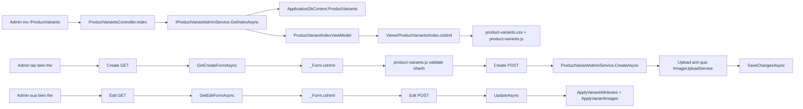

# Tai lieu module quan ly bien the san pham

## 1. Ket luan review code

Module `ProductVariants` hien tai dat yeu cau ve huong tach lop:

- Backend nam trong `Controllers/ProductVariantsController.cs`, `Services/ProductVariants/*`, `ViewModels/ProductVariants/*`.
- Frontend nam trong `Views/ProductVariants/*`, `wwwroot/css/product-variants.css`, `wwwroot/js/product-variants.js`.
- Controller chi dieu phoi request va response, khong viet truc tiep logic EF Core.
- Service xu ly nghiep vu, truy van database, validate backend, upload anh va ap dung thay doi vao entity.
- ViewModel la lop trung gian giua backend va giao dien, view khong nhan truc tiep entity EF Core.
- Razor chi render HTML va gan `data-*` cho JavaScript.
- JavaScript chi validate nhanh, quan ly UI dong va goi AJAX; backend van la noi quyet dinh cuoi cung.
- CSS duoc tach rieng theo module, khong tron vao Razor.
- Ton kho khong con duoc nhap thu cong trong form bien the. Khi tao moi, service gan `Quantity = 0`; khi sua, service khong doc `form.Quantity`.
- Anh bien the duoc upload qua `IImageUploadService`, giup service bien the khong phu thuoc truc tiep vao Cloudinary implementation.

Lenh kiem tra da chay:

```powershell
dotnet build --no-restore -p:UseAppHost=false -o .\obj\build-check-productvariants-docs
```

Ket qua:

```text
Build succeeded.
0 Warning(s)
0 Error(s)
```

Ghi chu: `git diff --check` chi bao canh bao line-ending cua `Program.cs` theo Git tren Windows. Day khong phai loi code.

## 2. Danh sach file lien quan

### Backend

```text
Program.cs
Controllers/ProductVariantsController.cs
Services/ProductVariants/IProductVariantAdminService.cs
Services/ProductVariants/ProductVariantServiceResults.cs
Services/ProductVariants/ProductVariantAdminService.cs
ViewModels/ProductVariants/ProductVariantViewModels.cs
Services/Uploads/IImageUploadService.cs
Models/Entities/CatalogEntities.cs
Data/ApplicationDbContext.cs
```

### Frontend

```text
Views/ProductVariants/Index.cshtml
Views/ProductVariants/Create.cshtml
Views/ProductVariants/Edit.cshtml
Views/ProductVariants/_Form.cshtml
wwwroot/js/product-variants.js
wwwroot/css/product-variants.css
```

## 3. Luong chay tong quat



Y nghia:

- Luong danh sach lay query tu URL, service loc du lieu, map ra row view model, view render bang.
- Luong tao moi lay form rong da co danh sach product, thuoc tinh va mot dong anh mac dinh.
- Luong sua lay entity hien co, map ve form view model, khoa product de tranh doi san pham cua bien the.
- Upload anh chi dien ra trong backend service sau khi validate form thanh cong.
- JavaScript giup nguoi dung thay loi ngay nhung khong thay the validate backend.

## 4. Program.cs

Code lien quan:

```csharp
using e_commerce_web_admin.Services.ProductVariants;
```

Giai thich tung dong:

- `using e_commerce_web_admin.Services.ProductVariants;`: import namespace chua `IProductVariantAdminService` va `ProductVariantAdminService`.

Code dang ky DI:

```csharp
builder.Services.AddScoped<IProductVariantAdminService, ProductVariantAdminService>();
```

Giai thich tung dong:

- `builder.Services`: truy cap container dependency injection cua ASP.NET Core.
- `AddScoped`: moi HTTP request tao mot instance service rieng.
- `IProductVariantAdminService`: controller phu thuoc vao interface.
- `ProductVariantAdminService`: class that su xu ly nghiep vu bien the.

Ly do cach nay sach:

- Controller khong new service truc tiep.
- De thay implementation khac neu can test hoac doi logic.
- Service dung `ApplicationDbContext`, nen vong doi `Scoped` phu hop voi DbContext.

## 5. Controllers/ProductVariantsController.cs

### 5.1. Using va namespace

```csharp
using e_commerce_web_admin.Services.ProductVariants;
using e_commerce_web_admin.ViewModels.ProductVariants;
using Microsoft.AspNetCore.Mvc;

namespace e_commerce_web_admin.Controllers;
```

Giai thich tung dong:

- `using e_commerce_web_admin.Services.ProductVariants;`: lay interface service va cac result/error cua module.
- `using e_commerce_web_admin.ViewModels.ProductVariants;`: lay query, form view model va index view model.
- `using Microsoft.AspNetCore.Mvc;`: lay `Controller`, `IActionResult`, `View`, `Ok`, `NotFound`, `BadRequest`.
- `namespace e_commerce_web_admin.Controllers;`: dat controller trong nhom controller chung cua project.

### 5.2. Khai bao controller va inject service

```csharp
public sealed class ProductVariantsController : Controller
{
    private readonly IProductVariantAdminService _variantService;

    public ProductVariantsController(IProductVariantAdminService variantService)
        => _variantService = variantService;
}
```

Giai thich tung dong:

- `public sealed class ProductVariantsController : Controller`: tao MVC controller, `sealed` de khong cho ke thua ngoai y muon.
- `private readonly IProductVariantAdminService _variantService;`: giu service xu ly nghiep vu.
- Constructor nhan `IProductVariantAdminService`: ASP.NET Core DI tu dong inject.
- `=> _variantService = variantService;`: gan dependency vao field dung trong cac action.

### 5.3. Action Index

```csharp
public async Task<IActionResult> Index(
    string? search,
    string? status,
    string? stock,
    long? productId,
    long? categoryId,
    int page = 1,
    CancellationToken ct = default)
```

Giai thich tung tham so:

- `search`: tu khoa tim SKU, san pham, slug, thuong hieu hoac danh muc.
- `status`: loc `active` hoac `inactive`.
- `stock`: loc `in-stock` hoac `out-of-stock`.
- `productId`: loc theo san pham cha.
- `categoryId`: loc theo danh muc cua san pham cha.
- `page`: trang hien tai, mac dinh la 1.
- `CancellationToken ct`: cho phep huy truy van khi request bi huy.

Code trong action:

```csharp
var viewModel = await _variantService.GetIndexAsync(
    new ProductVariantIndexQuery
    {
        Search = search,
        Status = status,
        Stock = stock,
        ProductId = productId,
        CategoryId = categoryId,
        Page = page,
    },
    ct);

return View(viewModel);
```

Giai thich tung dong:

- Tao `ProductVariantIndexQuery` de gom cac tham so URL vao mot object.
- Goi `_variantService.GetIndexAsync(...)` de backend loc, dem, phan trang va map du lieu.
- Truyen `ct` xuong service de EF Core co the huy query neu can.
- `return View(viewModel);`: tra view `Index.cshtml` cung model da san sang render.

### 5.4. Create GET

```csharp
public async Task<IActionResult> Create(long? productId, CancellationToken ct)
    => View(await _variantService.GetCreateFormAsync(productId, ct));
```

Giai thich tung dong:

- `productId`: neu admin tao bien the tu man san pham, product co the duoc chon san.
- `GetCreateFormAsync`: tao form rong, nap danh sach product, thuoc tinh va anh mac dinh.
- `View(...)`: tra giao dien tao moi.

### 5.5. Create POST

```csharp
[HttpPost, ValidateAntiForgeryToken]
public async Task<IActionResult> Create(ProductVariantFormViewModel viewModel, CancellationToken ct)
```

Giai thich:

- `[HttpPost]`: action chi nhan request POST.
- `[ValidateAntiForgeryToken]`: chan CSRF.
- `ProductVariantFormViewModel viewModel`: model binding tu form HTML.
- `CancellationToken ct`: truyen xuong service.

Code validate ModelState:

```csharp
if (!ModelState.IsValid)
{
    return View(await _variantService.PrepareFormAsync(viewModel, ct));
}
```

- `ModelState.IsValid`: kiem tra DataAnnotations nhu required, range, regex.
- Neu loi, goi `PrepareFormAsync` de nap lai options cho form.
- Tra lai view de hien loi.

Code luu:

```csharp
var result = await _variantService.CreateAsync(viewModel, ct);
if (!result.Succeeded)
{
    AddErrors(result.Errors);
    return View(result.Form);
}
```

- Goi service tao bien the.
- Neu service tra loi nghiep vu, dua loi vao `ModelState`.
- Tra lai form da duoc prepare.

Code thanh cong:

```csharp
TempData["Success"] = result.Message;
return RedirectToAction(nameof(Index), new { productId = result.Form.ProductId });
```

- `TempData["Success"]`: hien toast sau redirect.
- Redirect ve danh sach va giu loc theo product vua tao.

### 5.6. Edit GET va POST

Edit GET:

```csharp
var viewModel = await _variantService.GetEditFormAsync(id, ct);
return viewModel is null ? NotFound() : View(viewModel);
```

- Lay form edit tu service.
- Neu khong co bien the, tra 404.
- Neu co, render view.

Edit POST:

```csharp
if (id != viewModel.Id)
{
    return BadRequest();
}
```

- Dam bao id tren route trung voi hidden field trong form.
- Chan request sua nham record.

```csharp
if (!ModelState.IsValid)
{
    viewModel.IsProductLocked = true;
    return View(await _variantService.PrepareFormAsync(viewModel, ct));
}
```

- Neu DataAnnotations loi, khoa product lai vi edit khong cho doi product.
- Nap lai options roi tra view.

```csharp
var result = await _variantService.UpdateAsync(id, viewModel, ct);
```

- Goi service update.
- Luu y service khong cap nhat `Quantity`, nen ton kho khong bi sua bang form.

### 5.7. Delete va CheckDelete

`CheckDelete`:

```csharp
var result = await _variantService.CheckDeleteAsync(id, ct);
```

- Kiem tra bien the co dang duoc gio hang, wishlist, order, phieu nhap, voucher, promotion tham chieu khong.
- Tra JSON cho JavaScript hien thong bao truoc khi xoa.

`Delete`:

```csharp
var result = await _variantService.DeleteAsync(id, ct);
```

- Xoa that su sau khi service kiem tra an toan.
- Neu bi chan, message duoc dua vao `TempData["Error"]`.

### 5.8. ToggleActive va SetDefault

```csharp
public async Task<IActionResult> ToggleActive(long id, CancellationToken ct)
```

- Dao trang thai ban hang cua bien the.
- Tra JSON `{ isActive = result.Value }`.

```csharp
public async Task<IActionResult> SetDefault(long id, CancellationToken ct)
```

- Dat bien the hien tai lam mac dinh.
- Service tu bo mac dinh cua cac bien the anh em cung product.

### 5.9. AddErrors

```csharp
private void AddErrors(IEnumerable<ProductVariantValidationError> errors)
{
    foreach (var error in errors)
    {
        ModelState.AddModelError(error.FieldName, error.Message);
    }
}
```

Giai thich tung dong:

- Method private chi dung trong controller.
- Duyet tung loi service tra ve.
- `AddModelError`: dua loi vao MVC ModelState de Razor hien dung vi tri field.

## 6. Services/ProductVariants/IProductVariantAdminService.cs

Interface nay dinh nghia hop dong nghiep vu cho controller.

```csharp
Task<ProductVariantIndexViewModel> GetIndexAsync(ProductVariantIndexQuery query, CancellationToken ct = default);
```

- Lay danh sach bien the, thong ke, options loc va phan trang.

```csharp
Task<ProductVariantFormViewModel> GetCreateFormAsync(long? productId = null, CancellationToken ct = default);
```

- Tao model cho man hinh create.

```csharp
Task<ProductVariantFormViewModel?> GetEditFormAsync(long id, CancellationToken ct = default);
```

- Tao model cho man hinh edit.
- Co the tra `null` neu khong tim thay bien the.

```csharp
Task<ProductVariantFormViewModel> PrepareFormAsync(ProductVariantFormViewModel form, CancellationToken ct = default);
```

- Nap lai product options, attribute options, image row mac dinh.
- Dung ca khi GET lan dau va POST bi loi.

```csharp
Task<ProductVariantSaveResult> CreateAsync(ProductVariantFormViewModel form, CancellationToken ct = default);
Task<ProductVariantSaveResult> UpdateAsync(long id, ProductVariantFormViewModel form, CancellationToken ct = default);
```

- Tao va cap nhat bien the.
- Tra result gom thanh cong, message, form va danh sach loi.

```csharp
Task<ProductVariantDeleteCheckResult> CheckDeleteAsync(long id, CancellationToken ct = default);
Task<ProductVariantDeleteResult> DeleteAsync(long id, CancellationToken ct = default);
```

- Tach check xoa va xoa that su.
- Giao dien co the hoi backend truoc khi submit xoa.

```csharp
Task<ProductVariantToggleResult?> ToggleActiveAsync(long id, CancellationToken ct = default);
Task<ProductVariantToggleResult?> SetDefaultAsync(long id, CancellationToken ct = default);
```

- Xu ly action AJAX tren danh sach.
- Tra `null` neu khong tim thay record.

## 7. Services/ProductVariants/ProductVariantServiceResults.cs

### 7.1. ProductVariantValidationError

```csharp
public sealed record ProductVariantValidationError(string FieldName, string Message);
```

- `record`: object nho, immutable theo gia tri.
- `FieldName`: ten field trong ModelState, vi du `Code`, `Images[0].Color`.
- `Message`: noi dung loi tieng Viet.

### 7.2. ProductVariantSaveResult

```csharp
public bool Succeeded { get; init; }
public string? Message { get; init; }
public ProductVariantFormViewModel Form { get; init; } = new();
public IReadOnlyCollection<ProductVariantValidationError> Errors { get; init; } = [];
```

- `Succeeded`: co luu thanh cong khong.
- `Message`: thong bao thanh cong.
- `Form`: form da duoc prepare de render lai.
- `Errors`: danh sach loi service.

Factory methods:

```csharp
public static ProductVariantSaveResult Success(ProductVariantFormViewModel form, string message) =>
    new() { Succeeded = true, Form = form, Message = message };
```

- Tao ket qua thanh cong ngan gon.
- Gan form va message.

```csharp
public static ProductVariantSaveResult Failed(
    ProductVariantFormViewModel form,
    IReadOnlyCollection<ProductVariantValidationError> errors) =>
    new() { Succeeded = false, Form = form, Errors = errors };
```

- Tao ket qua that bai.
- Giu form de view khong mat du lieu nguoi dung vua nhap.

### 7.3. ProductVariantDeleteCheckResult

- `Found`: record co ton tai khong.
- `CanDelete`: co duoc xoa khong.
- `VariantCode`: ma SKU de hien thong bao.
- `Message`: noi dung thong bao.
- `Blockers`: danh sach ly do khong duoc xoa.

Factory:

- `NotFound()`: tra ve khi id khong ton tai.
- `Allowed(variantCode)`: tra ve khi co the xoa.
- `Blocked(variantCode, blockers)`: tra ve khi con du lieu lien quan.

### 7.4. ProductVariantDeleteResult va ProductVariantToggleResult

- `ProductVariantDeleteResult` dung cho action xoa that su.
- `ProductVariantToggleResult(bool Value)` dung cho toggle active va set default.

## 8. ViewModels/ProductVariants/ProductVariantViewModels.cs

### 8.1. ProductVariantIndexQuery

```csharp
public sealed class ProductVariantIndexQuery
{
    public string? Search { get; set; }
    public string? Status { get; set; }
    public string? Stock { get; set; }
    public long? ProductId { get; set; }
    public long? CategoryId { get; set; }
    public int Page { get; set; } = 1;
}
```

Giai thich tung dong:

- `Search`: tu khoa loc.
- `Status`: trang thai active/inactive.
- `Stock`: con hang/het hang.
- `ProductId`: loc theo san pham.
- `CategoryId`: loc theo danh muc.
- `Page`: trang hien tai, mac dinh 1.

### 8.2. ProductVariantIndexViewModel

View model nay gom du lieu cho `Index.cshtml`:

- `Variants`: danh sach row da map san.
- `ProductOptions`: danh sach san pham cho bo loc.
- `CategoryOptions`: danh sach danh muc cho bo loc.
- `Search`, `Status`, `Stock`, `ProductId`, `CategoryId`: giu lai gia tri filter dang ap dung.
- `Page`, `PageSize`, `TotalCount`: phan trang.
- `ActiveCount`, `InactiveCount`, `OutOfStockCount`, `TotalImageCount`: thong ke.

Computed properties:

```csharp
public int TotalPages => PageSize <= 0 ? 0 : (int)Math.Ceiling((double)TotalCount / PageSize);
public bool HasPrev => Page > 1;
public bool HasNext => Page < TotalPages;
```

- `TotalPages`: tinh tong so trang.
- `HasPrev`: co trang truoc hay khong.
- `HasNext`: co trang sau hay khong.

### 8.3. ProductVariantRowViewModel

Dung cho mot dong trong bang danh sach:

- `Id`: khoa chinh bien the.
- `ProductId`: san pham cha.
- `ProductName`, `ProductSlug`: thong tin san pham.
- `BrandName`, `CategoryName`: phan loai.
- `Code`: SKU.
- `Price`: gia ban.
- `SoldCount`: so luong da ban.
- `Quantity`: so ton hien tai doc tu database.
- `IsDefault`: bien the mac dinh.
- `IsActive`: trang thai ban.
- `AttributeSummary`: chuoi tom tat thuoc tinh.
- `ImageCount`: so anh cua bien the.
- `CreatedAt`: ngay tao.

### 8.4. ProductVariantFormViewModel

```csharp
public long Id { get; set; }
```

- Id cua bien the. Khi tao moi la 0.

```csharp
[Required(...)]
[Range(1, long.MaxValue, ...)]
public long? ProductId { get; set; }
```

- San pham cha bat buoc.
- Range dam bao id lon hon 0.

```csharp
public bool IsProductLocked { get; set; }
public string? ProductName { get; set; }
public string? ProductMeta { get; set; }
```

- `IsProductLocked`: edit thi khoa product.
- `ProductName`: ten san pham hien tai.
- `ProductMeta`: thuong hieu va danh muc de hien o form edit.

```csharp
[Required(...)]
[StringLength(80, ...)]
[RegularExpression(@"^[A-Z0-9][A-Z0-9_-]{1,79}$", ...)]
public string Code { get; set; } = string.Empty;
```

- SKU bat buoc.
- Toi da 80 ky tu.
- Chi cho chu in hoa, so, gach ngang, gach duoi.

```csharp
[Required(...)]
[Range(typeof(decimal), "0", "999999999999", ...)]
public decimal? Price { get; set; }
```

- Gia ban bat buoc.
- Khong duoc am.

```csharp
public int Quantity { get; set; }
```

- Chi dung de hien thi ton kho hien tai.
- Khong co input editable trong form.
- Service khong doc gia tri nay khi create/update.

```csharp
public bool IsDefault { get; set; }
public bool IsActive { get; set; } = true;
```

- `IsDefault`: bien the mac dinh cua san pham.
- `IsActive`: co duoc ban khong.

```csharp
public List<ProductVariantProductOptionViewModel> ProductOptions { get; set; } = [];
public List<ProductVariantAttributeInputViewModel> Attributes { get; set; } = [];
public List<ProductVariantImageInputViewModel> Images { get; set; } = [];
```

- Options san pham cho select.
- Danh sach thuoc tinh bien the theo category.
- Danh sach anh bien the.

### 8.5. ProductVariantImageInputViewModel

```csharp
public long? Id { get; set; }
public string? Color { get; set; }
public string? ImagePath { get; set; }
public IFormFile? ImageFile { get; set; }
public string? AltText { get; set; }
public int? Position { get; set; }
public bool Remove { get; set; }
```

Giai thich:

- `Id`: co gia tri neu la anh da ton tai.
- `Color`: mau anh, co the la ma hex hoac ten mau.
- `ImagePath`: URL anh sau khi upload Cloudinary.
- `ImageFile`: file admin chon tu may.
- `AltText`: mo ta anh.
- `Position`: thu tu hien thi.
- `Remove`: danh dau xoa anh cu khi edit.

## 9. Services/ProductVariants/ProductVariantAdminService.cs

### 9.1. Khai bao class va dependencies

```csharp
public sealed class ProductVariantAdminService : IProductVariantAdminService
{
    private const int DefaultPageSize = 30;
    private const string ProductVariantImageFolder = "product-variants";

    private readonly ApplicationDbContext _db;
    private readonly IImageUploadService _imageUploadService;
}
```

Giai thich:

- `sealed`: khong cho ke thua, giup service ro vai tro.
- `DefaultPageSize = 30`: moi trang danh sach co 30 bien the.
- `ProductVariantImageFolder`: folder upload anh tren Cloudinary.
- `_db`: EF Core DbContext.
- `_imageUploadService`: abstraction upload anh.

Constructor:

```csharp
public ProductVariantAdminService(
    ApplicationDbContext db,
    IImageUploadService imageUploadService)
{
    _db = db;
    _imageUploadService = imageUploadService;
}
```

- Nhan DbContext va upload service qua DI.
- Khong tao truc tiep Cloudinary client trong module bien the.

### 9.2. ProductSnapshot

```csharp
private sealed class ProductSnapshot
{
    public long Id { get; init; }
    public long CategoryId { get; init; }
    public string Name { get; init; } = string.Empty;
    public string BrandName { get; init; } = string.Empty;
    public string CategoryName { get; init; } = string.Empty;
}
```

Y nghia tung dong:

- Class private chi dung trong service.
- Chi lay cac truong can cho validate.
- Khong load full entity product khi khong can.
- `CategoryId` dung de biet phai validate nhom thuoc tinh nao.

### 9.3. GetIndexAsync

Method nay xu ly danh sach bien the:

```csharp
var page = Math.Max(1, query.Page);
var dbQuery = _db.ProductVariants.AsNoTracking();
```

- Ep page toi thieu la 1.
- Dung `AsNoTracking` de query danh sach nhanh hon vi khong sua entity.

Loc trang thai:

```csharp
if (query.Status == "active")
{
    dbQuery = dbQuery.Where(variant => variant.IsActive);
}
else if (query.Status == "inactive")
{
    dbQuery = dbQuery.Where(variant => !variant.IsActive);
}
```

- Neu status active, chi lay bien the dang bat.
- Neu inactive, chi lay bien the dang tat.
- Neu rong, lay tat ca.

Loc ton kho:

```csharp
if (query.Stock == "in-stock")
{
    dbQuery = dbQuery.Where(variant => variant.Quantity > 0);
}
else if (query.Stock == "out-of-stock")
{
    dbQuery = dbQuery.Where(variant => variant.Quantity <= 0);
}
```

- Ton kho doc tu `ProductVariant.Quantity`.
- Khong co input thu cong o module nay.

Loc product va category:

```csharp
if (query.ProductId.HasValue)
{
    dbQuery = dbQuery.Where(variant => variant.ProductId == query.ProductId.Value);
}
```

- Loc dung san pham cha.

```csharp
if (query.CategoryId.HasValue)
{
    dbQuery = dbQuery.Where(variant =>
        variant.Product != null &&
        variant.Product.CategoryId == query.CategoryId.Value);
}
```

- Loc theo category cua product cha.
- Co check `variant.Product != null` de tranh null navigation.

Tim kiem:

```csharp
if (!string.IsNullOrWhiteSpace(query.Search))
{
    var term = query.Search.Trim();
    dbQuery = dbQuery.Where(variant =>
        variant.Code.Contains(term) ||
        (variant.Product != null &&
            (variant.Product.Name.Contains(term) ||
             variant.Product.Slug.Contains(term) ||
             (variant.Product.Brand != null && variant.Product.Brand.Name.Contains(term)) ||
             (variant.Product.Category != null && variant.Product.Category.Name.Contains(term)))));
}
```

- Bo qua search rong.
- Trim de khong tim theo khoang trang thua.
- Tim theo SKU, ten san pham, slug, thuong hieu, danh muc.

Thong ke:

```csharp
var totalCount = await dbQuery.CountAsync(ct);
var activeCount = await dbQuery.CountAsync(variant => variant.IsActive, ct);
var inactiveCount = await dbQuery.CountAsync(variant => !variant.IsActive, ct);
var outOfStockCount = await dbQuery.CountAsync(variant => variant.Quantity <= 0, ct);
```

- Dem tren query da ap dung filter.
- Cac con so tren UI phan anh bo loc hien tai.

Lay rows:

```csharp
var entities = await dbQuery
    .Include(variant => variant.Product)
        .ThenInclude(product => product!.Brand)
    .Include(variant => variant.Product)
        .ThenInclude(product => product!.Category)
    .Include(variant => variant.VariantAttributes)
        .ThenInclude(item => item.AttributeOption)
            .ThenInclude(option => option!.Attribute)
    .Include(variant => variant.ProductVariantImages)
    .OrderByDescending(variant => variant.CreatedAt)
    .ThenBy(variant => variant.Code)
    .Skip((page - 1) * DefaultPageSize)
    .Take(DefaultPageSize)
    .ToListAsync(ct);
```

- Include product, brand, category de hien thong tin bang.
- Include attributes de tao `AttributeSummary`.
- Include images de dem anh.
- Sap xep moi nhat truoc, sau do theo SKU.
- `Skip/Take` de phan trang.

Return view model:

```csharp
return new ProductVariantIndexViewModel
{
    Variants = entities.Select(MapRow).ToList(),
    ProductOptions = await BuildProductOptionsAsync(ct),
    CategoryOptions = await BuildCategoryOptionsAsync(ct),
    ...
};
```

- Map entity sang row view model.
- Nap options cho bo loc.
- Giu lai filter va thong ke.

### 9.4. GetCreateFormAsync

```csharp
return await PrepareFormAsync(
    new ProductVariantFormViewModel
    {
        ProductId = productId,
        Quantity = 0,
        IsActive = true,
    },
    ct);
```

- Tao form moi.
- Gan product neu URL co `productId`.
- Ton kho mac dinh 0, khong cho admin nhap tay.
- Bien the mac dinh dang bat.
- Goi `PrepareFormAsync` de nap options.

### 9.5. GetEditFormAsync

```csharp
var entity = await _db.ProductVariants
    .AsNoTracking()
    .Include(...)
    .FirstOrDefaultAsync(variant => variant.Id == id, ct);
```

- Lay bien the theo id.
- Dung `AsNoTracking` vi chi doc de render form.
- Include product, attributes, images de map du lieu edit.

```csharp
if (entity is null)
{
    return null;
}
```

- Controller se chuyen `null` thanh 404.

Map form:

```csharp
var form = new ProductVariantFormViewModel
{
    Id = entity.Id,
    ProductId = entity.ProductId,
    IsProductLocked = true,
    ProductName = entity.Product?.Name,
    ProductMeta = BuildProductMeta(...),
    Code = entity.Code,
    Price = entity.Price,
    Quantity = entity.Quantity,
    IsDefault = entity.IsDefault,
    IsActive = entity.IsActive,
    ...
};
```

- `IsProductLocked = true`: khong doi product khi sua.
- `Quantity = entity.Quantity`: chi de hien thi.
- Attributes va images duoc map sang input view model.

### 9.6. PrepareFormAsync

```csharp
form.ProductOptions = await BuildProductOptionsAsync(ct);
form.Attributes = await BuildAttributeInputsAsync(form.Attributes, ct);
```

- Nap san pham cho dropdown.
- Nap thuoc tinh bien the theo category.
- Giu lai selected value neu form POST bi loi.

```csharp
if (form.ProductId.HasValue)
{
    var selectedProduct = form.ProductOptions.FirstOrDefault(item => item.Id == form.ProductId.Value);
    ...
}
```

- Lay ten san pham, brand va category de hien meta.

```csharp
if (form.Images.Count == 0)
{
    form.Images.Add(new ProductVariantImageInputViewModel());
}
```

- Dam bao form luon co it nhat mot dong anh rong.

### 9.7. CreateAsync

```csharp
NormalizeForm(form);
form = await PrepareFormAsync(form, ct);
```

- Chuan hoa SKU va chuoi anh.
- Nap lai options truoc khi validate.

```csharp
var errors = await ValidateFormAsync(form, existingId: null, ct);
```

- Validate nghiep vu backend.
- `existingId: null` vi tao moi.

```csharp
var uploadErrors = await UploadVariantImagesAsync(form, ct);
```

- Upload anh sau khi validate form.
- Neu upload thanh cong, service gan `ImagePath` bang URL Cloudinary.

Tao entity:

```csharp
var entity = new ProductVariant
{
    ProductId = form.ProductId!.Value,
    Code = form.Code,
    Price = form.Price!.Value,
    Quantity = 0,
    IsDefault = form.IsDefault || !hasExistingVariants,
    IsActive = form.IsActive,
    CreatedAt = DateTime.UtcNow,
};
```

Giai thich tung dong:

- `ProductId`: san pham cha da validate.
- `Code`: SKU da normalize.
- `Price`: gia da validate.
- `Quantity = 0`: ton kho khong nhap tay, se den tu phieu nhap.
- `IsDefault`: neu chua co bien the nao thi tu dong dat mac dinh.
- `IsActive`: lay tu form.
- `CreatedAt`: thoi gian tao UTC.

Them attributes:

```csharp
foreach (var selected in GetSelectedAttributeInputs(form))
{
    entity.VariantAttributes.Add(new VariantAttribute
    {
        AttributeOptionId = selected.SelectedOptionId!.Value,
        CreatedAt = DateTime.UtcNow,
    });
}
```

- Chi lay thuoc tinh cua category san pham.
- Tao row trong bang `variant_attributes`.

Them images:

```csharp
foreach (var image in GetSelectedImageInputs(form))
{
    entity.ProductVariantImages.Add(new ProductVariantImage
    {
        Color = image.Color!,
        ImagePath = image.ImagePath!,
        AltText = image.AltText,
        Position = image.Position!.Value,
    });
}
```

- Chi luu anh co color va image path.
- Image path la URL sau upload.
- Position da duoc tu dong gan neu admin bo trong.

Luu database:

```csharp
_db.ProductVariants.Add(entity);
await _db.SaveChangesAsync(ct);
```

- Them entity vao DbContext.
- EF Core insert bien the, thuoc tinh va anh.

### 9.8. UpdateAsync

```csharp
NormalizeForm(form);
```

- Chuan hoa input truoc khi validate.

```csharp
var entity = await _db.ProductVariants
    .Include(variant => variant.VariantAttributes)
    .Include(variant => variant.ProductVariantImages)
    .FirstOrDefaultAsync(variant => variant.Id == id, ct);
```

- Lay entity tracked de update.
- Include collections can sua.

```csharp
form.Id = entity.Id;
form.ProductId = entity.ProductId;
form.IsProductLocked = true;
```

- Bao ve viec edit khong doi product.
- Neu client gui product id khac, service gan lai id that tu database.

```csharp
entity.Code = form.Code;
entity.Price = form.Price!.Value;
entity.IsDefault = form.IsDefault;
entity.IsActive = form.IsActive;
entity.UpdatedAt = DateTime.UtcNow;
```

- Cap nhat cac truong duoc phep sua.
- Khong co `entity.Quantity = ...`, nen ton kho khong bi sua tu form.

```csharp
ApplyVariantAttributes(entity, GetSelectedAttributeInputs(form));
ApplyVariantImages(entity, GetSelectedImageInputs(form));
```

- Dong bo thuoc tinh va anh theo form moi.

### 9.9. ValidateFormAsync

Validate Product:

```csharp
if (!form.ProductId.HasValue)
{
    errors.Add(new ProductVariantValidationError(nameof(form.ProductId), "Vui long chon san pham."));
    return errors;
}
```

- Product bat buoc.
- Neu thieu product thi dung som vi khong biet category nao de validate thuoc tinh.

Validate ton tai:

```csharp
var product = await GetProductSnapshotAsync(form.ProductId.Value, ct);
if (product is null)
{
    errors.Add(...);
    return errors;
}
```

- Dam bao product id co that trong database.

Validate SKU:

- Rong thi loi bat buoc.
- Trung SKU voi bien the khac thi loi unique.
- Khi edit, bo qua chinh record dang sua.

Validate gia:

```csharp
if (!form.Price.HasValue || form.Price.Value < 0)
{
    errors.Add(new ProductVariantValidationError(nameof(form.Price), "Gia ban khong duoc am."));
}
```

- Gia bat buoc va khong am.

Validate con:

```csharp
ValidateAttributeInputs(form, product.CategoryId, errors);
ValidateImageInputs(form, errors);
```

- Kiem tra thuoc tinh theo category.
- Kiem tra anh, color, file/path, alt text, position.

Validate trung to hop:

```csharp
if (!errors.Any(error => error.FieldName.StartsWith(nameof(form.Attributes), StringComparison.Ordinal)))
{
    await ValidateDuplicateAttributeCombinationAsync(form, existingId, errors, ct);
}
```

- Chi check duplicate khi attributes khong co loi.
- Tranh so sanh to hop khong hop le.

### 9.10. ValidateAttributeInputs

- Loc attribute theo category cua san pham.
- Moi attribute bat buoc phai co option.
- Option duoc chon phai nam trong options hop le.
- Loi gan vao field `Attributes[index].SelectedOptionId` de view hien dung vi tri.

### 9.11. ValidateImageInputs

Quy tac:

- Dong anh rong hoan toan duoc bo qua.
- Neu co bat ky du lieu nao thi color bat buoc.
- Neu chua co `ImagePath` va khong co file moi thi bao loi chon anh.
- `Color` toi da 80 ky tu.
- `ImagePath` toi da 500 ky tu.
- `AltText` toi da 255 ky tu.
- `Position` khong duoc am.

### 9.12. UploadVariantImagesAsync

```csharp
foreach (var item in form.Images.Select((image, index) => new { image, index }))
```

- Duyet kem index de tra loi dung field neu loi.

```csharp
if (item.image.Remove ||
    item.image.ImageFile is null ||
    item.image.ImageFile.Length <= 0)
{
    continue;
}
```

- Bo qua anh bi xoa.
- Bo qua dong khong co file moi.
- Anh cu co `ImagePath` thi khong upload lai.

```csharp
var uploadResult = await _imageUploadService.UploadAsync(
    item.image.ImageFile,
    ProductVariantImageFolder,
    ct);
```

- Goi service upload chung.
- Folder la `product-variants`.

```csharp
item.image.ImagePath = uploadResult.SecureUrl;
```

- Gan URL Cloudinary vao form de cac buoc sau luu database.

### 9.13. ValidateDuplicateAttributeCombinationAsync

- Lay danh sach selected option ids.
- Sap xep va dua ve set.
- Lay cac bien the khac cua cung product.
- So sanh set option cua tung bien the.
- Neu set bang nhau, tra loi "to hop thuoc tinh da ton tai".

Y nghia nghiep vu:

- Mot san pham khong duoc co hai bien the cung mau/dung luong/size.

### 9.14. GetSelectedAttributeInputs

- Neu chua co product id thi tra rong.
- Lay category id cua product dang chon tu `ProductOptions`.
- Chi giu attributes thuoc category do.
- Chi giu attributes da chon option.

### 9.15. GetSelectedImageInputs

- Bo qua anh bi remove.
- Bo qua dong khong co color/path.
- Trim color, image path, alt text.
- Neu position rong, tu gan theo thu tu tang dan.
- Sap xep theo position truoc khi luu.

### 9.16. ApplyVariantAttributes

- Tao set selected option ids moi.
- Xoa `VariantAttribute` cu khong con trong form.
- Giu lai item cu neu van duoc chon.
- Them row moi cho option moi.

Cach nay tot hon xoa het insert lai vi:

- Giam thay doi khong can thiet.
- De EF Core track ro hon.
- Giu lich su created row neu option khong doi.

### 9.17. ApplyVariantImages

- Tach anh cu theo `Id`.
- Anh cu khong con trong selected list se bi xoa.
- Anh cu con lai duoc update color, path, alt, position.
- Anh moi khong co id se duoc add.

### 9.18. ClearSiblingDefaultsAsync

- Tim bien the cung product dang la default.
- Bo default cac bien the khac.
- Dam bao moi product chi co mot bien the mac dinh.

### 9.19. MapRow, BuildAttributeSummary, BuildProductMeta

- `MapRow`: chuyen entity sang row view model cho bang danh sach.
- `BuildAttributeSummary`: tao chuoi `Ten thuoc tinh: Gia tri`.
- `BuildProductMeta`: ghep brand va category bang dau phan cach.

### 9.20. BuildDeleteBlockers

Kiem tra cac quan he co the chan xoa:

- Gio hang.
- Wishlist.
- Dong don hang.
- Dong phieu nhap.
- Quy tac qua tang promotion.
- Pham vi voucher.
- Pham vi promotion.

Neu con bat ky blocker nao, service khong xoa bien the.

### 9.21. NormalizeForm

- Trim SKU va dua ve uppercase.
- Trim color, image path, alt text.
- Chuyen chuoi rong thanh `null`.

Day la diem giup validate va save on dinh hon.

## 10. Views/ProductVariants/Index.cshtml

### 10.1. Phan dau file

```cshtml
@model e_commerce_web_admin.ViewModels.ProductVariants.ProductVariantIndexViewModel
```

- View nhan `ProductVariantIndexViewModel`.
- Khong dung EF entity truc tiep.

```cshtml
var hasFilters = ...
```

- Tinh xem dang co bo loc nao khong.
- Dung de hien nut xoa loc va empty-state phu hop.

### 10.2. Section Styles

```cshtml
<link rel="stylesheet" href="~/css/product-variants.css" asp-append-version="true" />
```

- Nap CSS rieng cua module.
- `asp-append-version` them cache-busting theo file hash.

### 10.3. Hero va thong bao

- Hero hien title, mo ta, nut them bien the.
- `TempData["Success"]` va `TempData["Error"]` hien flash message sau redirect.
- `data-pv-toast-root` la vung JS dung de render toast AJAX.

### 10.4. Metrics

Render 4 the thong ke:

- Tong bien the.
- Dang bat.
- Het hang.
- Anh bien the.

Moi metric chi doc tu ViewModel, khong tinh trong view.

### 10.5. Toolbar filter

Form GET co cac input:

- `search`.
- `productId`.
- `categoryId`.
- `status`.
- `stock`.

Form dung GET de URL co the copy/share va refresh khong mat filter.

### 10.6. Bang danh sach

Moi row hien:

- SKU va ngay tao.
- San pham, brand, category.
- Tom tat thuoc tinh va so anh.
- Gia, ton, so da ban.
- Nut toggle active.
- Nut dat mac dinh.
- Nut sua va xoa.

Nut xoa co:

```cshtml
data-pv-delete
data-pv-id="@variant.Id"
data-pv-code="@variant.Code"
```

- JS dung cac data attribute nay de check xoa va confirm.

### 10.7. Pagination

- Dung `Model.HasPrev`, `Model.HasNext`, `Model.TotalPages`.
- Giu lai filter khi qua trang bang `asp-route-*`.

### 10.8. Section Scripts

```cshtml
<script src="~/js/product-variants.js" asp-append-version="true"></script>
```

- Nap JS rieng cua module.
- Khong nhung JS inline trong view.

## 11. Views/ProductVariants/Create.cshtml va Edit.cshtml

Hai view nay co cau truc giong nhau:

```cshtml
@model ProductVariantFormViewModel
```

- Dung chung form view model.

```cshtml
<form asp-action="Create" method="post" enctype="multipart/form-data" ... data-pv-form>
```

- `method="post"` gui du lieu tao/sua.
- `enctype="multipart/form-data"` bat buoc vi co upload anh.
- `novalidate` tat validation native browser de JS rieng hien loi tieng Viet dong bo.
- `data-pv-form` la hook cho `product-variants.js`.

```cshtml
@Html.AntiForgeryToken()
<partial name="_Form" model="Model" />
```

- Anti-forgery bao ve POST.
- `_Form` tai su dung cho create va edit.

Khac biet:

- Create POST ve `Create`.
- Edit POST ve `Edit` va co `asp-route-id="@Model.Id"`.

## 12. Views/ProductVariants/_Form.cshtml

### 12.1. Bien dau file

```cshtml
var isEdit = Model.Id > 0;
var selectedProduct = Model.ProductOptions.FirstOrDefault(product => product.Id == Model.ProductId);
var attributeItems = Model.Attributes.Select((attribute, index) => new { attribute, index }).ToList();
var imageItems = Model.Images.Select((image, index) => new { image, index }).ToList();
```

- `isEdit`: doi text nut submit.
- `selectedProduct`: hien thong tin product khi edit.
- `attributeItems`: giu index goc de name field dung `Attributes[index]`.
- `imageItems`: giu index goc de name field dung `Images[index]`.

Helper mau:

```cshtml
string PickerColor(string? color)
{
    var value = string.IsNullOrWhiteSpace(color) ? string.Empty : color.Trim();
    return value.Length == 7 && value[0] == '#' && value.Skip(1).All(Uri.IsHexDigit)
        ? value
        : "#111827";
}
```

- Input `type=color` chi nhan hex `#RRGGBB`.
- Neu color dang luu la ten mau hoac rong, picker dung mau mac dinh.
- O text van hien gia tri color that.

### 12.2. Thong tin bien the

- `ProductId`: select product khi create, locked display khi edit.
- `Code`: input SKU co validate required, regex, maxlength.
- `Price`: input number co validate required va min 0.
- `Quantity`: hien thi readonly bang `.pv-readonly-value`.
- Help box: goi y cach dat SKU.

Quan trong:

```cshtml
<div class="pv-readonly-value">
    <strong>@Model.Quantity.ToString("N0")</strong>
    <span>Cap nhat tu phieu nhap kho, khong nhap thu cong tai bien the.</span>
</div>
```

- Khong co input `name="Quantity"`.
- Nguoi dung khong submit ton kho tu form.
- Service cung khong doc `form.Quantity`.

### 12.3. Thuoc tinh bien the

Moi attribute field co:

- Hidden `CategoryId`.
- Hidden `AttributeId`.
- Select `SelectedOptionId`.
- `data-category-id` de JS an/hien theo product category.
- `data-pv-required` de JS validate nhanh.

Field name dung:

```cshtml
name="Attributes[@item.index].SelectedOptionId"
```

- MVC model binder bind ve `ProductVariantFormViewModel.Attributes`.

### 12.4. Anh bien the

Moi dong anh co:

- Hidden `Id`.
- Hidden `Remove`.
- Hidden `Color` de bind ve backend.
- Input `type=color` de chon mau nhanh.
- Input text `.pv-color-text` de sua mau thu cong.
- Hidden `ImagePath` giu URL anh cu hoac URL sau upload.
- File input `ImageFile` co `multiple`.
- Position.
- Preview.
- Alt text.
- Remove button.

Ly do co hidden `Color` va visible text rieng:

- Hidden input co `name="Images[index].Color"` de model binder nhan gia tri.
- Text input khong co name, chi la UI.
- JS dong bo text/picker vao hidden input.
- Cach nay tranh browser submit hai field cung ten.

### 12.5. Template anh

```cshtml
<template data-pv-image-template>
```

- Dung cho JS clone dong anh moi.
- Placeholder `__index__` se duoc JS thay bang index that.

### 12.6. Status panel

- `IsActive`: cho phep ban.
- `IsDefault`: bien the mac dinh.
- Hai field nay la checkbox trong form.

### 12.7. Submit panel

- Nut submit doi text theo create/edit.
- Nut huy quay ve Index.

## 13. wwwroot/js/product-variants.js

### 13.1. Khoi khoi tao

```javascript
'use strict';

document.addEventListener('DOMContentLoaded', () => {
    bindProductVariantFormValidation();
    bindProductAttributeVisibility();
    bindVariantImageRows();
    bindVariantStatusToggles();
    bindVariantDefaultButtons();
    bindVariantDeleteConfirmation();
    bindToastDismiss();
});
```

Giai thich:

- `'use strict'`: bat che do JS nghiem ngat.
- Cho DOM load xong moi bind event.
- Moi `bind...` phu trach mot nhom hanh vi rieng.

### 13.2. bindProductVariantFormValidation

Vai tro:

- Validate required, pattern, number min.
- Validate image rows.
- Hien alert chung khi submit loi.
- Focus field loi dau tien.

Diem quan trong:

```javascript
let hasSubmitted = !alertBox?.classList.contains('hidden');
```

- Neu server tra ve form co loi, alert dang hien, JS biet form da co trang thai loi.

```javascript
field.value = field.value.toUpperCase().replace(/[^A-Z0-9_-]/g, '').slice(0, 80);
```

- SKU tu dong uppercase.
- Loai ky tu khong hop le.
- Cat toi da 80 ky tu.

```javascript
event.preventDefault();
const firstInvalid = form.querySelector('[aria-invalid="true"]');
firstInvalid?.focus();
```

- Chan submit neu client validation loi.
- Dua con tro den field dau tien loi.

### 13.3. getValidatableFields va validateField

`getValidatableFields`:

- Lay field co `data-pv-required`, `data-pv-pattern`, `data-pv-number-min`.
- Bo qua disabled field.
- Bo qua field trong row hidden hoac anh da xoa.

`validateField`:

- Check required truoc.
- Check regex neu co pattern.
- Check min number neu co.
- Goi `setFieldError`.

### 13.4. validateImageRows va validateImageRow

Quy tac UI giong backend:

- Row anh bi remove thi hop le.
- Row rong thi bo qua.
- Neu co color/path/file/alt thi phai co color.
- Neu chua co path va khong chon file thi bao loi.
- Position khong duoc am.

### 13.5. setFieldError va clearFieldError

`setFieldError`:

- Lay error element bang `data-pv-error-target`.
- Ghi message vao span loi.
- Them class `has-error` cho field group.
- Set `aria-invalid` de ho tro accessibility.

`clearFieldError`:

- Xoa message.
- Bo class error.
- Set `aria-invalid=false`.

### 13.6. bindProductAttributeVisibility

Vai tro:

- Khi admin chon product, chi hien thuoc tinh bien the cua category product do.
- Field khong dung category bi disabled de khong submit/validate nham.
- Empty note doi text theo trang thai.

### 13.7. bindVariantImageRows

Xu ly:

- Xoa dong anh.
- Dong bo color picker/text/hidden.
- Chon mot hoac nhieu file.
- Tao preview anh.
- Them dong anh moi tu template.
- Reindex name/id/error target.

Khi xoa anh cu:

```javascript
if (row.dataset.existing === 'true') {
    const removeValue = row.querySelector('[data-pv-image-remove-value]');
    removeValue.value = 'true';
    row.classList.add('is-removed');
}
```

- Anh cu khong remove khoi DOM ngay.
- Hidden `Remove=true` de backend biet can xoa record.

Khi xoa anh moi:

```javascript
row.remove();
```

- Anh moi chua co database id, co the bo khoi DOM.

### 13.8. expandSelectedImageFiles

- Neu admin chon nhieu file cung luc, file dau tien giu o row hien tai.
- Moi file con lai tao them row moi.
- Dung `DataTransfer` de gan file cho input moi.
- Tat ca row moi nhan cung mau dang chon cua row dau.

### 13.9. syncImageColorControl

```javascript
const normalizedColor = (color || '').trim();
```

- Chap nhan color rong.
- Trim khoang trang.

```javascript
colorValue.value = normalizedColor;
```

- Hidden input luon la nguon du lieu submit len backend.

```javascript
if (colorText && !options.fromText) {
    colorText.value = normalizedColor ? normalizedColor.toUpperCase() : '';
}
```

- Neu thay doi tu picker, cap nhat text.
- Neu thay doi tu text, khong ghi nguoc lai text de tranh nhay cursor.

```javascript
if (colorPicker && isHexColor(normalizedColor)) {
    colorPicker.value = normalizedColor;
}
```

- Picker chi cap nhat khi gia tri la hex hop le.
- Neu admin nhap ten mau, text/hidden van giu duoc, picker khong bi loi.

### 13.10. syncImagePreview

- Neu co file moi, tao object URL de preview.
- Neu co image path cu, render anh cu.
- Neu khong co anh, hien empty state.
- Thu hoi object URL cu bang `URL.revokeObjectURL` de tranh leak bo nho.

### 13.11. reindexImageRows

Vai tro:

- Sau khi them/xoa anh, ten field phai lien tuc `Images[0]`, `Images[1]`, ...
- Cap nhat id input.
- Cap nhat label `for`.
- Cap nhat `data-pv-error-target`.
- Cap nhat id span error.

Day la phan quan trong de MVC model binder va validation message dung row.

### 13.12. Toggle, default, delete AJAX

- `getAntiForgeryToken`: lay token CSRF tu form hoac document.
- `toggleVariant`: POST `/ProductVariants/ToggleActive/{id}`.
- `setDefaultVariant`: POST `/ProductVariants/SetDefault/{id}`.
- `checkVariantDelete`: POST `/ProductVariants/CheckDelete/{id}` truoc khi submit delete.
- `showVariantNotice`: hien toast khong reload trang neu AJAX loi.
- `bindToastDismiss`: dong flash message.

## 14. wwwroot/css/product-variants.css

CSS duoc chia theo nhom chuc nang:

### 14.1. Animation va layout page

- `@keyframes pv-fade-up`: tao hieu ung hien len nhe.
- `.pv-page`, `.pv-crud-page`: layout grid cho trang index/create/edit.
- `.pv-anim`: ap dung animation chung.

### 14.2. Header, button va flash

- `.pv-title-row`, `.pv-form-hero`: can title va action.
- `.pv-primary-action`, `.pv-filter-submit`, `.pv-submit-btn`: style nut chinh mau teal.
- `.pv-flash-success`, `.pv-flash-error`: thong bao thanh cong/loi.
- Shadow cua nut la shadow trung tinh `rgba(15, 23, 42, ...)`, khong phai teal glow.

### 14.3. Metrics

- `.pv-metrics`: grid 4 cot desktop.
- `.pv-metric`: item thong ke.
- `.pv-metric-icon-*`: mau icon theo loai thong ke.
- Media query doi thanh 2 cot hoac 1 cot tren man nho.

### 14.4. Filter va table index

- `.pv-filter-grid`: grid bo loc, giup input/select/button deu hang.
- `.pv-search-field`, `.pv-select-field`: control bo loc.
- `.pv-index-grid`: grid bang danh sach.
- `.pv-table-head`: header bang.
- `.pv-row`: dong du lieu.
- `.pv-actions`: nhom nut sua/xoa.
- Media query o 1180px va 900px chuyen table ve layout card de tranh cuon ngang.

### 14.5. Form fields

- `.pv-form-grid`: form chinh dang mot cot.
- `.pv-form-card`: card form.
- `.pv-form-card-head`: header tung nhom.
- `.pv-field-row`: hai cot desktop, mot cot mobile.
- `.pv-input`: input chung.
- `.pv-input:focus`: chi giu vien xanh, khong co vien xam/glow phu.
- `.pv-field.has-error ...`: vien do khi loi.
- `.pv-field-error`: text loi duoi field.

### 14.6. Readonly ton kho

```css
.pv-readonly-value {
    display: grid;
    gap: 0.18rem;
    min-height: 3.2rem;
    border: 1px solid #d9e5e7;
    border-radius: 1rem;
    background: #f8fbfb;
    padding: 0.72rem 0.95rem;
}
```

Giai thich:

- Hien ton kho nhu mot field doc-only.
- Khong dung input de tranh hieu nham co the sua.
- Mau nen nhat hon input editable.

### 14.7. Anh bien the

- `.pv-image-list`: danh sach row anh.
- `.pv-image-row`: container tung anh.
- `.pv-image-row-grid`: 3 cot bang nhau cho mau, file, position.
- `.pv-color-control`: gom picker va text mau.
- `.pv-color-picker`: vong tron chon mau.
- `.pv-color-text`: input text khong border, cho phep sua ma mau.
- `.pv-file-drop`: label custom cho file input.
- `.pv-image-preview`: preview anh.
- `.pv-remove-image-btn`: nut xoa anh.

### 14.8. Switch va submit

- `.pv-switch-row`: dong checkbox custom.
- `.pv-switch-input`: an checkbox native.
- `.pv-switch-track`, `.pv-switch-thumb`: UI toggle.
- `.pv-submit-panel`: nhom nut submit/cancel.

### 14.9. Responsive

- `max-width: 1320px`: giam cot filter.
- `max-width: 1180px`: metrics 2 cot, table thanh layout nhieu dong.
- `max-width: 900px`: filter 2 cot, image row 1 cot.
- `max-width: 640px`: moi nhom ve 1 cot, nut them full width.

## 15. Quan he database lien quan

Module bien the dung cac quan he:

- `products` 1 - n `product_variants`.
- `product_variants` 1 - n `product_variant_images`.
- `product_variants` n - n `attribute_options` thong qua `variant_attributes`.
- `product_variants` 1 - n `cart_items`.
- `product_variants` 1 - n `wishlist`.
- `product_variants` 1 - n `order_items`.
- `product_variants` 1 - n `good_receipt_items`.
- `product_variants` co the duoc tham chieu boi voucher/promotion target polymorphic.
- `product_variants` co the duoc tham chieu boi `promotion_rules.GiftProductVariantId`.

Rang buoc xoa trong service dua tren cac quan he tren de tranh xoa record dang duoc nghiep vu khac dung.

## 16. Luong ton kho

Hien tai module bien the chi hien thi `ProductVariant.Quantity`.

Quy tac trong code:

- Create bien the: `Quantity = 0`.
- Edit bien the: khong cap nhat `Quantity`.
- View: hien `Quantity` trong block readonly.
- JS: khong validate quantity.
- Backend: khong doc `form.Quantity`.

Y nghia:

- Admin khong nhap ton kho thu cong trong module bien the.
- Khi module phieu nhap hang hoan thien, phieu nhap se la noi cap nhat `ProductVariant.Quantity`.

## 17. Luong anh va Cloudinary

Quy tac:

- Admin co the them nhieu anh.
- Moi anh co mau rieng.
- File moi duoc upload qua `IImageUploadService`.
- Service luu `SecureUrl` vao `ProductVariantImage.ImagePath`.
- Anh cu khong co file moi thi giu URL cu.
- Anh bi danh dau `Remove=true` se bi xoa khi update.

Ly do tach qua `IImageUploadService`:

- Module bien the khong can biet chi tiet Cloudinary.
- De test service de hon.
- Neu doi provider upload, chi can doi implementation upload.

## 18. Diem da review ve do sach va bao tri

Dat:

- Controller mong, khong co query EF Core truc tiep.
- Service gom nghiep vu va validation backend.
- ViewModel ro rang cho index, row, form, options, images.
- Frontend khong chua logic database.
- CSS/JS rieng theo module.
- Validate client va server dong bo thong diep tieng Viet.
- Xoa co check rang buoc truoc khi thuc hien.
- Upload anh co abstraction.
- Ton kho khong bi submit thu cong.
- Build 0 warning, 0 error.

Can nho khi phat trien tiep:

- Khi lam module `GoodsReceipts`, can cap nhat `ProductVariant.Quantity` tai service phieu nhap, khong dua input quantity tro lai form bien the.
- Neu muon xoa anh tren Cloudinary khi xoa record, can luu public id hoac tach them metadata upload. Hien tai database chi luu URL.
- Neu so san pham va bien the rat lon, co the can autocomplete server-side cho product select thay vi load tat ca options.

