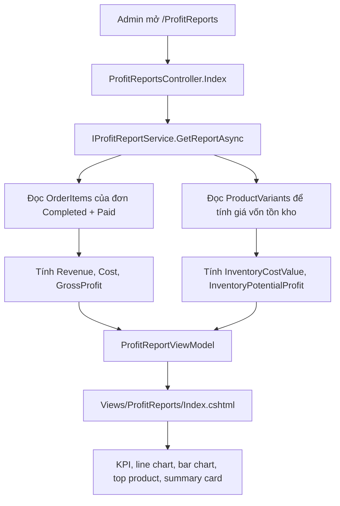
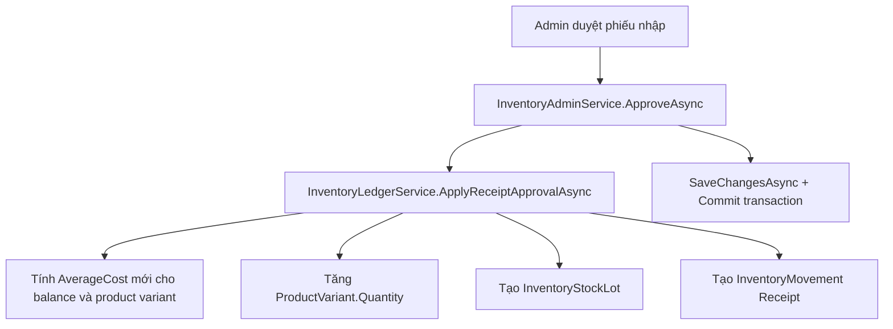
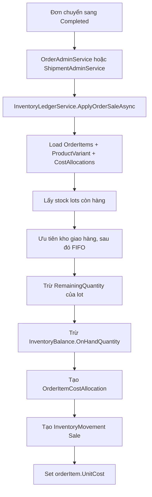
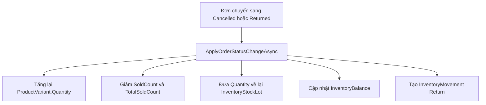

# Tài liệu module tính lãi và báo cáo lãi

## 1. Mục tiêu module

Module tính lãi được thêm để trả lời 2 nhóm câu hỏi:

- Hàng đã bán có lãi gộp bao nhiêu?
- Tồn kho hiện tại đang nằm bao nhiêu giá vốn và nếu bán theo giá hiện tại thì lãi dự kiến là bao nhiêu?

Trong code hiện tại, đây là module báo cáo lãi gộp, không phải báo cáo lãi ròng. Công thức đang dùng:

```text
Lãi gộp hàng bán = doanh thu sản phẩm đã hoàn tất - giá vốn hàng bán đã chốt
Biên lãi gộp = lãi gộp hàng bán / doanh thu sản phẩm đã hoàn tất * 100
Giá vốn tồn kho = tồn hiện tại * giá vốn trung bình
Lãi dự kiến từ tồn kho = tồn hiện tại * (giá bán hiện tại - giá vốn trung bình)
```

Những chi phí chưa được trừ:

- Phí vận chuyển.
- Phí thanh toán.
- Thuế.
- Voucher/giảm giá phân bổ theo từng sản phẩm.
- Chi phí sàn, nhân sự, đóng gói, vận hành.

Vì vậy trên giao diện đã ghi rõ đây là `Lãi gộp`.

## 2. Các file liên quan

### Báo cáo lãi

- `Controllers/ProfitReportsController.cs`
- `Services/ProfitReports/IProfitReportService.cs`
- `Services/ProfitReports/ProfitReportService.cs`
- `ViewModels/ProfitReports/ProfitReportViewModels.cs`
- `Views/ProfitReports/Index.cshtml`
- `Program.cs`
- `Models/Constants/AppConstants.cs`
- `Views/Shared/_Layout.cshtml`

### Nguồn dữ liệu giá vốn và sổ kho

- `Services/Inventory/IInventoryLedgerService.cs`
- `Services/Inventory/InventoryLedgerService.cs`
- `Services/Inventory/InventoryAdminService.cs`
- `Services/Orders/OrderAdminService.cs`
- `Services/Shipping/ShipmentAdminService.cs`
- `Models/Entities/InventoryEntities.cs`
- `Models/Entities/OrderEntities.cs`
- `Models/Entities/CatalogEntities.cs`
- `Models/Enums/CommerceEnums.cs`
- `Data/ApplicationDbContext.cs`
- `Migrations/20260715182837_AddInventoryLedgerProfitTracking.cs`

## 3. Sơ đồ tổng quát



Nguồn `Cost` không lấy trực tiếp từ phiếu nhập tại thời điểm báo cáo. Giá vốn của đơn bán được chốt vào `order_items.UnitCost` khi đơn chuyển sang `Completed`. Nhờ vậy báo cáo lãi không bị thay đổi ngược khi sau này nhập hàng với giá mới.

## 4. Đăng ký module và quyền truy cập

### Dependency injection

Trong `Program.cs`:

```csharp
builder.Services.AddScoped<IProfitReportService, ProfitReportService>();
builder.Services.AddScoped<IInventoryLedgerService, InventoryLedgerService>();
```

Ý nghĩa:

- `IProfitReportService` là service tính số liệu cho trang báo cáo lãi.
- `IInventoryLedgerService` là service ghi sổ kho, chốt giá vốn khi nhập hàng, bán hàng và trả hàng.
- `Scoped` phù hợp với `ApplicationDbContext`, mỗi request có một instance riêng.

### RBAC module

Trong `Models/Constants/AppConstants.cs` đã thêm module:

```csharp
"ProfitReports"
```

Và display name:

```csharp
["ProfitReports"] = "Báo cáo lãi"
```

Controller báo cáo dùng:

```csharp
[RbacAuthorize("ProfitReports", Permissions.View)]
```

Nghĩa là staff phải có quyền `ProfitReports.View` mới vào được trang báo cáo lãi.

## 5. Controller: ProfitReportsController

File: `Controllers/ProfitReportsController.cs`

```csharp
public async Task<IActionResult> Index(string? period, CancellationToken ct = default)
{
    var viewModel = await _profitReportService.GetReportAsync(
        new ProfitReportQuery { Period = period },
        ct);

    return View(viewModel);
}
```

Luồng xử lý:

1. Admin truy cập `/ProfitReports`.
2. Query string có thể có `period`, ví dụ `7d`, `30d`, `90d`, `year`, `all`.
3. Controller tạo `ProfitReportQuery`.
4. Controller gọi `IProfitReportService.GetReportAsync`.
5. Service trả `ProfitReportViewModel`.
6. Razor view render giao diện.

Controller không tự query database. Toàn bộ logic tính toán nằm trong service.

## 6. ViewModel của báo cáo

File: `ViewModels/ProfitReports/ProfitReportViewModels.cs`

### ProfitReportQuery

```csharp
public sealed class ProfitReportQuery
{
    public string? Period { get; set; }
}
```

Dùng để nhận bộ lọc thời gian từ URL.

### ProfitReportViewModel

Các trường KPI:

- `CompletedOrderCount`: số đơn đã hoàn tất và đã thanh toán trong kỳ.
- `SoldQuantity`: tổng số lượng sản phẩm đã bán.
- `Revenue`: doanh thu hàng bán.
- `Cost`: giá vốn hàng bán.
- `GrossProfit`: lãi gộp.
- `GrossMarginPercent`: biên lãi gộp.
- `AverageProfitPerOrder`: lãi gộp trung bình mỗi đơn.
- `InventoryCostValue`: tổng giá vốn tồn kho hiện tại.
- `InventoryPotentialProfit`: lãi dự kiến nếu bán tồn kho theo giá hiện tại.

Các trường biểu đồ và bảng:

- `Trend`: dữ liệu line chart theo ngày hoặc theo tháng.
- `TopProducts`: top 10 sản phẩm tạo lãi tốt nhất.
- `Categories`: top nhóm hàng có lãi gộp cao.
- `PeriodOptions`: danh sách nút lọc thời gian.

## 7. Service tính báo cáo: ProfitReportService

File: `Services/ProfitReports/ProfitReportService.cs`

### 7.1. Chuẩn hóa kỳ báo cáo

Service nhận `period` từ URL và chuẩn hóa:

```text
"7d"   -> 7 ngày gần đây
"30d"  -> 30 ngày gần đây
"90d"  -> 90 ngày gần đây
"year" -> từ đầu năm đến hiện tại
"all"  -> tất cả dữ liệu
mặc định -> "30d"
```

Ngày bắt đầu được tính trong `GetStartDate`:

```text
7d   = hôm nay - 6 ngày
30d  = hôm nay - 29 ngày
90d  = hôm nay - 89 ngày
year = ngày 01/01 của năm hiện tại
all  = null
```

### 7.2. Query đơn hàng được tính lãi

Service chỉ tính các dòng sản phẩm thỏa điều kiện:

```csharp
item.Order.OrderStatus == OrderStatus.Completed
item.Order.PaymentStatus == PaymentStatus.Paid
```

Nếu có `startDate`, service lọc thêm:

```csharp
item.Order.CreatedAt >= startDate
```

Lưu ý quan trọng:

- Mốc thời gian hiện tại đang dựa vào `Order.CreatedAt`, vì entity `Order` chưa có trường `CompletedAt`.
- Nếu sau này cần báo cáo theo ngày hoàn tất thực tế, nên thêm `CompletedAt` vào `orders` và đổi query sang trường đó.

### 7.3. Projection sang SaleRow

Mỗi `OrderItem` được đưa về một dòng nội bộ `SaleRow` gồm:

- `OrderId`
- `OrderedAt`
- `ProductName`
- `VariantCode`
- `CategoryName`
- `Quantity`
- `UnitPrice`
- `UnitCost`

Công thức trong `SaleRow`:

```csharp
public decimal Revenue => UnitPrice * Quantity;
public decimal Cost => UnitCost * Quantity;
public decimal Profit => Revenue - Cost;
```

`UnitCost` là giá vốn đã chốt trên `order_items`, không phải giá vốn mới nhất của SKU.

### 7.4. KPI chính

Service tính:

```text
revenue = sum(SaleRow.Revenue)
cost = sum(SaleRow.Cost)
grossProfit = revenue - cost
completedOrderCount = distinct OrderId
soldQuantity = sum(Quantity)
grossMarginPercent = grossProfit / revenue * 100
averageProfitPerOrder = grossProfit / completedOrderCount
```

Nếu mẫu số bằng 0 thì kết quả phần trăm hoặc trung bình trả về 0 để tránh lỗi chia 0.

### 7.5. KPI tồn kho

Service đọc `ProductVariants`:

```csharp
InventoryCostValue = Sum(variant.Quantity * variant.AverageCost)
InventoryPotentialProfit = Sum(variant.Quantity * (variant.Price - variant.AverageCost))
```

Ý nghĩa:

- `Quantity`: tồn kho hiện tại của SKU.
- `AverageCost`: giá vốn trung bình hiện tại của SKU.
- `Price`: giá bán hiện tại của SKU.

`InventoryPotentialProfit` chỉ là dự kiến, không phải lãi đã phát sinh. Nếu sau này đổi giá bán, số này sẽ đổi theo.

### 7.6. Trend chart

`BuildTrend` gom dữ liệu theo:

- Ngày, nếu khoảng thời gian nhỏ hơn hoặc bằng 120 ngày.
- Tháng, nếu khoảng thời gian lớn hơn 120 ngày.

Mỗi điểm có:

- `Label`
- `Revenue`
- `Cost`
- `GrossProfit`

Service tạo đủ điểm cho mỗi ngày hoặc mỗi tháng trong khoảng thời gian. Ngày nào không có đơn thì giá trị bằng 0. Cách này giúp chart không bị đứt trục thời gian.

### 7.7. Top products

`BuildTopProducts` group theo:

```csharp
new { item.ProductName, item.VariantCode }
```

Mỗi dòng tính:

- Tổng số lượng.
- Tổng doanh thu.
- Tổng giá vốn.
- Lãi gộp.
- Biên lãi.

Sau đó sắp xếp:

1. `GrossProfit` giảm dần.
2. `Revenue` giảm dần.
3. Lấy top 10.

### 7.8. Categories

`BuildCategories` group theo `CategoryName`.

Mỗi nhóm tính:

- Tổng số lượng.
- Tổng doanh thu.
- Tổng lãi gộp.
- Biên lãi.

Sau đó sắp xếp theo `GrossProfit` giảm dần và lấy top 8.

## 8. Giao diện báo cáo: Views/ProfitReports/Index.cshtml

Trang Razor nhận:

```csharp
@model ProfitReportViewModel
```

Thành phần giao diện:

- Header và breadcrumb.
- Nút lọc kỳ báo cáo: 7 ngày, 30 ngày, 90 ngày, năm nay, tất cả dữ liệu.
- 4 KPI chính: doanh thu, giá vốn, lãi gộp, lãi trung bình mỗi đơn.
- Line chart doanh thu, giá vốn và lãi gộp.
- Bar chart lãi theo nhóm hàng.
- Top sản phẩm tạo lãi.
- Các card tồn kho: giá vốn tồn kho, lãi dự kiến từ tồn kho.
- Hướng dẫn đọc nhanh.

Chart được render bằng `Chart.js` từ dữ liệu JSON:

```csharp
var trendJson = JsonSerializer.Serialize(Model.Trend.Select(...));
var categoryJson = JsonSerializer.Serialize(Model.Categories.Select(...));
```

Responsive hiện tại:

- Mobile và tablet nhỏ hiển thị danh sách sản phẩm dạng card để tránh bảng bị vỡ.
- Từ desktop rộng hơn hiển thị bảng đầy đủ.
- Các chart chỉ chia cột khi màn hình đủ rộng.
- Các nút period tự xuống dòng, không cuộn ngang.

## 9. Database đã thêm để xử lý giá vốn và tính lãi

Migration: `Migrations/20260715182837_AddInventoryLedgerProfitTracking.cs`

### 9.1. Cột mới trên bảng cũ

#### `product_variants.AverageCost`

```text
decimal(18,2), not null, default 0
```

Dùng để lưu giá vốn trung bình hiện tại của SKU.

Được cập nhật khi phiếu nhập được duyệt:

```text
AverageCost mới =
(số tồn cũ * average cost cũ + số nhập mới * giá nhập mới) / (số tồn cũ + số nhập mới)
```

#### `order_items.UnitCost`

```text
decimal(18,2), not null, default 0
```

Dùng để lưu giá vốn đã chốt của từng dòng đơn hàng.

Đây là cột quan trọng nhất của báo cáo lãi. Báo cáo tính:

```text
Cost = order_items.UnitCost * order_items.Quantity
```

Lý do phải chốt vào `order_items`:

- Giá nhập sau này có thể thay đổi.
- Average cost sau này có thể thay đổi.
- Báo cáo đơn đã bán không được thay đổi ngược theo giá vốn mới.

#### `goods_receipts.FulfillmentLocationId`

```text
bigint, nullable, FK -> fulfillment_locations.Id
```

Dùng để biết phiếu nhập thuộc điểm/kho nào. Nếu không có, ledger fallback về kho mặc định đang active.

### 9.2. Bảng mới: `inventory_stock_lots`

Bảng này đại diện cho lô hàng nhập.

Cột chính:

- `Id`
- `ProductVariantId`
- `FulfillmentLocationId`
- `GoodReceiptItemId`
- `LotCode`
- `ReceivedQuantity`
- `RemainingQuantity`
- `UnitCost`
- `ReceivedAt`
- `CreatedAt`
- `UpdatedAt`

Ý nghĩa:

- Mỗi dòng phiếu nhập được duyệt tạo một stock lot.
- `UnitCost` là giá nhập của lô.
- `RemainingQuantity` giảm dần khi bán hàng.
- Bán hàng sẽ trừ theo lô, ưu tiên kho giao hàng rồi FIFO theo `ReceivedAt`, `Id`.

Index/constraint quan trọng:

- Unique `LotCode`.
- Unique `GoodReceiptItemId` khi không null.
- Index `ProductVariantId`.
- Index `FulfillmentLocationId`.

### 9.3. Bảng mới: `inventory_balances`

Bảng này lưu tồn kho theo SKU và địa điểm/kho.

Cột chính:

- `Id`
- `ProductVariantId`
- `FulfillmentLocationId`
- `OnHandQuantity`
- `ReservedQuantity`
- `AverageCost`
- `UpdatedAt`
- `RowVersion`

Ý nghĩa:

- `OnHandQuantity`: tồn vật lý tại kho.
- `ReservedQuantity`: số lượng đã giữ cho đơn nhưng chưa xuất, hiện tại đã có cột để mở rộng.
- `AverageCost`: giá vốn trung bình theo SKU và kho.
- `RowVersion`: hỗ trợ optimistic concurrency khi sau này cần tránh ghi đè tồn kho.

Index/constraint:

- Unique `(ProductVariantId, FulfillmentLocationId)`.

### 9.4. Bảng mới: `inventory_movements`

Bảng này là lịch sử di chuyển kho.

Cột chính:

- `Id`
- `ProductVariantId`
- `FulfillmentLocationId`
- `StockLotId`
- `Type`
- `QuantityDelta`
- `ReservedQuantityDelta`
- `UnitCost`
- `TotalCost`
- `ReferenceType`
- `ReferenceId`
- `Note`
- `OccurredAt`
- `CreatedAt`

Enum `InventoryMovementType` gồm:

```text
Receipt
Reserve
Release
Sale
Return
Adjustment
TransferIn
TransferOut
```

Ý nghĩa:

- Nhập kho tạo movement `Receipt`.
- Bán hàng tạo movement `Sale`.
- Trả/hủy đơn tạo movement `Return`.
- Migration backfill tồn đầu kỳ tạo movement `Adjustment`.

Index quan trọng:

- `(ProductVariantId, OccurredAt)` để xem lịch sử theo SKU.
- `(ReferenceType, ReferenceId)` để truy nguồn theo nghiệp vụ.
- `StockLotId`.
- `FulfillmentLocationId`.

### 9.5. Bảng mới: `order_item_cost_allocations`

Bảng này lưu dòng đơn hàng đã lấy giá vốn từ lô hàng nào.

Cột chính:

- `Id`
- `OrderItemId`
- `StockLotId`
- `Quantity`
- `UnitCost`
- `CreatedAt`

Ý nghĩa:

- Một `OrderItem` có thể lấy hàng từ nhiều stock lot.
- Mỗi allocation ghi `Quantity` và `UnitCost` của lô đã dùng.
- Khi trả/hủy đơn, hệ thống đưa số lượng này về lại đúng stock lot cũ.

## 10. Backfill dữ liệu cũ trong migration

Migration không chỉ tạo schema, mà còn backfill dữ liệu hiện có:

1. Tìm kho mặc định active:

```sql
SELECT TOP (1) @defaultLocationId = Id
FROM fulfillment_locations
WHERE IsActive = 1
ORDER BY IsDefault DESC, Name ASC
```

2. Gán `FulfillmentLocationId` cho các phiếu nhập đã approved nếu đang null.

3. Tính `product_variants.AverageCost` từ các `good_receipt_items` của phiếu nhập approved:

```text
AverageCost = tổng(Quantity * ImportPrice) / tổng(Quantity)
```

4. Backfill `order_items.UnitCost = product_variants.AverageCost` với các order item đang có `UnitCost = 0`.

5. Tạo lot đầu kỳ `OPEN-{variantId}` cho SKU đang có tồn.

6. Tạo `inventory_balances` đầu kỳ.

7. Tạo `inventory_movements` loại `Adjustment` để ghi nhận tồn đầu kỳ.

Lưu ý:

- Dữ liệu lịch sử trước migration không có allocation theo lô thật sự.
- Vì vậy `UnitCost` backfill cho đơn cũ là giá vốn trung bình tại thời điểm migration, không chính xác bằng việc có sổ lô từ đầu.
- Các đơn mới sau migration sẽ chính xác hơn vì giá vốn được chốt khi đơn completed.

## 11. Luồng nhập kho và cập nhật giá vốn



Chi tiết trong `ApplyReceiptApprovalAsync`:

1. Xác định `FulfillmentLocationId`.
2. Group item theo `ProductVariantId`.
3. Tính `incomingQuantity` và `incomingValue`.
4. Lấy hoặc tạo `InventoryBalance`.
5. Cập nhật average cost theo công thức weighted average.
6. Tăng `balance.OnHandQuantity`.
7. Cập nhật `variant.AverageCost`.
8. Tăng `variant.Quantity`.
9. Tạo `InventoryStockLot` cho từng dòng phiếu nhập.
10. Tạo `InventoryMovement` type `Receipt`.

Công thức weighted average:

```text
nextQuantity = oldQuantity + incomingQuantity
oldValue = oldQuantity * oldAverageCost
newAverageCost = (oldValue + incomingValue) / nextQuantity
```

Kết quả làm tròn 2 chữ số thập phân bằng `MidpointRounding.AwayFromZero`.

## 12. Luồng đơn hàng hoàn tất và chốt giá vốn



Nguồn gọi:

- `Services/Orders/OrderAdminService.cs`: khi admin cập nhật trạng thái đơn sang `Completed`.
- `Services/Shipping/ShipmentAdminService.cs`: khi đồng bộ giao hàng làm đơn chuyển sang `Completed`.

Điều kiện idempotency:

```csharp
item.UnitCost <= 0 && item.CostAllocations.Count == 0
```

Nghĩa là nếu đơn đã chốt giá vốn rồi, service không chốt lại lần nữa. Điều này tránh trừ kho và ghi giá vốn trùng lặp.

Thuật toán chọn lot:

1. Lọc lot cùng SKU và `RemainingQuantity > 0`.
2. Ưu tiên lot có `FulfillmentLocationId` trùng với kho giao hàng.
3. Sau đó sắp xếp theo `ReceivedAt`.
4. Nếu cùng thời gian, sắp xếp theo `Id`.

Khi lot không đủ hàng:

- Service tiếp tục lấy các lot tiếp theo.
- Nếu vẫn còn thiếu, phần thiếu được tính theo `ProductVariant.AverageCost`.
- Sau đó set `orderItem.UnitCost = totalCost / orderItem.Quantity`.

Đây là fallback để báo cáo không bị mất giá vốn khi dữ liệu tồn kho không đủ, nhưng vận hành thật nên tránh để tồn kho âm hoặc không đủ allocation.

## 13. Luồng hủy/trả đơn và hoàn tồn



Service chỉ xử lý khi:

```csharp
from != to
to is Cancelled or Returned
```

Nếu order item có cost allocations, service đưa đúng số lượng về lại stock lot cũ. Nhờ vậy lịch sử lot và tồn kho khớp với lần xuất bán trước đó.

## 14. Vì sao báo cáo lãi đọc order_items.UnitCost

Nếu báo cáo đọc `product_variants.AverageCost` trực tiếp tại thời điểm xem báo cáo, số lãi lịch sử sẽ sai khi:

- Sau khi bán hàng, admin nhập thêm hàng với giá khác.
- Average cost thay đổi.
- Đơn đã bán trước đó bị tính lại theo giá vốn mới.

Thiết kế hiện tại dùng `order_items.UnitCost` để snapshot giá vốn tại lúc đơn completed.

Ví dụ:

```text
Ngày 01: Nhập 10 sản phẩm giá 100.000
Ngày 02: Bán 1 sản phẩm, chốt UnitCost = 100.000
Ngày 03: Nhập 10 sản phẩm giá 200.000, AverageCost tăng
Báo cáo đơn ngày 02 vẫn phải dùng UnitCost = 100.000
```

## 15. Công thức trong báo cáo

### Doanh thu hàng bán

```text
Revenue = sum(order_items.UnitPrice * order_items.Quantity)
```

Chỉ tính dòng sản phẩm của đơn:

```text
OrderStatus = Completed
PaymentStatus = Paid
```

### Giá vốn hàng bán

```text
Cost = sum(order_items.UnitCost * order_items.Quantity)
```

### Lãi gộp

```text
GrossProfit = Revenue - Cost
```

### Biên lãi

```text
GrossMarginPercent = GrossProfit / Revenue * 100
```

Nếu `Revenue = 0` thì `GrossMarginPercent = 0`.

### Lãi trung bình mỗi đơn

```text
AverageProfitPerOrder = GrossProfit / distinct completed paid orders
```

Nếu không có đơn thì giá trị bằng 0.

### Giá vốn tồn kho

```text
InventoryCostValue = sum(product_variants.Quantity * product_variants.AverageCost)
```

### Lãi dự kiến từ tồn kho

```text
InventoryPotentialProfit = sum(product_variants.Quantity * (product_variants.Price - product_variants.AverageCost))
```

## 16. Các điểm cần lưu ý khi dùng trong hệ thống kho thật

### 16.1. Đây là lãi gộp, chưa phải lãi ròng

Báo cáo hiện tại phù hợp để xem biên lãi hàng hóa. Nếu muốn lãi ròng, cần bổ sung:

- Phân bổ voucher/giảm giá về từng order item.
- Phí ship thực trả cho đơn.
- Phí thanh toán/COD.
- Thuế.
- Chi phí vận hành.

### 16.2. Nên có ngày completed riêng

Hiện tại period lọc theo `Order.CreatedAt`. Nếu nghiệp vụ cần báo cáo theo ngày giao/hoàn tất, nên thêm:

- `orders.CompletedAt`
- Cập nhật trường này khi đơn chuyển sang `Completed`
- Đổi query báo cáo sang `CompletedAt`

### 16.3. Đơn cũ trước migration chỉ là backfill gần đúng

Migration gán `order_items.UnitCost` của đơn cũ theo average cost hiện có. Nếu cần số lịch sử chính xác, cần có dữ liệu lô hàng lịch sử hoặc import lại lịch sử nhập/xuất.

### 16.4. Cần tránh tồn kho âm

`ApplyOrderSaleAsync` có fallback bằng `ProductVariant.AverageCost` nếu stock lot không đủ. Fallback giúp báo cáo không lỗi, nhưng vận hành thật nên có rule chặn completed khi tồn kho không đủ.

### 16.5. Average cost và lot đang cùng tồn tại

Thiết kế hiện tại dùng cả hai:

- `InventoryStockLot`: truy vết lô và allocation chính xác.
- `AverageCost`: tính nhanh tồn kho và fallback giá vốn.

Đây là cách dùng đúng cho hệ thống kho cần báo cáo nhanh nhưng vẫn có truy vết.

## 17. Checklist khi mở rộng module

Nếu sau này thêm chi phí để tính lãi ròng:

1. Thêm cột/bảng lưu chi phí.
2. Xác định chi phí gắn theo order hay order item.
3. Nếu chi phí order-level, cần rule phân bổ về item.
4. Thêm trường vào `ProfitReportViewModel`.
5. Cập nhật `ProfitReportService`.
6. Cập nhật `Views/ProfitReports/Index.cshtml`.
7. Cập nhật docs này.

Nếu thêm kho đa địa điểm nâng cao:

1. Bắt buộc mỗi phiếu nhập có `FulfillmentLocationId`.
2. Bắt buộc mỗi shipment/order có kho xuất.
3. Chặn completed nếu lot tại kho đó không đủ.
4. Xử lý transfer lot giữa kho bằng `TransferIn`/`TransferOut`.

Nếu thêm báo cáo theo thời gian hoàn tất:

1. Thêm `CompletedAt`.
2. Backfill `CompletedAt` cho đơn cũ nếu có dữ liệu giao hàng.
3. Đổi `ProfitReportService` lọc theo `CompletedAt`.
4. Đổi trend group theo `CompletedAt`.

## 18. Kết luận kiến trúc

Module tính lãi hiện tại được tách theo 2 lớp nghiệp vụ:

1. Lớp ghi nhận giá vốn: `InventoryLedgerService`
   - Nhập kho tạo lot, balance, movement.
   - Đơn completed chốt `order_items.UnitCost`.
   - Trả/hủy đơn hoàn tồn theo allocation.

2. Lớp báo cáo: `ProfitReportService`
   - Chỉ đọc dữ liệu đã chốt.
   - Tính KPI, trend, top product, category.
   - Trả ViewModel sạch cho Razor.

Thiết kế này đúng hướng cho hệ thống kho thực tế vì số lãi của đơn đã bán được đóng băng tại lúc đơn hoàn tất, không bị thay đổi ngược khi giá nhập hoặc tồn kho sau này thay đổi.
