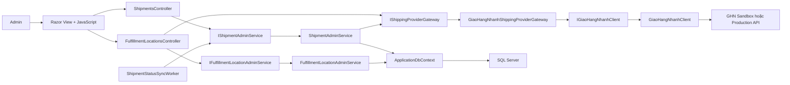
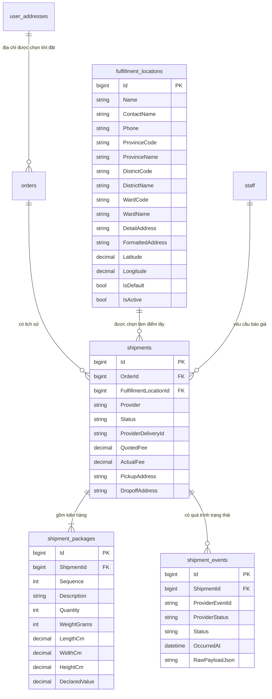
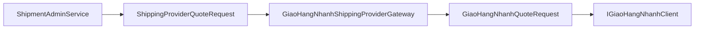
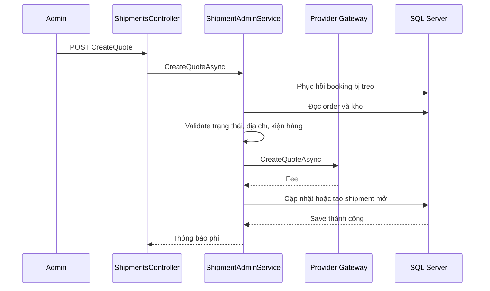
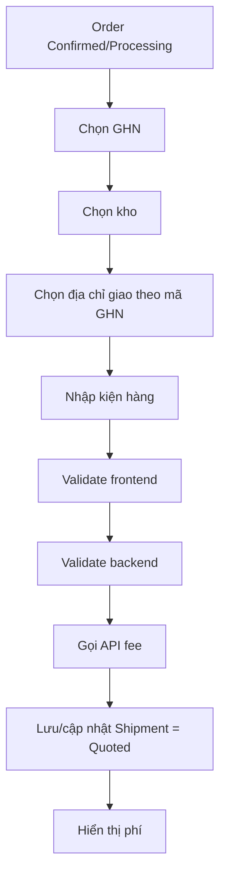
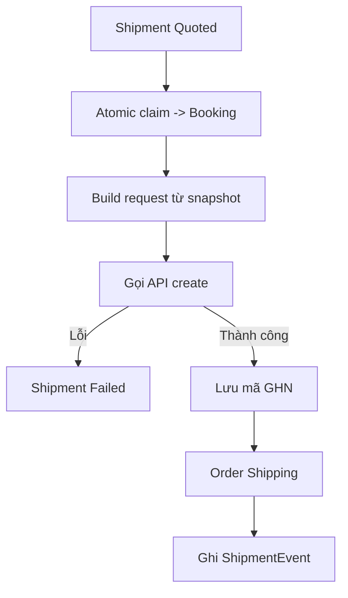
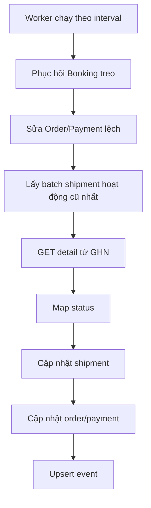
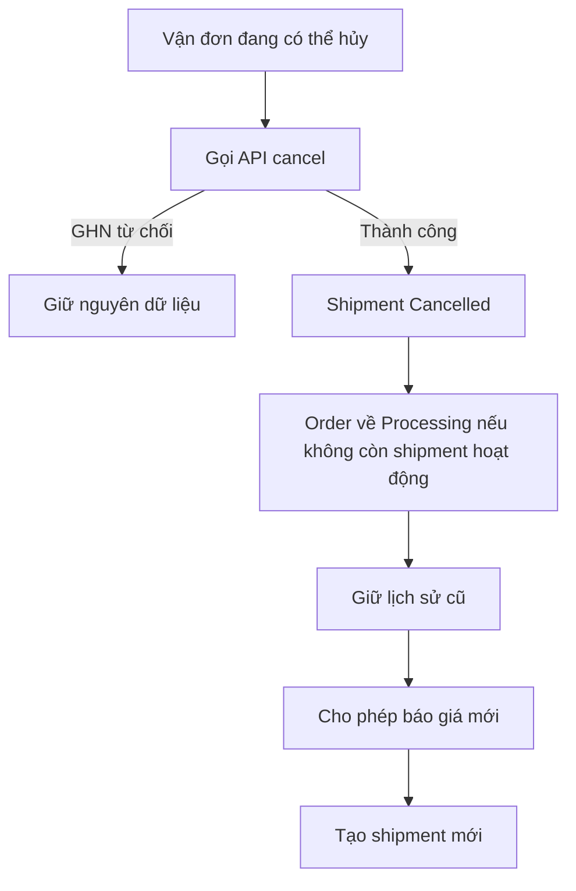

# Tài liệu module vận chuyển và tích hợp Giao Hàng Nhanh

## 1. Mục đích tài liệu

Tài liệu này mô tả toàn bộ phần code liên quan đến vận chuyển trong trang quản trị, từ dữ liệu trong SQL Server đến giao diện admin và kết nối API Giao Hàng Nhanh.

Phạm vi gồm:

- Quản lý điểm lấy hàng.
- Lưu thông tin kiện hàng riêng với biến thể sản phẩm.
- Lấy báo giá GHN.
- Tạo vận đơn GHN.
- Hủy vận đơn.
- Theo dõi và đồng bộ trạng thái bằng API nền.
- Lưu lịch sử trạng thái vận chuyển.
- Đồng bộ trạng thái vận chuyển sang trạng thái đơn hàng và thanh toán.
- Webhook GHN được giữ lại nhưng đang tắt.
- Các ràng buộc chống tạo dữ liệu trùng và phục hồi thao tác bị gián đoạn.
- Cách mở rộng để tích hợp thêm đơn vị vận chuyển khác.

Tài liệu phản ánh cấu trúc code hiện tại sau đợt review ngày 24/06/2026.

## 2. Trạng thái hiện tại

Module hiện sử dụng Giao Hàng Nhanh làm nhà vận chuyển duy nhất:

```csharp
public enum ShippingProvider
{
    GiaoHangNhanh = 0
}
```

Trạng thái vận đơn được đồng bộ chủ yếu bằng API nền:

```json
"EnableBackgroundStatusSync": true,
"EnableWebhookProcessing": false
```

Webhook vẫn tồn tại tại:

```text
POST /api/giao-hang-nhanh/webhook
```

Nhưng khi `EnableWebhookProcessing = false`, endpoint chỉ trả HTTP `202 Accepted` và không thay đổi dữ liệu.

Database không còn bảng `shipment_quotes`. Báo giá gần nhất được giữ ngay trên bản ghi `shipments` chưa có mã vận đơn. Cách này tránh việc admin bấm báo giá nhiều lần làm phát sinh không giới hạn các dòng báo giá.

## 3. Danh sách file liên quan

### 3.1. Cấu hình và đăng ký dependency injection

- `Program.cs`
- `appsettings.json`
- `appsettings.Development.json`
- `appsettings.example.json`

### 3.2. Entity, enum và Entity Framework Core

- `Models/Enums/CommerceEnums.cs`
- `Models/Entities/ShippingEntities.cs`
- `Models/Entities/OrderEntities.cs`
- `Models/Entities/UserEntities.cs`
- `Models/Entities/StaffEntities.cs`
- `Models/Constants/AppConstants.cs`
- `Data/ApplicationDbContext.cs`

### 3.3. Integration riêng của GHN

- `Integrations/GiaoHangNhanh/GiaoHangNhanhOptions.cs`
- `Integrations/GiaoHangNhanh/IGiaoHangNhanhClient.cs`
- `Integrations/GiaoHangNhanh/GiaoHangNhanhClient.cs`
- `Integrations/GiaoHangNhanh/GiaoHangNhanhModels.cs`
- `Integrations/GiaoHangNhanh/GiaoHangNhanhServiceCollectionExtensions.cs`

### 3.4. Lớp abstraction cho nhà vận chuyển

- `Services/Shipping/Providers/IShippingProviderGateway.cs`
- `Services/Shipping/Providers/GiaoHangNhanhShippingProviderGateway.cs`

### 3.5. Nghiệp vụ vận chuyển

- `Services/Shipping/IShipmentAdminService.cs`
- `Services/Shipping/ShipmentAdminService.cs`
- `Services/Shipping/ShipmentServiceResults.cs`
- `Services/Shipping/ShipmentStatusMapper.cs`
- `Services/Shipping/ShipmentStatusSyncWorker.cs`

### 3.6. Quản lý điểm lấy hàng

- `Controllers/FulfillmentLocationsController.cs`
- `Services/FulfillmentLocations/IFulfillmentLocationAdminService.cs`
- `Services/FulfillmentLocations/FulfillmentLocationAdminService.cs`
- `ViewModels/FulfillmentLocations/FulfillmentLocationViewModels.cs`
- `Views/FulfillmentLocations/Index.cshtml`
- `Views/FulfillmentLocations/Create.cshtml`
- `Views/FulfillmentLocations/Edit.cshtml`
- `Views/FulfillmentLocations/_Editor.cshtml`
- `Views/FulfillmentLocations/_Form.cshtml`
- `wwwroot/js/fulfillment-locations.js`
- `wwwroot/css/fulfillment-locations.css`

### 3.7. Giao diện vận chuyển trong đơn hàng

- `Controllers/ShipmentsController.cs`
- `Services/Orders/OrderAdminService.cs`
- `ViewModels/Orders/OrderViewModels.cs`
- `ViewModels/Shipments/ShipmentViewModels.cs`
- `ViewModels/Shipments/ShipmentFormNumberParser.cs`
- `Views/Orders/Details.cshtml`
- `Views/Orders/Index.cshtml`
- `wwwroot/js/orders.js`
- `wwwroot/css/orders.css`

### 3.8. Migration

- `20260620071148_AddGrabShippingTables`
- `20260621132912_AddGhnAddressCodes`
- `20260622005213_AddShipmentProviderAddressFields`
- `20260622163645_RemoveShipmentQuotesTable`
- `20260623153501_AddShipmentAddressSnapshots`
- `20260624042728_AddOpenShipmentConstraint`
- `20260624043430_EnforceSingleDefaultLocation`

Tên migration `AddGrabShippingTables` là tên lịch sử từ giai đoạn đầu. Không nên đổi tên migration đã áp dụng vì `__EFMigrationsHistory` đang dùng chính ID đó.

## 4. Kiến trúc tổng thể



Ý nghĩa từng lớp:

- Razor View chịu trách nhiệm render HTML.
- JavaScript xử lý modal, tải địa chỉ GHN, hiển thị lỗi nhanh và tương tác giao diện.
- Controller nhận HTTP request, kiểm tra quyền, gọi service và điều hướng.
- Service chứa nghiệp vụ và là nơi quyết định cuối cùng dữ liệu có hợp lệ hay không.
- Provider gateway cung cấp hợp đồng trung lập, không để service nghiệp vụ phụ thuộc trực tiếp vào model GHN.
- GHN client chỉ phụ trách HTTP, header, JSON request, JSON response và lỗi mạng.
- Background worker định kỳ gọi API chi tiết đơn GHN để đồng bộ trạng thái.
- Entity Framework Core quản lý snapshot, vận đơn, kiện hàng và lịch sử sự kiện.

Đây là ứng dụng ASP.NET Core MVC nên frontend và backend được tách theo file và trách nhiệm, nhưng không phải hai ứng dụng triển khai độc lập như SPA + REST API.

## 5. Mô hình dữ liệu

### 5.1. Sơ đồ quan hệ



### 5.2. `FulfillmentLocation`

File: `Models/Entities/ShippingEntities.cs`

Entity này đại diện kho hoặc cửa hàng mà đơn vị vận chuyển tới lấy hàng.

| Thuộc tính | Ý nghĩa |
|---|---|
| `Id` | Khóa chính nội bộ. |
| `Name` | Tên hiển thị của kho, ví dụ `Kho Hóc Môn`. |
| `ContactName` | Người GHN liên hệ khi tới lấy hàng. |
| `Phone` | Số điện thoại liên hệ của kho. |
| `ProvinceCode` | Mã tỉnh/thành lấy từ dữ liệu GHN. |
| `ProvinceName` | Tên tỉnh/thành. |
| `DistrictCode` | Mã quận/huyện GHN. Đây là mã quan trọng khi báo giá. |
| `DistrictName` | Tên quận/huyện dùng khi tạo vận đơn. |
| `WardCode` | Mã phường/xã GHN. |
| `WardName` | Tên phường/xã dùng khi tạo vận đơn. |
| `DetailAddress` | Số nhà, tên đường và phần địa chỉ chi tiết. |
| `FormattedAddress` | Địa chỉ đầy đủ đã chuẩn hóa để hiển thị. |
| `Latitude`, `Longitude` | Tọa độ tham khảo, không phải điều kiện bắt buộc của API GHN hiện tại. |
| `IsDefault` | Kho được chọn sẵn khi admin mở form giao hàng. |
| `IsActive` | Chỉ kho đang hoạt động mới được dùng để báo giá. |
| `CreatedAt`, `UpdatedAt` | Thời gian tạo và cập nhật. |
| `Shipments` | Navigation property tới các lần vận chuyển đã dùng kho này. |

Ràng buộc database:

- Chỉ có tối đa một dòng `IsDefault = 1`.
- Có index theo `IsActive`.
- Kho đã được liên kết với shipment không được xóa cứng qua nghiệp vụ admin.
- Có thể tắt hoạt động để ngừng sử dụng nhưng vẫn giữ lịch sử.

### 5.3. `Shipment`

`Shipment` đại diện một lần chuẩn bị hoặc thực hiện giao hàng cho một đơn hàng.

Một order có thể có nhiều shipment trong lịch sử vì vận đơn cũ có thể bị hủy rồi tạo vận đơn mới.

#### Nhóm định danh

| Thuộc tính | Ý nghĩa |
|---|---|
| `Id` | Khóa chính nội bộ. |
| `OrderId` | Đơn hàng nội bộ. |
| `FulfillmentLocationId` | Kho được chọn lúc báo giá. |
| `Provider` | Nhà vận chuyển. Hiện tại là `GiaoHangNhanh`. |
| `Status` | Trạng thái chuẩn hóa của hệ thống. |
| `ProviderDeliveryId` | Mã vận đơn GHN, ví dụ `LXR7K3`. |
| `ProviderQuoteId` | Mã báo giá nếu provider có trả về. GHN hiện có thể không trả mã riêng. |
| `ProviderStatus` | Trạng thái gốc do GHN trả về, ví dụ `ready_to_pick`. |
| `TrackingUrl` | Link theo dõi vận đơn. |

#### Snapshot điểm lấy hàng

| Thuộc tính | Ý nghĩa |
|---|---|
| `PickupContactName` | Snapshot tên người phụ trách kho. |
| `PickupPhone` | Snapshot số điện thoại kho. |
| `PickupDetailAddress` | Snapshot phần địa chỉ chi tiết gửi sang GHN. |
| `PickupAddress` | Snapshot địa chỉ đầy đủ để hiển thị. |
| `PickupLatitude`, `PickupLongitude` | Snapshot tọa độ. |
| `ProviderPickupProvinceCode/Name` | Snapshot mã và tên tỉnh của provider. |
| `ProviderPickupDistrictCode/Name` | Snapshot mã và tên quận/huyện của provider. |
| `ProviderPickupWardCode/Name` | Snapshot mã và tên phường/xã của provider. |

Việc lưu snapshot rất quan trọng. Nếu admin sửa tên, số điện thoại hoặc địa chỉ kho sau này, vận đơn cũ vẫn hiển thị đúng thông tin được dùng tại thời điểm báo giá/tạo vận đơn.

#### Snapshot điểm giao hàng

| Thuộc tính | Ý nghĩa |
|---|---|
| `DropoffContactName` | Tên người nhận tại thời điểm báo giá. |
| `DropoffPhone` | Số điện thoại người nhận. |
| `DropoffDetailAddress` | Địa chỉ chi tiết gửi provider. |
| `DropoffAddress` | Địa chỉ đầy đủ hiển thị trong lịch sử. |
| `DropoffLatitude`, `DropoffLongitude` | Tọa độ lấy từ `UserAddress` nếu có. |
| `ProviderDropoffProvinceCode/Name` | Tỉnh/thành đã chọn theo danh mục provider. |
| `ProviderDropoffDistrictCode/Name` | Quận/huyện đã chọn theo danh mục provider. |
| `ProviderDropoffWardCode/Name` | Phường/xã đã chọn theo danh mục provider. |

Thông tin điểm giao được snapshot vào `Shipment` thay vì tiếp tục đọc trực tiếp từ `UserAddress`. Vì vậy việc người dùng sửa địa chỉ sau đó không làm thay đổi vận đơn lịch sử.

#### Phí và thời gian

| Thuộc tính | Ý nghĩa |
|---|---|
| `QuotedFee` | Phí nhận được khi gọi API báo giá. |
| `ActualFee` | Phí từ kết quả tạo hoặc đồng bộ vận đơn. |
| `Currency` | Hiện là `VND`. |
| `EstimatedDistanceMeters` | Dành cho provider có trả khoảng cách. |
| `EstimatedDurationSeconds` | Dành cho provider có trả thời lượng. |
| `RequestedByStaffId` | Nhân viên thực hiện báo giá. |
| `BookedAt` | Thời điểm tạo vận đơn thành công. |
| `PickedUpAt` | Thời điểm luồng trạng thái bước vào quá trình lấy hàng. |
| `DeliveredAt` | Thời điểm giao thành công. |
| `CancelledAt` | Thời điểm hủy. |
| `LastSyncedAt` | Lần gọi API trạng thái gần nhất thành công. |
| `FailureReason` | Lỗi provider hoặc lý do thất bại. |
| `CreatedAt`, `UpdatedAt` | Dấu thời gian nội bộ. |

#### Ràng buộc chống trùng

Index thứ nhất:

```csharp
entity.HasIndex(shipment => new { shipment.Provider, shipment.ProviderDeliveryId })
    .IsUnique()
    .HasFilter("[ProviderDeliveryId] IS NOT NULL");
```

Mục đích:

- Một mã vận đơn GHN chỉ được lưu một lần.
- Không thể vô tình liên kết cùng mã GHN với hai shipment.

Index thứ hai:

```csharp
entity.HasIndex(shipment => new { shipment.OrderId, shipment.Provider })
    .IsUnique()
    .HasDatabaseName("IX_shipments_OrderId_Provider_Open")
    .HasFilter("[ProviderDeliveryId] IS NULL");
```

Mục đích:

- Mỗi order và provider chỉ có một shipment đang mở chưa có mã vận đơn.
- Bấm báo giá nhiều lần sẽ cập nhật shipment đang mở.
- Hai request báo giá đồng thời không thể tạo hai dòng nháp.

### 5.4. `ShipmentPackage`

Thông tin kiện hàng được tách riêng, không đặt vào `ProductVariant`.

Lý do:

- Kích thước vận chuyển có thể khác kích thước sản phẩm.
- Một kiện có thể chứa nhiều sản phẩm.
- Admin có thể đóng gói lại theo từng lần giao.
- Lần vận chuyển khác nhau có thể dùng cân nặng và kích thước khác nhau.
- Thông tin này là snapshot của lần giao hàng, không phải đặc điểm cố định của biến thể.

| Thuộc tính | Ý nghĩa |
|---|---|
| `ShipmentId` | Shipment sở hữu kiện hàng. |
| `Sequence` | Thứ tự kiện, hiện form tạo một kiện với sequence `1`. |
| `Description` | Mô tả nội dung kiện. |
| `Quantity` | Số lượng đơn vị kiện/nội dung khai báo. |
| `WeightGrams` | Cân nặng gram. |
| `LengthCm`, `WidthCm`, `HeightCm` | Kích thước centimet. |
| `DeclaredValue` | Giá trị khai báo/bảo hiểm. |
| `IsFragile` | Đánh dấu hàng dễ vỡ trong hệ thống. |
| `Notes` | Ghi chú cho vận đơn. |

Index `(ShipmentId, Sequence)` là unique để một shipment không có hai kiện cùng thứ tự.

### 5.5. `ShipmentEvent`

`ShipmentEvent` lưu quá trình vận chuyển theo thời gian.

Đây là lý do bảng này cần được giữ lại:

- Hiển thị timeline trong chi tiết đơn hàng.
- Biết vận đơn đã từng được tạo, lấy hàng, giao thất bại, hủy hoặc hoàn.
- Giữ lịch sử ngay cả khi shipment hiện tại đã bị hủy.
- Hỗ trợ điều tra lỗi và đối soát với provider.
- Chống xử lý trùng cùng một sự kiện provider.

| Thuộc tính | Ý nghĩa |
|---|---|
| `ShipmentId` | Vận đơn sở hữu sự kiện. |
| `ProviderEventId` | Khóa định danh sự kiện để chống trùng. |
| `ProviderStatus` | Trạng thái gốc từ GHN. |
| `Status` | Trạng thái đã chuẩn hóa. |
| `Message` | Mô tả hoặc lý do provider trả về. |
| `DriverName` | Tên tài xế nếu webhook/provider có cung cấp. |
| `DriverPhone` | Số điện thoại tài xế. |
| `VehiclePlate` | Biển số xe. |
| `OccurredAt` | Thời điểm sự kiện xảy ra phía provider. |
| `RawPayloadJson` | JSON gốc phục vụ debug và đối soát. |
| `CreatedAt` | Thời điểm hệ thống ghi nhận. |

`ProviderEventId` có filtered unique index. Nếu API nền trả lại đúng trạng thái và đúng thời điểm, hệ thống cập nhật sự kiện đã có thay vì chèn trùng.

## 6. Trạng thái vận chuyển

### 6.1. Enum nội bộ

`ShipmentStatus` nằm trong `Models/Enums/CommerceEnums.cs`.

| Trạng thái | Ý nghĩa |
|---|---|
| `Draft` | Bản ghi nội bộ đang chuẩn bị. |
| `Quoted` | Đã lấy phí nhưng chưa tạo vận đơn. |
| `Booking` | Hệ thống đã giữ quyền tạo vận đơn và đang gọi API. |
| `Booked` | Trạng thái chung đã đặt vận chuyển. |
| `ReadyToPick` | GHN vừa tạo đơn, chờ lấy hàng. |
| `PickingUp` | Trạng thái chung đang lấy hàng. |
| `Picking` | Nhân viên GHN đang tới lấy hàng. |
| `MoneyCollectPicking` | GHN đang tương tác/thu tiền người gửi. |
| `Picked` | Đã lấy hàng. |
| `InTransit` | Trạng thái chung đang vận chuyển. |
| `Storing` | Hàng ở kho GHN. |
| `Transporting` | Đang luân chuyển. |
| `Sorting` | Đang phân loại. |
| `Delivering` | Đang giao cho người nhận. |
| `MoneyCollectDelivering` | Đang thu tiền người nhận. |
| `Delivered` | Giao thành công. |
| `DeliveryFail` | Giao không thành công. |
| `WaitingToReturn` | Chờ quyết định giao lại/hoàn. |
| `Return` | Đang chờ trả hàng. |
| `ReturnTransporting` | Luân chuyển hàng hoàn. |
| `ReturnSorting` | Phân loại hàng hoàn. |
| `Returning` | Đang trả hàng cho shop. |
| `ReturnFail` | Trả hàng thất bại. |
| `Returned` | Đã hoàn hàng. |
| `Cancelled` | Đã hủy vận đơn. |
| `Failed` | Lỗi nội bộ hoặc lỗi lúc gọi provider. |
| `Exception` | Đơn ngoại lệ. |
| `Damage` | Hàng hư hỏng. |
| `Lost` | Hàng thất lạc. |
| `ProviderUnknown` | Provider trả trạng thái chưa được map. |

### 6.2. Mapping trạng thái GHN

File: `Services/Shipping/ShipmentStatusMapper.cs`

| GHN | Nội bộ |
|---|---|
| `ready_to_pick` | `ReadyToPick` |
| `picking` | `Picking` |
| `money_collect_picking` | `MoneyCollectPicking` |
| `picked` | `Picked` |
| `storing` | `Storing` |
| `transporting` | `Transporting` |
| `sorting` | `Sorting` |
| `delivering` | `Delivering` |
| `money_collect_delivering` | `MoneyCollectDelivering` |
| `delivered` | `Delivered` |
| `cancel`, `canceled`, `cancelled` | `Cancelled` |
| `delivery_fail` | `DeliveryFail` |
| `waiting_to_return` | `WaitingToReturn` |
| `return` | `Return` |
| `return_transporting` | `ReturnTransporting` |
| `return_sorting` | `ReturnSorting` |
| `returning` | `Returning` |
| `return_fail` | `ReturnFail` |
| `returned` | `Returned` |
| `exception` | `Exception` |
| `damage` | `Damage` |
| `lost` | `Lost` |
| Giá trị khác | `ProviderUnknown` |

Hàm normalize chấp nhận trạng thái dùng dấu gạch ngang, khoảng trắng hoặc chữ thường:

```csharp
providerStatus.Trim()
    .Replace("-", "_")
    .Replace(" ", "_")
    .ToUpperInvariant();
```

Trạng thái chưa biết không tự ép order sang `Shipping`. Hệ thống vẫn lưu `ProviderUnknown` để không mất thông tin và tiếp tục đồng bộ trong các lần sau.

### 6.3. Đồng bộ sang order

`ShipmentStatusMapper.SyncOrderStatusFromShipment` thực hiện:

| Shipment | Order |
|---|---|
| Các trạng thái lấy hàng, luân chuyển, giao, chờ hoàn | `Shipping` |
| `Delivered` | `Completed` |
| `Returned`, `Damage`, `Lost` | `Returned` |
| `Cancelled` | Trả từ `Shipping` về `Processing` nếu phù hợp |
| `ProviderUnknown` | Không thay đổi order |

Quy tắc thanh toán:

- Nếu shipment chuyển `Delivered`.
- Và order là COD.
- Và payment chưa `Refunded`.
- Thì `PaymentStatus` tự chuyển sang `Paid`.

Đơn không phải COD không tự đánh dấu đã thanh toán chỉ vì giao thành công.

## 7. Đăng ký dịch vụ trong `Program.cs`

Các đăng ký chính:

```csharp
builder.Services.AddGiaoHangNhanhIntegration(builder.Configuration);
builder.Services.AddScoped<IShippingProviderGateway, GiaoHangNhanhShippingProviderGateway>();
builder.Services.AddScoped<IShipmentAdminService, ShipmentAdminService>();
builder.Services.AddHostedService<ShipmentStatusSyncWorker>();
builder.Services.AddScoped<IFulfillmentLocationAdminService, FulfillmentLocationAdminService>();
```

Giải thích:

- `AddGiaoHangNhanhIntegration`: bind cấu hình GHN và đăng ký typed `HttpClient`.
- `IShippingProviderGateway`: abstraction trung lập mà nghiệp vụ sử dụng.
- `IShipmentAdminService`: service xử lý báo giá, booking, hủy, đồng bộ.
- `ShipmentStatusSyncWorker`: tiến trình chạy nền.
- `IFulfillmentLocationAdminService`: CRUD điểm lấy hàng.

Các service dùng `Scoped` vì phụ thuộc `ApplicationDbContext`, vốn có vòng đời theo request hoặc scope của background worker.

## 8. Cấu hình GHN

File mẫu: `appsettings.example.json`

| Khóa | Ý nghĩa |
|---|---|
| `Enabled` | Bật/tắt toàn bộ integration. |
| `UseMockResponses` | Dùng dữ liệu giả, không gọi GHN thật. |
| `ApiBaseUrl` | Base URL sandbox hoặc production. |
| `FeePath` | API tính phí. |
| `CreateOrderPath` | API tạo đơn GHN. |
| `OrderDetailPath` | API lấy chi tiết và trạng thái. |
| `CancelOrderPath` | API hủy vận đơn. |
| `ProvincePath` | API tỉnh/thành. |
| `DistrictPath` | API quận/huyện. |
| `WardPath` | API phường/xã. |
| `Token` | Token tài khoản GHN. |
| `ShopId` | Mã shop GHN. |
| `ServiceId` | Mã dịch vụ cụ thể, có thể để null. |
| `ServiceTypeId` | Loại dịch vụ, mặc định `2`. |
| `PaymentTypeId` | Bên trả phí, mặc định `1` là shop. |
| `RequiredNote` | Quy định xem hàng. |
| `Coupon` | Coupon GHN nếu có. |
| `DefaultWeightGrams` | Fallback cân nặng. |
| `DefaultLengthCm` | Fallback chiều dài. |
| `DefaultWidthCm` | Fallback chiều rộng. |
| `DefaultHeightCm` | Fallback chiều cao. |
| `MaxInsuranceValue` | Trần giá trị bảo hiểm, mặc định 5.000.000. |
| `EnableCodForUnpaidOrders` | Có gửi COD cho đơn chưa thanh toán hay không. |
| `TrackingUrlTemplate` | Mẫu link tracking. |
| `TimeoutSeconds` | Timeout HTTP. |
| `EnableBackgroundStatusSync` | Bật đồng bộ API nền. |
| `StatusSyncIntervalSeconds` | Khoảng cách giữa hai vòng đồng bộ, bị clamp 30-3600 giây. |
| `StatusSyncBatchSize` | Số shipment xử lý mỗi vòng, bị clamp 1-100. |
| `BookingRecoveryMinutes` | Thời gian để phục hồi booking bị gián đoạn, bị clamp 1-60 phút. |
| `EnableWebhookProcessing` | Cho webhook thay đổi dữ liệu hay không. |
| `WebhookSecret` | Secret dùng xác thực webhook nếu bật. |
| `EnableWebhookSignatureValidation` | Dùng HMAC SHA-256 hay shared secret. |

### 8.1. Cấu hình sandbox đề xuất

```json
{
  "GiaoHangNhanh": {
    "Enabled": true,
    "UseMockResponses": false,
    "ApiBaseUrl": "https://dev-online-gateway.ghn.vn/shiip/public-api",
    "Token": "SANDBOX_TOKEN",
    "ShopId": 123456,
    "EnableBackgroundStatusSync": true,
    "EnableWebhookProcessing": false
  }
}
```

Không commit Token, ShopId hoặc secret thật. `appsettings.json` và `appsettings.Development.json` đang được `.gitignore`.

Có thể dùng user secrets:

```powershell
dotnet user-secrets set "GiaoHangNhanh:Enabled" "true"
dotnet user-secrets set "GiaoHangNhanh:Token" "TOKEN_CUA_BAN"
dotnet user-secrets set "GiaoHangNhanh:ShopId" "SHOP_ID_CUA_BAN"
```

## 9. Lớp integration GHN

### 9.1. `GiaoHangNhanhOptions`

Class này chỉ chứa cấu hình. Không chứa nghiệp vụ và không gọi HTTP.

ASP.NET Core bind section `GiaoHangNhanh` vào class thông qua:

```csharp
services.Configure<GiaoHangNhanhOptions>(
    configuration.GetSection(GiaoHangNhanhOptions.SectionName));
```

### 9.2. `IGiaoHangNhanhClient`

Interface mô tả các thao tác HTTP riêng của GHN:

- `GetProvincesAsync`
- `GetDistrictsAsync`
- `GetWardsAsync`
- `CreateQuoteAsync`
- `CreateOrderAsync`
- `GetOrderDetailAsync`
- `CancelOrderAsync`

Nghiệp vụ admin không nên inject interface này trực tiếp. Nó được bọc bởi provider gateway.

### 9.3. `GiaoHangNhanhModels`

File này chứa DTO/request/response sát với GHN:

- `GiaoHangNhanhPackage`
- `GiaoHangNhanhProvince`
- `GiaoHangNhanhDistrict`
- `GiaoHangNhanhWard`
- `GiaoHangNhanhQuoteRequest`
- `GiaoHangNhanhCreateOrderRequest`
- Các response tương ứng

Các record response có factory `Failed` để mọi lỗi cùng một định dạng: `Succeeded` bằng `false`, có thông báo lỗi, các field dữ liệu không tồn tại được đặt `null` và currency giữ `VND` khi phù hợp.

```csharp
public static GiaoHangNhanhCancelOrderResponse Failed(
    string message,
    string? rawPayload = null) =>
    new(false, message, rawPayload);
```

`GiaoHangNhanhWebhookPayload` được khai báo để mô tả payload webhook nhưng handler hiện tại parse linh hoạt bằng `JsonDocument`, vì GHN có thể gửi tên field theo nhiều kiểu chữ.

### 9.4. `GiaoHangNhanhClient`

#### `IsConfigured`

Integration được xem là cấu hình hợp lệ khi:

- `Enabled = true`.
- Và đang dùng mock.
- Hoặc có cả `Token` và `ShopId`.

Lookup địa chỉ chỉ cần token nên dùng điều kiện riêng `HasAddressLookupConfigured`.

#### API địa chỉ

- Province gọi `GET`.
- District và ward gọi `POST`.
- Các response được parse không phân biệt hoa thường.
- JSON sai định dạng không làm crash request, mà trả response thất bại.

#### API báo giá

Body gửi GHN gồm:

- Mã quận/huyện và phường/xã điểm lấy.
- Mã quận/huyện và phường/xã điểm giao.
- Service ID hoặc service type ID.
- Cân nặng và kích thước.
- Giá trị bảo hiểm.
- COD.
- Coupon.
- Danh sách item.

Nếu không có package, client trả lỗi trước khi gọi mạng.

#### API tạo đơn

Body gồm:

- Người gửi, điện thoại và địa chỉ kho snapshot.
- Địa chỉ hoàn hàng.
- Người nhận và địa chỉ giao snapshot.
- COD, nội dung hàng, kích thước và giá trị bảo hiểm.
- `client_order_code = Order.OrderCode`.

`client_order_code` giúp request tạo đơn có tính idempotent phía GHN. Khi ứng dụng bị gián đoạn và gọi lại cùng mã order, GHN có thể trả lại vận đơn đã tạo thay vì tạo một vận đơn mới.

#### API chi tiết

`GetOrderDetailAsync` gọi API detail bằng mã GHN. Parser lấy:

- `order_code`
- `status`
- `reason`, `content` hoặc `note`
- Tổng phí
- Leadtime
- Thời gian cập nhật
- Raw JSON

#### API hủy

Request gửi mảng:

```json
{
  "order_codes": ["LXR7K3"]
}
```

Ngay cả khi HTTP 200, parser vẫn kiểm tra `data[].result`. Nếu GHN trả `false`, nghiệp vụ không đánh dấu shipment đã hủy.

#### `SendAsync`

Hàm dùng chung chịu trách nhiệm:

- Ghép URL.
- Gắn `Token`.
- Gắn `ShopId` khi endpoint yêu cầu.
- Serialize JSON.
- Đọc raw response.
- Phân biệt HTTP lỗi và lỗi nghiệp vụ GHN.
- Bắt timeout.
- Bắt `HttpRequestException`.
- Dispose `HttpRequestMessage` và response.

### 9.5. `GiaoHangNhanhServiceCollectionExtensions`

Extension method này gom phần đăng ký integration vào một nơi:

```csharp
services.Configure<GiaoHangNhanhOptions>(
    configuration.GetSection(GiaoHangNhanhOptions.SectionName));
services.AddHttpClient<IGiaoHangNhanhClient, GiaoHangNhanhClient>();
```

Ý nghĩa:

- Options được lấy từ section `GiaoHangNhanh`.
- `GiaoHangNhanhClient` là typed client do `IHttpClientFactory` quản lý.
- Controller và service không tự tạo `HttpClient`.
- Việc quản lý handler và connection pool thuộc về ASP.NET Core.

## 10. Provider abstraction

### 10.1. Vì sao cần `IShippingProviderGateway`

Nếu `ShipmentAdminService` dùng thẳng `IGiaoHangNhanhClient`, mọi model nghiệp vụ sẽ dính tên và DTO GHN. Khi thêm GHTK, Viettel Post hoặc Grab, service sẽ phải viết lại nhiều.

Gateway định nghĩa model trung lập:

- `ShippingProviderPackage`
- `ShippingProviderQuoteRequest`
- `ShippingProviderCreateOrderRequest`
- `ShippingProviderOrderDetailResponse`
- Các model địa chỉ trung lập

### 10.2. `GiaoHangNhanhShippingProviderGateway`

Class này là adapter:



Nhiệm vụ:

- Chuyển request trung lập sang request GHN.
- Gọi client GHN.
- Chuyển response GHN về response trung lập.
- Không chứa quy tắc order, COD hoặc trạng thái admin.

## 11. Quản lý điểm lấy hàng

### 11.1. `IFulfillmentLocationAdminService`

Interface cung cấp:

- Danh sách có tìm kiếm, lọc và phân trang.
- Form tạo/sửa.
- Tạo và cập nhật.
- Xóa.
- Đặt mặc định.
- Bật/tắt hoạt động.

### 11.2. `FulfillmentLocationAdminService`

#### `GetIndexAsync`

Thực hiện:

- Chuẩn hóa page tối thiểu là 1.
- Lọc `active`, `inactive` hoặc `default`.
- Tìm theo tên kho, người phụ trách, điện thoại và địa chỉ.
- Tính các metric tổng.
- Phân trang 20 dòng.
- Đếm số shipment đã dùng từng kho.

#### `GetCreateFormAsync`

Kho đầu tiên đang hoạt động được đề xuất làm mặc định nếu hệ thống chưa có kho mặc định.

#### `CreateAsync`

Thứ tự xử lý:

1. Trim và chuẩn hóa form.
2. Validate nghiệp vụ.
3. Nếu chưa có kho mặc định đang hoạt động, kho mới được đặt mặc định.
4. Nếu form chọn mặc định, bỏ cờ mặc định của kho khác.
5. Tạo entity.
6. Lưu database.

#### `UpdateAsync`

Khi sửa:

- Không sửa các shipment snapshot cũ.
- Chỉ các lần báo giá mới dùng thông tin kho mới.
- Đảm bảo sau cập nhật vẫn có một kho mặc định đang hoạt động nếu còn kho hoạt động.

#### `DeleteAsync`

Kho đã có shipment không được xóa:

```text
Điểm lấy hàng đã có báo giá hoặc vận đơn GHN, không thể xóa.
```

Điều này bảo vệ khóa ngoại và lịch sử. Admin nên tắt hoạt động thay vì xóa.

#### `ToggleActiveAsync`

- Tắt kho mặc định sẽ bỏ cờ mặc định.
- Nếu bật một kho mà chưa có mặc định, kho đó được chọn làm mặc định.
- Sau thao tác, `EnsureOneActiveDefaultAsync` tìm kho thay thế nếu cần.

#### Validate riêng

- Kho mặc định phải hoạt động.
- Latitude và longitude phải cùng có hoặc cùng trống.
- Tên kho không được trùng.
- Database bảo vệ thêm việc chỉ có một kho mặc định.

### 11.3. `FulfillmentLocationsController`

Controller được bảo vệ bằng RBAC:

```csharp
[RbacAuthorize("FulfillmentLocations", Permissions.View)]
```

Quyền cụ thể:

- Xem danh sách: `View`.
- Tạo: `Create`.
- Sửa, đặt mặc định, bật/tắt: `Edit`.
- Xóa: `Delete`.

Các endpoint địa chỉ:

| Method | URL | Mục đích |
|---|---|---|
| GET | `/FulfillmentLocations/GhnProvinces` | Danh sách tỉnh/thành |
| GET | `/FulfillmentLocations/GhnDistricts?provinceId={provinceId}&purpose=pickup` | Quận/huyện lấy hàng |
| GET | `/FulfillmentLocations/GhnWards?districtId={districtId}&purpose=pickup` | Phường/xã lấy hàng |

`IsSupportedAddress` lọc:

- `Status = 2`: địa chỉ bị khóa.
- `SupportType = 0`: không hỗ trợ.
- `purpose=pickup`: chỉ giữ loại hỗ trợ lấy hàng.
- `purpose=delivery`: chỉ giữ loại hỗ trợ giao hàng.

### 11.4. ViewModel điểm lấy hàng

`FulfillmentLocationFormViewModel` kiểm tra:

- Tên, người phụ trách bắt buộc.
- Điện thoại đúng 10 chữ số.
- Mã và tên tỉnh/quận/phường bắt buộc.
- Địa chỉ chi tiết bắt buộc.
- Latitude từ -90 đến 90.
- Longitude từ -180 đến 180.

### 11.5. Frontend điểm lấy hàng

`fulfillment-locations.js` xử lý:

- Xác nhận xóa.
- Bật/tắt trạng thái bằng fetch POST có anti-forgery token.
- Tải cascade tỉnh -> quận/huyện -> phường/xã.
- Ghi cả code và name vào hidden input.
- Phục hồi lựa chọn cũ khi mở form edit.
- Hiển thị lỗi tải API.
- Chuẩn hóa địa chỉ hiển thị.

`fulfillment-locations.css` chịu trách nhiệm:

- Trang danh sách.
- Metric.
- Grid desktop.
- Form thống nhất create/edit.
- Trạng thái, action và responsive.

## 12. `ShipmentAdminService`

Đây là trung tâm nghiệp vụ của module.

### 12.0. Interface và kiểu kết quả

`IShipmentAdminService` định nghĩa toàn bộ public operation:

| Method | Vai trò |
|---|---|
| `GetPanelAsync` | Chuẩn bị dữ liệu vận chuyển cho chi tiết order. |
| `CreateQuoteAsync` | Validate và lấy báo giá. |
| `BookShipmentAsync` | Tạo vận đơn từ báo giá đã chấp nhận. |
| `CancelShipmentAsync` | Hủy vận đơn. |
| `SyncShipmentStatusAsync` | Đồng bộ thủ công một vận đơn. |
| `SyncActiveProviderStatusesAsync` | Đồng bộ batch cho background worker. |
| `HandleProviderWebhookAsync` | Xử lý payload webhook khi webhook được bật. |

Controller nhận `IShipmentAdminService` thay vì class cụ thể. Nhờ đó có thể thay implementation hoặc viết test mock mà không sửa controller.

`ShipmentActionResult` chuẩn hóa kết quả service:

| Field | Ý nghĩa |
|---|---|
| `Found` | Dữ liệu mục tiêu có tồn tại hay không. |
| `Succeeded` | Nghiệp vụ thành công hay thất bại. |
| `Message` | Thông báo cho admin hoặc API caller. |

Ba factory:

- `NotFound`: controller trả HTTP 404.
- `Failed`: dữ liệu tồn tại nhưng nghiệp vụ không hợp lệ.
- `Success`: thao tác hoàn tất.

### 12.1. `GetPanelAsync`

Hàm tạo toàn bộ dữ liệu vận chuyển cho màn hình chi tiết order:

1. Lấy các kho đang hoạt động.
2. Sắp kho mặc định lên đầu.
3. Lấy tất cả shipment của order.
4. Lấy tối đa 5 event gần nhất cho mỗi shipment.
5. Tạo tracking URL từ mã GHN.
6. Chọn shipment mới nhất làm `CurrentShipment`.
7. Đưa toàn bộ danh sách vào `ShipmentHistory`.
8. Tạo form báo giá mặc định.

Form mặc định:

- Chọn kho mặc định.
- Mô tả `Đơn hàng {OrderCode}`.
- Điền tên địa chỉ giao từ order hoặc `UserAddress`.
- Số kiện mặc định bằng 1.

### 12.2. `CreateQuoteAsync`

Luồng:



Điều kiện:

- Order phải `Confirmed` hoặc `Processing`.
- Không có shipment đang hoạt động.
- Kho phải tồn tại và đang hoạt động.
- Mã quận/huyện, phường/xã lấy và giao phải hợp lệ.
- Cân nặng 1-30000 gram.
- Kích thước mỗi chiều 1-150 cm.
- Giá trị khai báo không âm.

Sau khi nhận phí:

- Tìm shipment mở hiện tại.
- Nếu có, cập nhật snapshot và package.
- Nếu chưa có, tạo mới.
- Đặt trạng thái `Quoted`.
- Không tạo dòng lịch sử báo giá riêng.

Chống request đồng thời:

- Database chỉ cho một shipment chưa có `ProviderDeliveryId` trên mỗi order/provider.
- Nếu hai request cùng insert, một request gặp unique constraint.
- Service bắt lỗi SQL 2601/2627, tải lại shipment đang mở và cập nhật nó.

### 12.3. `BookShipmentAsync`

Chỉ shipment `Quoted` mới được tạo vận đơn.

Trước khi gọi GHN, service thực hiện atomic claim:

```csharp
UPDATE shipments
SET Status = 'Booking'
WHERE Id = @id
  AND Status = 'Quoted'
  AND ProviderDeliveryId IS NULL
```

Nếu số dòng cập nhật bằng 0:

- Request khác đang xử lý.
- Hoặc vận đơn đã được tạo.
- Request hiện tại dừng lại.

Sau claim:

1. Build request từ snapshot.
2. Gọi provider tạo đơn.
3. Nếu lỗi, chuyển `Failed`.
4. Nếu thành công, lưu mã GHN, trạng thái, phí, tracking URL.
5. Ghi `BookedAt`.
6. Chuyển order sang `Shipping`.
7. Thêm event `local:booked:{shipmentId}`.

### 12.4. Phục hồi `Booking` bị treo

Rủi ro:

- Database đã chuyển `Booking`.
- Ứng dụng bị dừng trong lúc chờ GHN.
- Shipment có thể mắc kẹt.

`RecoverStaleBookingClaimsAsync` tìm shipment:

- Provider GHN.
- Chưa có mã vận đơn.
- Status `Booking`.
- Quá `BookingRecoveryMinutes`.

Sau đó chuyển lại `Quoted` và ghi lý do gián đoạn.

Khi admin tạo lại, `client_order_code` vẫn là `OrderCode`. Cách này dựa vào tính duy nhất của mã order phía GHN để hạn chế tạo trùng.

### 12.5. `CancelShipmentAsync`

Luồng:

1. Kiểm tra shipment tồn tại.
2. Kiểm tra trạng thái có cho phép hủy.
3. Nếu đã có mã GHN, gọi API hủy.
4. Chỉ khi GHN trả thành công mới cập nhật local.
5. Đặt `Cancelled`, `CancelledAt`.
6. Ghi event hủy.
7. Nếu không còn shipment hoạt động, order từ `Shipping` về `Processing`.

Shipment bị hủy vẫn giữ:

- Mã GHN.
- Snapshot.
- Phí.
- Package.
- Timeline.

Vì vậy lịch sử vẫn hiển thị đầy đủ và admin có thể báo giá để tạo một shipment mới.

### 12.6. `SyncShipmentStatusAsync`

Đây là thao tác đồng bộ thủ công từ nút `Đồng bộ GHN`.

Hàm:

- Tải shipment và order.
- Kiểm tra có mã GHN.
- Gọi `GetOrderDetailAsync`.
- Áp trạng thái bằng `ApplyProviderStatusAsync`.
- Ghi event nếu chưa có.

### 12.7. `SyncActiveProviderStatusesAsync`

Đây là entry point của background worker.

Mỗi vòng:

1. Phục hồi booking treo.
2. Nếu provider chưa cấu hình, dừng gọi API.
3. Sửa lại order/payment chưa khớp với shipment cuối.
4. Chọn batch shipment đang hoạt động theo `LastSyncedAt` cũ nhất.
5. Gọi API detail lần lượt.
6. Lưu trạng thái và event.

Các trạng thái kết thúc như `Delivered`, `Cancelled`, `Returned`, `Damage`, `Lost` không bị gọi API nền mãi mãi.

### 12.8. `SyncOrderStatusesFromLatestShipmentsAsync`

Hàm này sửa dữ liệu order bị lệch với shipment cuối cùng.

Chỉ query các order thực sự cần sửa:

- Shipment cuối `Delivered` nhưng order chưa `Completed`.
- Shipment cuối `Delivered`, order COD nhưng payment chưa `Paid`.
- Shipment cuối `Returned`, `Damage`, `Lost` nhưng order chưa `Returned`.

Không quét và SaveChanges toàn bộ lịch sử mỗi vòng.

### 12.9. `ApplyProviderStatusAsync`

Nhiệm vụ:

- Chuẩn hóa status.
- Cập nhật `ProviderStatus`.
- Cập nhật status nội bộ.
- Cập nhật `LastSyncedAt`.
- Đồng bộ order/payment.
- Ghi thời điểm picked up, delivered hoặc cancelled.
- Ghi failure reason.
- Tạo hoặc cập nhật event.

`BuildProviderEventId` kết hợp:

```text
source + deliveryId + providerStatus + providerOccurredAt
```

để hạn chế event trùng.

### 12.10. Build request và giới hạn số

`BuildPackage` clamp dữ liệu trước khi gửi:

- Weight: 1-30000.
- Mỗi chiều: 1-150.
- Insurance: 0 đến `MaxInsuranceValue`.

`GetCodAmount` chỉ trả COD khi:

- Cấu hình cho phép.
- Order chưa paid.
- Order đúng là phương thức COD.

COD bị giới hạn tối đa 10.000.000.

## 13. Controller vận chuyển

### 13.1. Các action admin

| Action | Method | Quyền | Chức năng |
|---|---|---|---|
| `CreateQuote` | POST | `Orders.Approve` | Lấy phí |
| `BookShipment` | POST | `Orders.Approve` | Tạo vận đơn |
| `CancelShipment` | POST | `Orders.Approve` | Hủy |
| `SyncShipmentStatus` | POST | `Orders.Approve` | Đồng bộ thủ công |

Tất cả action admin:

- Có anti-forgery token.
- Gọi service.
- Ghi `TempData`.
- Redirect lại `Orders/Details`.

### 13.2. Webhook

Route:

```text
POST /api/giao-hang-nhanh/webhook
```

Đặc điểm:

- Bỏ anti-forgery vì request đến từ hệ thống ngoài.
- Giới hạn body 1 MB.
- Khi tắt, trả `202` trước khi đọc body.
- Khi bật, bắt buộc có `WebhookSecret`.

Chế độ HMAC hỗ trợ header:

- `X-GHN-Signature`
- `X-Hub-Signature-256`
- `X-Signature`
- `X-Webhook-Signature`

Chấp nhận:

- Hex lowercase/uppercase.
- Base64.
- Prefix `sha256=`.

Chế độ shared secret hỗ trợ:

- `X-Webhook-Secret`
- `X-GHN-Webhook-Secret`
- Query `secret`

So sánh dùng `CryptographicOperations.FixedTimeEquals` để giảm timing attack.

Hiện tại không nên bật webhook nếu GHN chưa xác nhận cơ chế ký request thực tế.

## 14. Background worker

`ShipmentStatusSyncWorker` kế thừa `BackgroundService`.

Pseudo flow:

```text
while ứng dụng còn chạy:
    đọc cấu hình mới nhất
    nếu integration và background sync đang bật:
        tạo DI scope
        lấy IShipmentAdminService
        gọi SyncActiveProviderStatusesAsync
    chờ theo interval
```

Worker tự tạo scope vì `IShipmentAdminService` và `DbContext` là scoped service.

Xử lý lỗi:

- Cancellation khi shutdown được bỏ qua.
- Lỗi khác được log warning.
- Một vòng lỗi không làm worker chết vĩnh viễn.

Lưu ý khi deploy nhiều instance:

- Mỗi instance đều chạy worker.
- Event unique index giúp giảm dữ liệu trùng.
- Tuy nhiên production nhiều instance nên cân nhắc distributed lock hoặc tách worker riêng để giảm số lần gọi GHN.

## 15. ViewModel và validation

### 15.1. `ShipmentPanelViewModel`

Gom dữ liệu cho toàn bộ khu vực vận chuyển:

- Provider đã cấu hình hay chưa.
- Danh sách kho.
- Shipment hiện tại.
- Lịch sử shipment.
- Form báo giá.

### 15.2. `ShipmentSummaryViewModel`

Là model hiển thị, không phải entity EF:

- Label và CSS class đã chuẩn hóa.
- Package đã rút gọn.
- Event gần nhất.
- Các cờ `CanBook`, `CanCancel`, `CanSync`.

View không tự viết lại nghiệp vụ trạng thái.

### 15.3. `ShipmentQuoteCreateViewModel`

Data annotation kiểm tra field đơn giản. `IValidatableObject` kiểm tra số thập phân và khoảng giá trị.

Length, width, height dùng `string` thay vì `decimal` trong form để:

- Chủ động parse cả dấu chấm và dấu phẩy.
- Tránh lỗi culture kiểu chuỗi `0.1` không hợp lệ trong môi trường `vi-VN`.
- Hiển thị lỗi rõ dưới đúng field.

### 15.4. `ShipmentFormNumberParser`

Parser hỗ trợ:

- `10.5`
- `10,5`
- Số có dấu phân nhóm.
- Culture invariant, `vi-VN`, `en-US`.

Backend service và ViewModel dùng chung parser để không có hai quy tắc khác nhau.

### 15.5. `ShipmentDisplay`

Class này tập trung logic hiển thị và khả năng thao tác:

- `GetStatusLabel`: đổi enum thành nhãn tiếng Việt.
- `GetStatusClass`: đổi enum thành CSS class của badge.
- `CanCancel`: xác định có hiển thị nút hủy hay không.
- `CanSync`: xác định có hiển thị nút đồng bộ thủ công hay không.

Việc gom vào một class tránh Razor tự viết nhiều biểu thức trạng thái khác nhau. Backend service cũng tái sử dụng `CanCancel`, nên giao diện và nghiệp vụ hủy dùng cùng một tập trạng thái.

## 16. Giao diện chi tiết đơn hàng

### 16.1. Cấu trúc Razor

`Views/Orders/Details.cshtml` hiển thị:

- Thông tin sản phẩm.
- Khách hàng và thanh toán.
- Khu vực tạo vận chuyển.
- Shipment hiện tại.
- Lịch sử vận chuyển.
- Form cập nhật trạng thái order.

Khu vực vận chuyển:

- Chọn provider.
- Hiển thị cảnh báo nếu thiếu cấu hình hoặc chưa có kho.
- Mở form nổi để nhập thông tin.
- Sau khi báo giá, hiển thị phí và nút tạo vận đơn.
- Sau khi tạo, hiển thị tracking, timeline, hủy và đồng bộ.

### 16.2. Lịch sử vận chuyển

- Tối đa ba shipment hiển thị ban đầu.
- Nếu nhiều hơn ba, có nút hiển thị thêm.
- Timeline từng shipment nằm trong `<details>`.
- Không mở toàn bộ quá trình mặc định để tránh trang quá dài.
- Shipment hiện tại được đánh dấu.

### 16.3. `orders.js`

Các nhóm chức năng vận chuyển:

- `bindShipmentHistoryToggle`: mở các shipment lịch sử còn ẩn.
- `bindShippingProviderSelector`: chọn provider và mở form nổi.
- `bindShipmentQuoteForms`: validate form báo giá.
- `bindShipmentProviderAddressPickers`: cascade địa chỉ giao.
- Mapping label trạng thái để validate cập nhật order.

Validation JavaScript chỉ giúp trải nghiệm tốt hơn. Backend vẫn validate lại toàn bộ.

Địa chỉ giao dùng:

```text
purpose=delivery
```

để API controller loại các địa bàn GHN không hỗ trợ giao hàng.

### 16.4. `orders.css`

CSS chứa:

- Layout thống nhất của chi tiết order.
- Khu vực vận chuyển chia hai cột giữa shipment hiện tại và lịch sử.
- Modal/form nổi.
- Timeline.
- Badge trạng thái.
- Grid form kiện hàng.
- Responsive desktop, tablet và mobile.

## 17. Liên kết với module order

### 17.1. `OrderAdminService.GetDetailsAsync`

Sau khi tạo `OrderDetailsViewModel`, service gọi:

```csharp
viewModel.ShipmentPanel = await _shipmentService.GetPanelAsync(viewModel.Id, ct);
```

Order service không tự query chi tiết vận chuyển. Phần đó thuộc `IShipmentAdminService`.

### 17.2. Chặn admin hoàn tất order sai

Khi admin chọn `Completed`:

- Nếu có shipment mới nhất.
- Và shipment chưa `Delivered`.
- Backend trả lỗi.

Điều này ngăn order bị đánh dấu đã giao trong khi GHN vẫn đang lấy hoặc giao hàng.

### 17.3. COD

Khi order được hoàn tất và là COD, payment tự chuyển `Paid`.

Quy tắc được áp dụng cả:

- Khi đồng bộ shipment `Delivered`.
- Khi admin cập nhật order hợp lệ.

## 18. Luồng nghiệp vụ đầy đủ

### 18.1. Tạo báo giá



### 18.2. Tạo vận đơn



### 18.3. Đồng bộ nền



### 18.4. Hủy và tạo lại



Đây là nghiệp vụ đúng: hủy vận đơn không đồng nghĩa xóa lịch sử hoặc hủy order bán hàng.

## 19. Migration và sự phát triển schema

### `AddGrabShippingTables`

Tạo nền tảng ban đầu:

- `fulfillment_locations`
- `shipments`
- `shipment_packages`
- `shipment_events`
- `shipment_quotes`
- Tọa độ và formatted address cho user address

### `AddGhnAddressCodes`

Thêm district code/name cho:

- `user_addresses`
- `fulfillment_locations`

### `AddShipmentProviderAddressFields`

Thêm snapshot code/name provider cho điểm lấy và điểm giao.

### `RemoveShipmentQuotesTable`

Xóa bảng báo giá riêng. Phí báo giá được lưu vào shipment mở.

### `AddShipmentAddressSnapshots`

Thêm:

- `PickupDetailAddress`
- `DropoffDetailAddress`

Mục đích là tách địa chỉ chi tiết gửi API khỏi địa chỉ đầy đủ dùng hiển thị.

### `AddOpenShipmentConstraint`

- Dọn dữ liệu shipment mở bị trùng nếu có.
- Tạo unique filtered index cho shipment chưa có mã provider.

### `EnforceSingleDefaultLocation`

- Dọn nhiều kho mặc định nếu dữ liệu cũ có lỗi.
- Tạo unique filtered index bảo đảm chỉ một kho mặc định.

## 20. Bảo toàn dữ liệu

### 20.1. Sửa kho

Vận đơn cũ không thay đổi vì `Shipment` đã lưu snapshot.

### 20.2. Sửa UserAddress

Vận đơn cũ không thay đổi. Lần báo giá mới sẽ đọc dữ liệu order và lựa chọn provider mới.

### 20.3. Bấm báo giá nhiều lần

Không tạo bảng quote mới. Shipment mở hiện tại được cập nhật.

### 20.4. Bấm tạo vận đơn hai lần

Atomic claim cho phép một request chuyển `Quoted -> Booking`. Request còn lại bị từ chối.

### 20.5. Ứng dụng dừng giữa lúc tạo

Booking quá hạn được phục hồi. Lần tạo lại dùng cùng `client_order_code`.

### 20.6. API trả trạng thái lạ

Lưu `ProviderUnknown`, giữ raw status và tiếp tục cho phép đồng bộ.

## 21. Lỗi thường gặp

### `from ward not found`

Nguyên nhân:

- Mã phường/xã của kho không thuộc GHN.
- Mã không thuộc district đã chọn.
- Địa bàn bị khóa hoặc không hỗ trợ pickup.

Xử lý:

- Sửa điểm lấy hàng.
- Chọn lại tỉnh, quận/huyện, phường/xã từ API.

### `to ward not found`

Nguyên nhân tương tự nhưng ở điểm giao.

Xử lý:

- Mở form giao hàng.
- Chọn lại địa chỉ giao theo danh mục GHN.

### `SHOP_INFO_ERROR`

Nguyên nhân:

- Shop GHN chưa có địa chỉ hợp lệ.
- Token và ShopId không thuộc cùng shop.
- Cấu hình shop sandbox chưa hoàn tất.

Điểm lấy hàng nội bộ không thay thế cấu hình shop bắt buộc phía GHN.

### Không lấy được tỉnh/quận/phường

Kiểm tra:

- `Enabled`.
- Token.
- Base URL.
- Kết nối mạng.
- Response GHN.

### Báo giá được nhưng tạo đơn lỗi

API create yêu cầu nhiều field hơn API fee. Kiểm tra:

- Tên, điện thoại người gửi.
- Tên quận/huyện và phường/xã.
- Địa chỉ chi tiết.
- Người nhận.
- `RequiredNote`.
- Service type.

### Trạng thái không đổi

Kiểm tra:

- Background sync đã bật.
- App đang chạy.
- `LastSyncedAt`.
- Mã `ProviderDeliveryId`.
- Sandbox GHN đã được giả lập trạng thái.

## 22. Checklist kiểm thử

### Cấu hình

- [ ] Token và ShopId đúng môi trường.
- [ ] Base URL sandbox khi test.
- [ ] Webhook đang tắt nếu chưa có xác nhận từ GHN.
- [ ] Có ít nhất một kho hoạt động và mặc định.

### Điểm lấy hàng

- [ ] Tạo kho.
- [ ] Chọn tỉnh/quận/phường từ API.
- [ ] Sửa kho không làm đổi shipment cũ.
- [ ] Không tạo được hai kho mặc định.
- [ ] Kho có shipment không xóa được.

### Báo giá

- [ ] Order chưa Confirmed/Processing bị chặn.
- [ ] Thiếu cân nặng/kích thước hiển thị lỗi.
- [ ] Địa chỉ không hợp lệ bị chặn.
- [ ] Bấm nhiều lần không tăng số dòng shipment mở.
- [ ] Hai request đồng thời không tạo hai shipment mở.

### Tạo vận đơn

- [ ] Chỉ shipment Quoted được tạo.
- [ ] Tạo thành công có mã GHN và tracking URL.
- [ ] Order chuyển Shipping.
- [ ] Có event tạo vận đơn.
- [ ] Bấm hai lần không tạo trùng.

### Đồng bộ

- [ ] Worker gọi API detail.
- [ ] Trạng thái GHN map đúng.
- [ ] Delivered chuyển order Completed.
- [ ] Delivered COD chuyển payment Paid.
- [ ] Đơn không COD không tự Paid.
- [ ] Returned/Damage/Lost chuyển order Returned.

### Hủy

- [ ] Chỉ trạng thái cho phép mới hủy.
- [ ] GHN từ chối thì local không đổi.
- [ ] Hủy thành công lưu event.
- [ ] Order trở về Processing khi phù hợp.
- [ ] Có thể báo giá và tạo vận đơn mới.
- [ ] Lịch sử cũ vẫn hiển thị.

## 23. Mở rộng thêm nhà vận chuyển

Để thêm provider mới:

1. Thêm enum vào `ShippingProvider`.
2. Tạo thư mục `Integrations/TenProvider`.
3. Tạo options, client interface, client và DTO riêng.
4. Tạo adapter implement `IShippingProviderGateway`.
5. Tạo status mapper riêng hoặc mở rộng mapper theo provider.
6. Đăng ký DI.
7. Cho UI chọn provider.
8. Lưu snapshot và provider code vào `Shipment`.
9. Không thêm code provider cụ thể vào entity chung nếu không thật sự cần.

Khi có nhiều provider đồng thời, nên thay đăng ký một gateway đơn:

```csharp
AddScoped<IShippingProviderGateway, GiaoHangNhanhShippingProviderGateway>();
```

bằng registry/resolver:

```text
IShippingProviderResolver.Get(ShippingProvider provider)
```

Mỗi adapter vẫn dùng request/response trung lập.

## 24. Quy tắc bảo trì

- Không đọc trực tiếp kho hiện tại để hiển thị vận đơn cũ; luôn dùng snapshot.
- Không dùng JavaScript làm lớp bảo vệ duy nhất.
- Không lưu mỗi lần bấm báo giá thành một dòng mới.
- Không xóa `ShipmentEvent` chỉ vì shipment đã hủy.
- Không tự map trạng thái provider chưa biết sang `Shipping`.
- Không đánh dấu Paid khi Delivered nếu không phải COD.
- Không commit token, ShopId hoặc webhook secret.
- Không đổi tên migration đã áp dụng.
- Khi thêm trạng thái GHN mới, cập nhật đồng thời:
  - `ShipmentStatus`
  - `ShipmentStatusMapper`
  - `ShipmentDisplay`
  - label JavaScript nếu giao diện cần
  - danh sách trạng thái sync/cancel
- Khi thay đổi schema, chạy:

```powershell
dotnet ef migrations add TenMigrationTrungTinh
dotnet ef database update
dotnet ef migrations has-pending-model-changes
dotnet build /warnaserror
```

## 25. Giới hạn hiện tại

- Chỉ có một provider được đăng ký tại runtime.
- UI form hiện tạo một package chính.
- Background worker chạy trong tiến trình web.
- Chưa có test project tự động.
- Webhook chưa được dùng thực tế.
- Tính đúng của phí và response vẫn phụ thuộc tài khoản, shop và môi trường GHN.
- Driver name, phone và vehicle plate thường null khi chỉ đồng bộ qua API detail.
- Tracking sandbox dùng `https://tracking.ghn.dev/?order_code={orderCode}`.

## 26. Tóm tắt luồng đọc code

Khi cần hiểu một thao tác từ giao diện xuống database, đọc theo thứ tự:

### Báo giá

```text
Views/Orders/Details.cshtml
-> wwwroot/js/orders.js
-> Controllers/ShipmentsController.CreateQuote
-> Services/Shipping/ShipmentAdminService.CreateQuoteAsync
-> Services/Shipping/Providers/IShippingProviderGateway
-> GiaoHangNhanhShippingProviderGateway
-> GiaoHangNhanhClient.CreateQuoteAsync
-> GHN API
-> ApplicationDbContext.Shipments
```

### Tạo vận đơn

```text
Views/Orders/Details.cshtml
-> ShipmentsController.BookShipment
-> ShipmentAdminService.BookShipmentAsync
-> BuildDeliveryRequest
-> ProviderGateway.CreateOrderAsync
-> GiaoHangNhanhClient.CreateOrderAsync
-> shipments + shipment_events + orders
```

### Đồng bộ trạng thái

```text
ShipmentStatusSyncWorker
-> IShipmentAdminService.SyncActiveProviderStatusesAsync
-> GiaoHangNhanhClient.GetOrderDetailAsync
-> ShipmentStatusMapper
-> shipments + shipment_events + orders
```

### Quản lý kho

```text
Views/FulfillmentLocations
-> fulfillment-locations.js
-> FulfillmentLocationsController
-> FulfillmentLocationAdminService
-> fulfillment_locations
```

Module hiện được tổ chức theo hướng provider-specific code nằm trong `Integrations/GiaoHangNhanh`, còn nghiệp vụ chung nằm trong `Services/Shipping`. Đây là ranh giới quan trọng nhất cần giữ khi tiếp tục phát triển.
