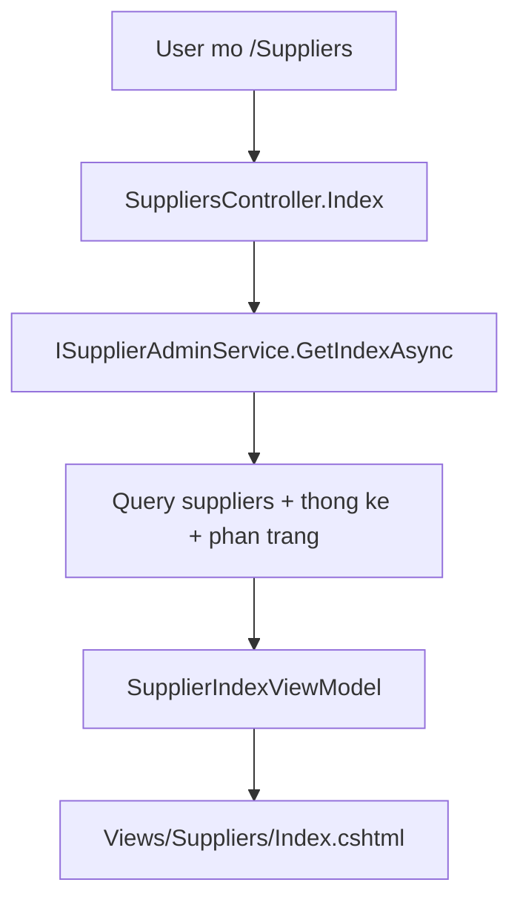
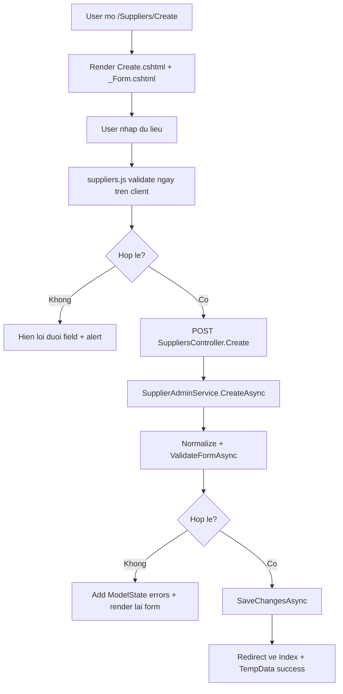
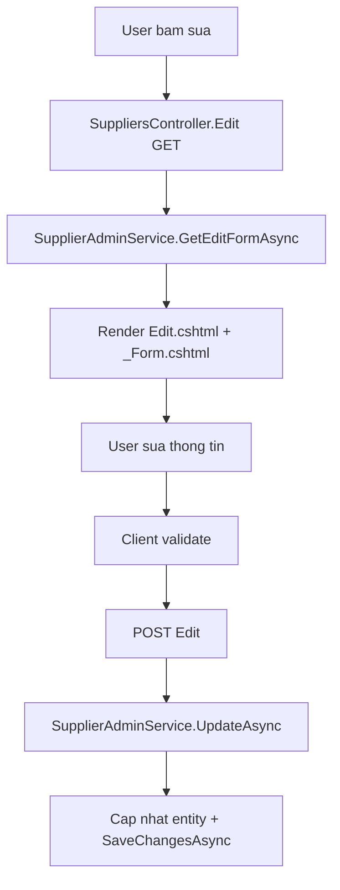
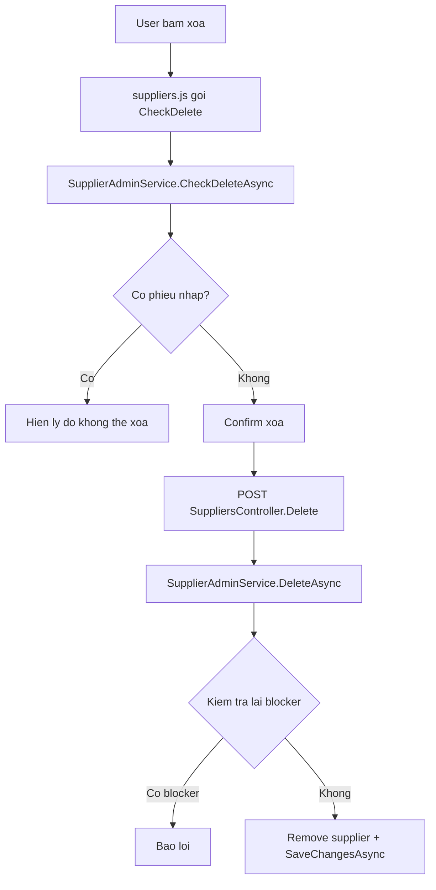
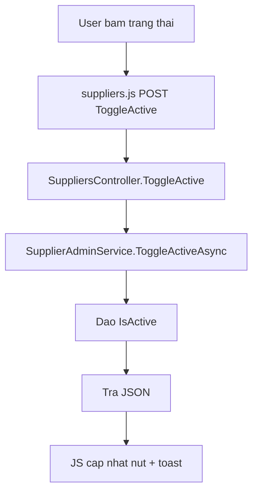

# Tai lieu module quan ly nha cung cap

## 1. Tong quan

Module quan ly nha cung cap duoc xay dung theo huong tach biet ro giua backend va frontend:

- Backend xu ly nghiep vu, validate du lieu, truy van database va tra ket qua thong qua service.
- Controller chi dieu phoi request/response, khong chua logic truy van phuc tap.
- ViewModel la lop trung gian giua UI va backend, giup view khong phu thuoc truc tiep vao entity EF.
- Razor view chi render giao dien va bind form.
- JavaScript chi xu ly tuong tac tren trinh duyet nhu validate tuc thoi, confirm xoa, toggle trang thai va hien toast.
- CSS chi phu trach giao dien cua module nha cung cap.

Module hien tai phu hop voi yeu cau code sach, de bao tri va frontend/backend duoc tach lop hop ly.

## 2. Danh sach file lien quan

### Backend

- `Controllers/SuppliersController.cs`
- `Services/Suppliers/ISupplierAdminService.cs`
- `Services/Suppliers/SupplierAdminService.cs`
- `Services/Suppliers/SupplierServiceResults.cs`
- `ViewModels/Suppliers/SupplierViewModels.cs`
- `Program.cs`
- `Models/Supplier.cs`
- `Models/GoodsReceipt.cs`
- `Data/ApplicationDbContext.cs`

### Frontend

- `Views/Suppliers/Index.cshtml`
- `Views/Suppliers/Create.cshtml`
- `Views/Suppliers/Edit.cshtml`
- `Views/Suppliers/_Form.cshtml`
- `wwwroot/js/suppliers.js`
- `wwwroot/css/suppliers.css`
- `Views/Shared/_Layout.cshtml`

## 3. Cau truc database lien quan

### `Supplier`

Entity `Supplier` dai dien cho bang nha cung cap.

```csharp
public class Supplier
{
    public long Id { get; set; }
    public string Name { get; set; } = null!;
    public string? Phone { get; set; }
    public string? Email { get; set; }
    public string? Address { get; set; }
    public bool IsActive { get; set; } = true;
    public DateTime CreatedAt { get; set; } = DateTime.UtcNow;
    public DateTime UpdatedAt { get; set; } = DateTime.UtcNow;

    public ICollection<GoodsReceipt> GoodsReceipts { get; set; } = new List<GoodsReceipt>();
}
```

Y nghia tung truong:

- `Id`: khoa chinh cua nha cung cap.
- `Name`: ten nha cung cap, bat buoc o tang ung dung.
- `Phone`: so dien thoai, hien tai module bat buoc nhap va phai dung 10 chu so.
- `Email`: email lien he, khong bat buoc.
- `Address`: dia chi, hien tai module bat buoc nhap.
- `IsActive`: trang thai dang hoat dong hay tam ngung.
- `CreatedAt`, `UpdatedAt`: moc thoi gian tao va cap nhat.
- `GoodsReceipts`: danh sach phieu nhap hang lien ket voi nha cung cap.

Luu y: trong entity, `Phone` va `Address` van la nullable de giu nguyen schema database hien tai. Yeu cau bat buoc dang duoc dam bao o service va UI.

### `GoodsReceipt`

`GoodsReceipt` lien ket voi `Supplier` thong qua `SupplierId`.

```csharp
public class GoodsReceipt
{
    public long Id { get; set; }
    public long SupplierId { get; set; }
    public string ReceiptCode { get; set; } = null!;
    public decimal TotalAmount { get; set; }
    public string Status { get; set; } = "draft";
    public long CreatedBy { get; set; }
    public long? ApprovedBy { get; set; }
    public DateTime CreatedAt { get; set; } = DateTime.UtcNow;
    public DateTime UpdatedAt { get; set; } = DateTime.UtcNow;

    public Supplier Supplier { get; set; } = null!;
    public User CreatedByUser { get; set; } = null!;
    public User? ApprovedByUser { get; set; }
    public ICollection<GoodsReceiptItem> Items { get; set; } = new List<GoodsReceiptItem>();
}
```

Quan he nay quan trong trong chuc nang xoa nha cung cap. Neu nha cung cap da co phieu nhap hang, service se chan xoa de tranh mat lien ket du lieu.

### Cau hinh trong `ApplicationDbContext`

Trong `ApplicationDbContext`, module su dung cac `DbSet`:

```csharp
public DbSet<Supplier> Suppliers => Set<Supplier>();
public DbSet<GoodsReceipt> GoodsReceipts => Set<GoodsReceipt>();
public DbSet<GoodsReceiptItem> GoodsReceiptItems => Set<GoodsReceiptItem>();
```

Phan cau hinh inventory khai bao bang, khoa, index va quan he:

```csharp
modelBuilder.Entity<Supplier>(entity =>
{
    entity.ToTable("suppliers");
    entity.HasKey(e => e.Id);
    entity.Property(e => e.Id).HasColumnName("id");
    entity.Property(e => e.Name).HasColumnName("name").HasMaxLength(255).IsRequired();
    entity.Property(e => e.Phone).HasColumnName("phone").HasMaxLength(30);
    entity.Property(e => e.Email).HasColumnName("email").HasMaxLength(100);
    entity.Property(e => e.Address).HasColumnName("address").HasMaxLength(500);
    entity.Property(e => e.IsActive).HasColumnName("is_active").HasDefaultValue(true);
    entity.Property(e => e.CreatedAt).HasColumnName("createdAt").HasColumnType("datetime2(7)").HasDefaultValueSql("GETUTCDATE()");
    entity.Property(e => e.UpdatedAt).HasColumnName("updatedAt").HasColumnType("datetime2(7)").HasDefaultValueSql("GETUTCDATE()");
});
```

Y nghia:

- `ToTable("suppliers")`: map entity vao bang `suppliers`.
- `HasKey(e => e.Id)`: khai bao khoa chinh.
- `HasMaxLength(...)`: gioi han do dai theo database.
- `IsRequired()` tren `Name`: database yeu cau ten khong null.
- `HasDefaultValue(true)`: nha cung cap moi mac dinh hoat dong.
- `GETUTCDATE()`: database tu gan thoi gian mac dinh khi insert.

Quan he voi phieu nhap:

```csharp
modelBuilder.Entity<GoodsReceipt>(entity =>
{
    entity.ToTable("goods_receipts");
    entity.HasKey(e => e.Id);
    entity.Property(e => e.SupplierId).HasColumnName("supplier_id");

    entity.HasOne(e => e.Supplier)
        .WithMany(e => e.GoodsReceipts)
        .HasForeignKey(e => e.SupplierId)
        .OnDelete(DeleteBehavior.Restrict);
});
```

`DeleteBehavior.Restrict` giup tranh viec xoa nha cung cap lam xoa day chuyen cac phieu nhap.

## 4. Dang ky dependency injection

Trong `Program.cs`, service duoc dang ky nhu sau:

```csharp
builder.Services.AddScoped<ISupplierAdminService, SupplierAdminService>();
```

Y nghia:

- Controller chi phu thuoc vao interface `ISupplierAdminService`.
- Implementation co the thay doi ma khong can sua controller.
- Lifetime `Scoped` phu hop voi EF `DbContext`, moi request co mot instance service rieng.

Dong using lien quan:

```csharp
using e_commerce_web_admin.Services.Suppliers;
```

## 5. ViewModel

Tat ca ViewModel nam trong `ViewModels/Suppliers/SupplierViewModels.cs`.

### `SupplierIndexQuery`

```csharp
public class SupplierIndexQuery
{
    public string? Search { get; set; }
    public string Status { get; set; } = "all";
    public int Page { get; set; } = 1;
    public int PageSize { get; set; } = 10;
}
```

Dung de nhan tham so loc danh sach tu query string.

- `Search`: tu khoa tim theo ten, dien thoai, email, dia chi.
- `Status`: loc `all`, `active`, `inactive`.
- `Page`: trang hien tai.
- `PageSize`: so dong moi trang.

View khong can tu doc query string thu cong, controller bind truc tiep vao class nay.

### `SupplierIndexViewModel`

```csharp
public class SupplierIndexViewModel
{
    public SupplierIndexQuery Query { get; set; } = new();
    public IReadOnlyList<SupplierRowViewModel> Suppliers { get; set; } = Array.Empty<SupplierRowViewModel>();
    public int TotalItems { get; set; }
    public int TotalPages { get; set; }
    public int ActiveCount { get; set; }
    public int InactiveCount { get; set; }
    public int WithReceiptsCount { get; set; }
}
```

Day la model chinh cua trang danh sach.

- `Query`: giu lai trang thai bo loc de render lai input/select.
- `Suppliers`: danh sach row da projection san.
- `TotalItems`, `TotalPages`: phuc vu phan trang.
- `ActiveCount`, `InactiveCount`: thong ke theo trang thai.
- `WithReceiptsCount`: so nha cung cap da co phieu nhap.

### `SupplierRowViewModel`

```csharp
public class SupplierRowViewModel
{
    public long Id { get; set; }
    public string Name { get; set; } = string.Empty;
    public string? Phone { get; set; }
    public string? Email { get; set; }
    public string? Address { get; set; }
    public bool IsActive { get; set; }
    public int GoodsReceiptCount { get; set; }
    public decimal TotalPurchasedAmount { get; set; }
    public DateTime CreatedAt { get; set; }
    public DateTime UpdatedAt { get; set; }
}
```

Dung cho tung dong tren bang danh sach.

- Khong dua nguyen entity `Supplier` ra view.
- Co san `GoodsReceiptCount` va `TotalPurchasedAmount` de view chi render.
- Giam nguy co view truy cap navigation property gay query ngoai y muon.

### `SupplierFormViewModel`

```csharp
public class SupplierFormViewModel
{
    public long? Id { get; set; }

    [Display(Name = "Ten nha cung cap")]
    [StringLength(255, ErrorMessage = "Ten nha cung cap khong duoc vuot qua 255 ky tu.")]
    public string? Name { get; set; }

    [Display(Name = "So dien thoai")]
    [StringLength(10, MinimumLength = 10, ErrorMessage = "So dien thoai phai gom dung 10 chu so.")]
    [RegularExpression(@"^\d{10}$", ErrorMessage = "So dien thoai phai gom dung 10 chu so.")]
    public string? Phone { get; set; }

    [Display(Name = "Email")]
    [EmailAddress(ErrorMessage = "Email khong dung dinh dang.")]
    [StringLength(100, ErrorMessage = "Email khong duoc vuot qua 100 ky tu.")]
    public string? Email { get; set; }

    [Display(Name = "Dia chi")]
    [StringLength(500, ErrorMessage = "Dia chi khong duoc vuot qua 500 ky tu.")]
    public string? Address { get; set; }

    public bool IsActive { get; set; } = true;
}
```

Luu y quan trong:

- `Name`, `Phone`, `Address` khong dat `[Required]` truc tiep trong ViewModel.
- Ly do: service dang chu dong validate de tra message tieng Viet va gom loi theo mot cach nhat quan.
- `StringLength`, `RegularExpression`, `EmailAddress` van giu lai de ho tro validate format va do dai.
- Yeu cau bat buoc duoc xu ly trong `SupplierAdminService.ValidateFormAsync`.

## 6. Lop ket qua service

File `Services/Suppliers/SupplierServiceResults.cs` gom cac object ket qua rieng cho tung tac vu.

### `SupplierValidationError`

```csharp
public sealed record SupplierValidationError(string Field, string Message);
```

Dai dien cho mot loi validate.

- `Field`: ten field trong form, vi du `Name`, `Phone`, `Address`.
- `Message`: noi dung loi tieng Viet.

Controller dung `Field` de add vao `ModelState`.

### `SupplierSaveResult`

```csharp
public sealed class SupplierSaveResult
{
    public bool Succeeded { get; init; }
    public long? SupplierId { get; init; }
    public IReadOnlyList<SupplierValidationError> Errors { get; init; } = Array.Empty<SupplierValidationError>();
}
```

Dung cho create/update.

- `Succeeded = true`: luu thanh cong.
- `SupplierId`: id ban ghi vua tao/cap nhat.
- `Errors`: danh sach loi neu that bai.

### `SupplierDeleteCheckResult`

```csharp
public sealed class SupplierDeleteCheckResult
{
    public bool Exists { get; init; }
    public bool CanDelete { get; init; }
    public string Message { get; init; } = string.Empty;
    public int GoodsReceiptCount { get; init; }
}
```

Dung cho API kiem tra truoc khi xoa.

- Neu khong ton tai, `Exists = false`.
- Neu da co phieu nhap, `CanDelete = false`.
- `Message` duoc hien thi tren modal/toast.
- `GoodsReceiptCount` cho biet so phieu nhap dang lien ket.

### `SupplierDeleteResult`

```csharp
public sealed class SupplierDeleteResult
{
    public bool Succeeded { get; init; }
    public string Message { get; init; } = string.Empty;
}
```

Dung cho request xoa that su.

### `SupplierToggleResult`

```csharp
public sealed class SupplierToggleResult
{
    public bool Succeeded { get; init; }
    public string Message { get; init; } = string.Empty;
    public bool IsActive { get; init; }
}
```

Dung khi bat/tat trang thai nha cung cap.

## 7. Interface service

File `ISupplierAdminService.cs` dinh nghia hop dong backend:

```csharp
public interface ISupplierAdminService
{
    Task<SupplierIndexViewModel> GetIndexAsync(SupplierIndexQuery query);
    Task<SupplierFormViewModel> GetCreateFormAsync();
    Task<SupplierFormViewModel?> GetEditFormAsync(long id);
    Task<SupplierSaveResult> CreateAsync(SupplierFormViewModel form);
    Task<SupplierSaveResult> UpdateAsync(long id, SupplierFormViewModel form);
    Task<SupplierDeleteCheckResult> CheckDeleteAsync(long id);
    Task<SupplierDeleteResult> DeleteAsync(long id);
    Task<SupplierToggleResult> ToggleActiveAsync(long id);
}
```

Y nghia tung ham:

- `GetIndexAsync`: lay danh sach, thong ke, phan trang.
- `GetCreateFormAsync`: tao model rong cho trang them moi.
- `GetEditFormAsync`: lay du lieu do vao form sua.
- `CreateAsync`: validate va tao nha cung cap.
- `UpdateAsync`: validate va cap nhat nha cung cap.
- `CheckDeleteAsync`: kiem tra co the xoa hay khong.
- `DeleteAsync`: xoa nha cung cap neu hop le.
- `ToggleActiveAsync`: doi trang thai hoat dong.

Controller khong can biet chi tiet EF query nam ben trong.

## 8. Service backend

File `SupplierAdminService.cs` la noi chua toan bo logic nghiep vu.

### Constructor

```csharp
public SupplierAdminService(ApplicationDbContext db)
{
    _db = db;
}
```

Service nhan `ApplicationDbContext` qua DI. Moi request co mot DbContext rieng.

### `GetIndexAsync`

Ham nay phu trach lay danh sach nha cung cap cho trang index.

```csharp
public async Task<SupplierIndexViewModel> GetIndexAsync(SupplierIndexQuery query)
{
    var page = Math.Max(1, query.Page);
    var pageSize = query.PageSize <= 0 ? DefaultPageSize : Math.Min(query.PageSize, MaxPageSize);
    var status = NormalizeStatus(query.Status);
    var search = query.Search?.Trim();

    var suppliers = _db.Suppliers.AsNoTracking();
    var allSuppliers = _db.Suppliers.AsNoTracking();

    if (!string.IsNullOrWhiteSpace(search))
    {
        suppliers = suppliers.Where(s =>
            s.Name.Contains(search) ||
            (s.Phone != null && s.Phone.Contains(search)) ||
            (s.Email != null && s.Email.Contains(search)) ||
            (s.Address != null && s.Address.Contains(search)));
    }

    suppliers = status switch
    {
        "active" => suppliers.Where(s => s.IsActive),
        "inactive" => suppliers.Where(s => !s.IsActive),
        _ => suppliers
    };
}
```

Nhung diem quan trong:

- `Math.Max(1, query.Page)`: tranh page nho hon 1.
- Gioi han `PageSize` de tranh request lay qua nhieu dong.
- `NormalizeStatus` dam bao status chi nam trong cac gia tri hop le.
- `AsNoTracking()` giup query doc danh sach nhe hon vi khong can EF tracking.
- Tim kiem ap dung tren ten, dien thoai, email va dia chi.

Phan projection:

```csharp
var items = await suppliers
    .OrderByDescending(s => s.UpdatedAt)
    .ThenByDescending(s => s.Id)
    .Skip((page - 1) * pageSize)
    .Take(pageSize)
    .Select(s => new SupplierRowViewModel
    {
        Id = s.Id,
        Name = s.Name,
        Phone = s.Phone,
        Email = s.Email,
        Address = s.Address,
        IsActive = s.IsActive,
        GoodsReceiptCount = s.GoodsReceipts.Count,
        TotalPurchasedAmount = s.GoodsReceipts.Sum(r => (decimal?)r.TotalAmount) ?? 0,
        CreatedAt = s.CreatedAt,
        UpdatedAt = s.UpdatedAt
    })
    .ToListAsync();
```

Y nghia:

- Sap xep ban ghi moi cap nhat len truoc.
- `Skip/Take` de phan trang tai database.
- `Select` thang sang `SupplierRowViewModel`, khong lay entity day du ra view.
- `Sum(r => (decimal?)r.TotalAmount) ?? 0` tranh loi khi chua co phieu nhap.

Ket qua tra ve:

```csharp
return new SupplierIndexViewModel
{
    Query = new SupplierIndexQuery
    {
        Search = search,
        Status = status,
        Page = page,
        PageSize = pageSize
    },
    Suppliers = items,
    TotalItems = totalItems,
    TotalPages = totalPages,
    ActiveCount = activeCount,
    InactiveCount = inactiveCount,
    WithReceiptsCount = withReceiptsCount
};
```

View nhan du thong tin de render danh sach, thong ke, bo loc va phan trang.

### `GetCreateFormAsync`

```csharp
public Task<SupplierFormViewModel> GetCreateFormAsync()
{
    return Task.FromResult(new SupplierFormViewModel
    {
        IsActive = true
    });
}
```

Tao form mac dinh cho trang them moi. Nha cung cap moi mac dinh la dang hoat dong.

### `GetEditFormAsync`

```csharp
public async Task<SupplierFormViewModel?> GetEditFormAsync(long id)
{
    return await _db.Suppliers
        .AsNoTracking()
        .Where(s => s.Id == id)
        .Select(s => new SupplierFormViewModel
        {
            Id = s.Id,
            Name = s.Name,
            Phone = s.Phone,
            Email = s.Email,
            Address = s.Address,
            IsActive = s.IsActive
        })
        .FirstOrDefaultAsync();
}
```

Ham nay lay du lieu nha cung cap va do vao form sua.

- Tra ve `null` neu khong tim thay.
- Su dung projection de view khong lam viec truc tiep voi entity.

### `CreateAsync`

```csharp
public async Task<SupplierSaveResult> CreateAsync(SupplierFormViewModel form)
{
    NormalizeForm(form);

    var errors = await ValidateFormAsync(form);
    if (errors.Count > 0)
    {
        return new SupplierSaveResult { Succeeded = false, Errors = errors };
    }

    var supplier = new Supplier
    {
        Name = form.Name!,
        Phone = form.Phone,
        Email = form.Email,
        Address = form.Address,
        IsActive = form.IsActive,
        CreatedAt = DateTime.UtcNow,
        UpdatedAt = DateTime.UtcNow
    };

    _db.Suppliers.Add(supplier);
    await _db.SaveChangesAsync();

    return new SupplierSaveResult { Succeeded = true, SupplierId = supplier.Id };
}
```

Luon di theo thu tu:

1. Chuan hoa du lieu.
2. Validate.
3. Neu loi thi tra ve danh sach loi.
4. Neu hop le thi tao entity.
5. Luu database.

Controller khong can lap lai validate.

### `UpdateAsync`

```csharp
public async Task<SupplierSaveResult> UpdateAsync(long id, SupplierFormViewModel form)
{
    NormalizeForm(form);
    form.Id = id;

    var supplier = await _db.Suppliers.FirstOrDefaultAsync(s => s.Id == id);
    if (supplier is null)
    {
        return new SupplierSaveResult
        {
            Succeeded = false,
            Errors = new[] { new SupplierValidationError(string.Empty, "Khong tim thay nha cung cap.") }
        };
    }

    var errors = await ValidateFormAsync(form);
    if (errors.Count > 0)
    {
        return new SupplierSaveResult { Succeeded = false, Errors = errors };
    }

    supplier.Name = form.Name!;
    supplier.Phone = form.Phone;
    supplier.Email = form.Email;
    supplier.Address = form.Address;
    supplier.IsActive = form.IsActive;
    supplier.UpdatedAt = DateTime.UtcNow;

    await _db.SaveChangesAsync();

    return new SupplierSaveResult { Succeeded = true, SupplierId = supplier.Id };
}
```

Khac voi create:

- Can tim entity hien co.
- Gan `form.Id = id` de validate trung ten bo qua chinh ban ghi dang sua.
- Chi cap nhat cac truong can thiet.

### `CheckDeleteAsync`

```csharp
public async Task<SupplierDeleteCheckResult> CheckDeleteAsync(long id)
{
    var supplier = await _db.Suppliers
        .AsNoTracking()
        .Where(s => s.Id == id)
        .Select(s => new
        {
            s.Id,
            s.Name,
            GoodsReceiptCount = s.GoodsReceipts.Count
        })
        .FirstOrDefaultAsync();

    if (supplier is null)
    {
        return new SupplierDeleteCheckResult
        {
            Exists = false,
            CanDelete = false,
            Message = "Khong tim thay nha cung cap."
        };
    }

    var blockers = BuildDeleteBlockers(supplier.GoodsReceiptCount);
    if (blockers.Count > 0)
    {
        return new SupplierDeleteCheckResult
        {
            Exists = true,
            CanDelete = false,
            GoodsReceiptCount = supplier.GoodsReceiptCount,
            Message = string.Join(" ", blockers)
        };
    }
}
```

Ham nay dung cho frontend goi truoc khi xoa. Neu nha cung cap da co phieu nhap, UI co the bao ly do cu the truoc khi gui request xoa.

### `DeleteAsync`

```csharp
public async Task<SupplierDeleteResult> DeleteAsync(long id)
{
    var supplier = await _db.Suppliers
        .Include(s => s.GoodsReceipts)
        .FirstOrDefaultAsync(s => s.Id == id);

    if (supplier is null)
    {
        return new SupplierDeleteResult
        {
            Succeeded = false,
            Message = "Khong tim thay nha cung cap."
        };
    }

    var blockers = BuildDeleteBlockers(supplier.GoodsReceipts.Count);
    if (blockers.Count > 0)
    {
        return new SupplierDeleteResult
        {
            Succeeded = false,
            Message = string.Join(" ", blockers)
        };
    }

    _db.Suppliers.Remove(supplier);
    await _db.SaveChangesAsync();

    return new SupplierDeleteResult
    {
        Succeeded = true,
        Message = "Da xoa nha cung cap."
    };
}
```

Co hai lop bao ve:

- Frontend goi `CheckDeleteAsync` de canh bao truoc.
- Backend van kiem tra lai trong `DeleteAsync` de tranh truong hop du lieu thay doi giua hai request.

### `ToggleActiveAsync`

```csharp
public async Task<SupplierToggleResult> ToggleActiveAsync(long id)
{
    var supplier = await _db.Suppliers.FirstOrDefaultAsync(s => s.Id == id);
    if (supplier is null)
    {
        return new SupplierToggleResult
        {
            Succeeded = false,
            Message = "Khong tim thay nha cung cap."
        };
    }

    supplier.IsActive = !supplier.IsActive;
    supplier.UpdatedAt = DateTime.UtcNow;
    await _db.SaveChangesAsync();

    return new SupplierToggleResult
    {
        Succeeded = true,
        IsActive = supplier.IsActive,
        Message = supplier.IsActive
            ? "Nha cung cap da duoc kich hoat."
            : "Nha cung cap da tam ngung."
    };
}
```

Ham nay chi doi `IsActive`, khong sua cac thong tin khac.

### `ValidateFormAsync`

```csharp
private async Task<List<SupplierValidationError>> ValidateFormAsync(SupplierFormViewModel form)
{
    var errors = new List<SupplierValidationError>();

    if (string.IsNullOrWhiteSpace(form.Name))
    {
        errors.Add(new SupplierValidationError(nameof(form.Name), "Ten nha cung cap la bat buoc."));
    }

    if (string.IsNullOrWhiteSpace(form.Phone))
    {
        errors.Add(new SupplierValidationError(nameof(form.Phone), "So dien thoai la bat buoc."));
    }
    else if (!PhoneRegex.IsMatch(form.Phone))
    {
        errors.Add(new SupplierValidationError(nameof(form.Phone), "So dien thoai phai gom dung 10 chu so."));
    }

    if (string.IsNullOrWhiteSpace(form.Address))
    {
        errors.Add(new SupplierValidationError(nameof(form.Address), "Dia chi la bat buoc."));
    }
}
```

Day la noi validate chinh cua backend.

Loi tieng Viet duoc tra o day de tranh hien thong bao mac dinh tieng Anh cua trinh duyet hoac framework.

Phan check trung ten:

```csharp
if (!string.IsNullOrWhiteSpace(form.Name))
{
    var normalizedName = form.Name.Trim();
    var duplicateName = await _db.Suppliers.AnyAsync(s =>
        s.Name == normalizedName &&
        (!form.Id.HasValue || s.Id != form.Id.Value));

    if (duplicateName)
    {
        errors.Add(new SupplierValidationError(nameof(form.Name), "Ten nha cung cap da ton tai."));
    }
}
```

Hien tai trung ten duoc kiem tra o tang ung dung. Neu muon chan tuyet doi ca truong hop hai request tao cung luc, nen them unique index o database.

### `BuildDeleteBlockers`

```csharp
private static List<string> BuildDeleteBlockers(int goodsReceiptCount)
{
    var blockers = new List<string>();

    if (goodsReceiptCount > 0)
    {
        blockers.Add($"Nha cung cap nay da co {goodsReceiptCount} phieu nhap hang nen khong the xoa.");
    }

    return blockers;
}
```

Tach rieng logic chan xoa de `CheckDeleteAsync` va `DeleteAsync` dung chung, tranh lap code.

### `NormalizeForm`

```csharp
private static void NormalizeForm(SupplierFormViewModel form)
{
    form.Name = NormalizeText(form.Name);
    form.Phone = NormalizeText(form.Phone);
    form.Email = NormalizeText(form.Email);
    form.Address = NormalizeText(form.Address);
}
```

Chuan hoa du lieu truoc khi validate va luu.

- Trim khoang trang dau/cuoi.
- Doi chuoi rong thanh `null`.
- Giam loi do nguoi dung nhap thua khoang trang.

## 9. Controller

File `Controllers/SuppliersController.cs` dieu phoi request cho module.

### Constructor

```csharp
public SuppliersController(ISupplierAdminService supplierService)
{
    _supplierService = supplierService;
}
```

Controller phu thuoc vao interface, khong phu thuoc truc tiep vao EF hay implementation.

### `Index`

```csharp
public async Task<IActionResult> Index([FromQuery] SupplierIndexQuery query)
{
    var model = await _supplierService.GetIndexAsync(query);
    return View(model);
}
```

Tra ve trang danh sach.

- Query string tu dong bind vao `SupplierIndexQuery`.
- Toan bo logic loc, thong ke, phan trang nam trong service.

### `Create` GET

```csharp
[HttpGet]
public async Task<IActionResult> Create()
{
    var model = await _supplierService.GetCreateFormAsync();
    return View(model);
}
```

Mo trang them nha cung cap.

### `Create` POST

```csharp
[HttpPost]
[ValidateAntiForgeryToken]
public async Task<IActionResult> Create(SupplierFormViewModel form)
{
    var result = await _supplierService.CreateAsync(form);
    if (!result.Succeeded)
    {
        AddErrors(result.Errors);
        return View(form);
    }

    TempData["SupplierSuccess"] = "Da tao nha cung cap moi.";
    return RedirectToAction(nameof(Index));
}
```

Luon goi service de validate va tao.

- Neu co loi: add loi vao `ModelState`, render lai form.
- Neu thanh cong: dung `TempData` hien thong bao va redirect ve danh sach.
- `[ValidateAntiForgeryToken]` bao ve request form POST.

### `Edit` GET

```csharp
[HttpGet]
public async Task<IActionResult> Edit(long id)
{
    var model = await _supplierService.GetEditFormAsync(id);
    if (model is null)
    {
        return NotFound();
    }

    return View(model);
}
```

Neu khong tim thay nha cung cap thi tra `404`.

### `Edit` POST

```csharp
[HttpPost]
[ValidateAntiForgeryToken]
public async Task<IActionResult> Edit(long id, SupplierFormViewModel form)
{
    var result = await _supplierService.UpdateAsync(id, form);
    if (!result.Succeeded)
    {
        AddErrors(result.Errors);
        form.Id = id;
        return View(form);
    }

    TempData["SupplierSuccess"] = "Da cap nhat nha cung cap.";
    return RedirectToAction(nameof(Index));
}
```

Tuong tu create, nhung goi `UpdateAsync`.

### `Delete`

```csharp
[HttpPost]
[ValidateAntiForgeryToken]
public async Task<IActionResult> Delete(long id)
{
    var result = await _supplierService.DeleteAsync(id);

    TempData[result.Succeeded ? "SupplierSuccess" : "SupplierError"] = result.Message;
    return RedirectToAction(nameof(Index));
}
```

Xoa bang POST de tranh xoa qua GET.

### `CheckDelete`

```csharp
[HttpGet]
public async Task<IActionResult> CheckDelete(long id)
{
    var result = await _supplierService.CheckDeleteAsync(id);
    return Json(result);
}
```

Endpoint JSON cho JavaScript kiem tra truoc khi xoa.

### `ToggleActive`

```csharp
[HttpPost]
[ValidateAntiForgeryToken]
public async Task<IActionResult> ToggleActive(long id)
{
    var result = await _supplierService.ToggleActiveAsync(id);
    return Json(result);
}
```

Endpoint JSON doi trang thai hoat dong.

### `AddErrors`

```csharp
private void AddErrors(IEnumerable<SupplierValidationError> errors)
{
    foreach (var error in errors)
    {
        ModelState.AddModelError(error.Field, error.Message);
    }
}
```

Chuyen loi tu service vao `ModelState` de Razor hien thi dung ben duoi tung field.

## 10. Trang danh sach `Index.cshtml`

Trang index nhan model:

```csharp
@model SupplierIndexViewModel
```

### Import CSS

```csharp
@section Styles {
    <link rel="stylesheet" href="~/css/suppliers.css" asp-append-version="true" />
}
```

CSS tach rieng theo module, khong tron vao layout chung.

### Header

Header hien breadcrumb, tieu de va nut them moi:

```html
<a asp-action="Create" class="inline-flex items-center gap-2 rounded-xl bg-teal-600 px-4 py-2 text-sm font-semibold text-white shadow-sm shadow-teal-500/20 transition hover:bg-teal-700">
    <i class="fas fa-plus text-xs"></i>
    Them nha cung cap
</a>
```

Nut di den action `Create`.

### Toast tu `TempData`

```csharp
@if (TempData["SupplierSuccess"] is string successMessage)
{
    <div class="rounded-2xl border border-emerald-200 bg-emerald-50 px-4 py-3 text-sm font-medium text-emerald-700">
        @successMessage
    </div>
}
```

Dung de hien thong bao sau redirect.

### The thong ke

Trang hien cac so lieu:

- Tong nha cung cap.
- Dang hoat dong.
- Tam ngung.
- Da co phieu nhap.

Vi cac so nay da duoc service tinh san, view chi render:

```html
<p class="mt-2 text-2xl font-bold text-slate-950">@Model.TotalItems</p>
```

### Form loc va tim kiem

```html
<form method="get" class="supplier-filter-form">
    <input type="text" name="Search" value="@Model.Query.Search" />
    <select name="Status">...</select>
    <button type="submit">Loc</button>
</form>
```

Form dung GET de URL co the share/bookmark. Service xu ly query.

### Bang danh sach

Moi dong dung `SupplierRowViewModel`.

```csharp
@foreach (var supplier in Model.Suppliers)
{
    <tr data-supplier-row="@supplier.Id">
        ...
    </tr>
}
```

`data-supplier-row` giup JavaScript tim dung row khi toggle trang thai.

### Hien thong tin lien he

View co xu ly hien dau gach khi thieu du lieu:

```csharp
@(string.IsNullOrWhiteSpace(supplier.Phone) ? "Chua co so dien thoai" : supplier.Phone)
```

Du lieu da duoc service projection, view khong goi database.

### Toggle trang thai

Nut toggle chua cac data attribute:

```html
<button
    type="button"
    class="supplier-status-toggle"
    data-supplier-toggle
    data-url="@Url.Action("ToggleActive", new { id = supplier.Id })"
    data-active="@supplier.IsActive.ToString().ToLowerInvariant()">
```

JavaScript doc:

- `data-supplier-toggle`: tim cac nut toggle.
- `data-url`: endpoint POST.
- `data-active`: trang thai hien tai.

### Xoa nha cung cap

Nut xoa co:

```html
<button
    type="button"
    data-supplier-delete
    data-check-url="@Url.Action("CheckDelete", new { id = supplier.Id })"
    data-delete-url="@Url.Action("Delete", new { id = supplier.Id })"
    data-name="@supplier.Name">
```

JavaScript se:

1. Goi `CheckDelete`.
2. Neu khong duoc xoa thi hien message.
3. Neu duoc xoa thi confirm.
4. Submit form POST kem anti-forgery token.

### Phan trang

View tinh nut prev/next dua vao:

- `Model.Query.Page`
- `Model.TotalPages`
- `Model.Query.Search`
- `Model.Query.Status`

Query search/status duoc giu lai khi chuyen trang.

### Import JS

```csharp
@section Scripts {
    <script src="~/js/suppliers.js" asp-append-version="true"></script>
}
```

`asp-append-version` giup browser lay file moi khi noi dung thay doi.

## 11. Trang them moi `Create.cshtml`

Trang create nhan `SupplierFormViewModel`.

```csharp
@model SupplierFormViewModel
```

Form:

```html
<form asp-action="Create" method="post" class="space-y-6" data-supplier-form novalidate>
    @Html.AntiForgeryToken()
    <partial name="_Form" model="Model" />
</form>
```

Y nghia:

- `asp-action="Create"`: POST ve action Create.
- `data-supplier-form`: JavaScript nhan dien form can validate.
- `novalidate`: tat bubble validate mac dinh cua browser bang tieng Anh.
- `_Form` dung chung cho create va edit.

## 12. Trang sua `Edit.cshtml`

Form edit:

```html
<form asp-action="Edit" asp-route-id="@Model.Id" method="post" class="space-y-6" data-supplier-form novalidate>
    @Html.AntiForgeryToken()
    <partial name="_Form" model="Model" />
</form>
```

Khac create o diem co `asp-route-id="@Model.Id"` de POST ve dung nha cung cap can sua.

## 13. Partial form `_Form.cshtml`

Partial nay gom cac field dung chung.

### Hidden Id

```html
<input type="hidden" asp-for="Id" />
```

Giup giu id khi sua.

### Alert loi chung

```html
<div data-supplier-form-alert class="@(ViewData.ModelState.IsValid ? "hidden " : "")bg-red-50 ...">
    Vui long kiem tra lai cac thong tin bat buoc.
</div>
```

Alert se hien khi:

- Server tra ve `ModelState` co loi.
- JavaScript validate that bai tren client.

### Ten nha cung cap

```html
<input
    asp-for="Name"
    data-supplier-required="Ten nha cung cap la bat buoc."
    data-supplier-error-target="supplier-name-error" />
<span asp-validation-for="Name" id="supplier-name-error" class="mt-2 block text-sm text-red-600"></span>
```

Co hai lop validate:

- JavaScript doc `data-supplier-required` de hien loi ngay.
- Server add loi vao `ModelState`, `asp-validation-for` hien loi sau POST neu can.

### So dien thoai

```html
<input
    asp-for="Phone"
    inputmode="numeric"
    maxlength="10"
    data-supplier-phone
    data-supplier-error-target="supplier-phone-error" />
<span asp-validation-for="Phone" id="supplier-phone-error" class="mt-2 block text-sm text-red-600"></span>
```

Quan trong:

- Khong dung `pattern` cua HTML de tranh browser hien tooltip tieng Anh.
- `inputmode="numeric"` goi y ban phim so tren mobile.
- `maxlength="10"` gioi han nhap toi da 10 ky tu.
- JavaScript kiem tra bat buoc va dung 10 chu so.

### Email

```html
<input asp-for="Email" type="email" />
<span asp-validation-for="Email" class="mt-2 block text-sm text-red-600"></span>
```

Email khong bat buoc. Backend van validate format email neu co nhap.

### Dia chi

```html
<textarea
    asp-for="Address"
    data-supplier-required="Dia chi la bat buoc."
    data-supplier-error-target="supplier-address-error"></textarea>
<span asp-validation-for="Address" id="supplier-address-error" class="mt-2 block text-sm text-red-600"></span>
```

Dia chi bat buoc va loi hien duoi field.

### Trang thai

```html
<input asp-for="IsActive" type="checkbox" />
```

Nguoi dung co the chon nha cung cap dang hoat dong hay tam ngung ngay khi tao/sua.

## 14. JavaScript `wwwroot/js/suppliers.js`

File JS duoc boc trong IIFE:

```javascript
(() => {
    ...
})();
```

Y nghia:

- Tranh ro ri bien ra global scope.
- Giu code module gon va it xung dot voi file khac.

### Khoi tao

```javascript
document.addEventListener("DOMContentLoaded", () => {
    bindSupplierFormValidation();
    bindSupplierToggles();
    bindSupplierDeletes();
});
```

Chi bind event sau khi DOM da load xong.

### `bindSupplierFormValidation`

Ham nay xu ly validate real-time cho form them/sua nha cung cap.

```javascript
const bindSupplierFormValidation = () => {
    document.querySelectorAll("[data-supplier-form]").forEach((form) => {
        ...
    });
};
```

Tim tat ca form co `data-supplier-form`.

### Lay danh sach field bat buoc

```javascript
const requiredFields = Array.from(form.querySelectorAll("[data-supplier-required]"));
const phoneField = form.querySelector("[data-supplier-phone]");
```

- `requiredFields`: ten nha cung cap va dia chi.
- `phoneField`: so dien thoai co rule rieng.

### Hien/an alert chung

```javascript
const setAlertVisible = (visible) => {
    if (!alertBox) {
        return;
    }

    alertBox.classList.toggle("hidden", !visible);
};
```

Neu form co loi, alert chung se hien tren dau form.

### Hien loi duoi field

```javascript
const setFieldError = (field, message) => {
    const targetId = field.dataset.supplierErrorTarget;
    const target = targetId ? document.getElementById(targetId) : null;

    if (target) {
        target.textContent = message;
    }

    field.classList.toggle("border-red-300", Boolean(message));
    field.classList.toggle("focus:border-red-400", Boolean(message));
    field.classList.toggle("focus:ring-red-100", Boolean(message));
};
```

Ham nay dam bao loi hien dung yeu cau:

- Loi nam duoi moi field.
- Khong dung tooltip mac dinh cua browser.
- Field co border mau do khi loi.

### Validate required

```javascript
const validateRequiredField = (field) => {
    const message = field.dataset.supplierRequired || "Truong nay la bat buoc.";

    if (!field.value.trim()) {
        setFieldError(field, message);
        return false;
    }

    setFieldError(field, "");
    return true;
};
```

Neu nguoi dung bo trong ten hoac dia chi, loi hien ngay duoi field.

### Validate phone

```javascript
const validatePhoneField = () => {
    if (!phoneField) {
        return true;
    }

    const value = phoneField.value.trim();
    if (!value) {
        setFieldError(phoneField, "So dien thoai la bat buoc.");
        return false;
    }

    if (!/^\d{10}$/.test(value)) {
        setFieldError(phoneField, "So dien thoai phai gom dung 10 chu so.");
        return false;
    }

    setFieldError(phoneField, "");
    return true;
};
```

Rule hien tai:

- Khong duoc bo trong.
- Chi gom chu so.
- Dung 10 chu so.

### Validate toan form

```javascript
const validateForm = () => {
    const requiredValid = requiredFields
        .map(validateRequiredField)
        .every(Boolean);
    const phoneValid = validatePhoneField();
    const isValid = requiredValid && phoneValid;

    setAlertVisible(!isValid);
    return isValid;
};
```

Khi user submit, neu co bat ky field loi nao thi form khong gui len server.

### Validate ngay khi nhap

```javascript
requiredFields.forEach((field) => {
    field.addEventListener("input", () => {
        validateRequiredField(field);
        validateForm();
    });
});

phoneField?.addEventListener("input", () => {
    phoneField.value = phoneField.value.replace(/\D/g, "").slice(0, 10);
    validatePhoneField();
    validateForm();
});
```

Hanh vi:

- Ten va dia chi bao loi ngay khi nhap/xoa.
- So dien thoai tu loai ky tu khong phai so.
- So dien thoai chi giu toi da 10 chu so.

### Chan submit neu loi

```javascript
form.addEventListener("submit", (event) => {
    if (!validateForm()) {
        event.preventDefault();
        event.stopPropagation();
    }
});
```

Khi bo trong cac truong bat buoc va bam tao nha cung cap:

- Form khong reload.
- Loi hien duoi tung field.
- Alert chung hien phia tren.

### Anti-forgery token

```javascript
const getAntiForgeryToken = () => {
    const tokenInput = document.querySelector('input[name="__RequestVerificationToken"]');
    return tokenInput?.value || "";
};
```

Dung token nay khi JavaScript goi POST cho toggle/xoa.

### Toggle trang thai

```javascript
const bindSupplierToggles = () => {
    document.querySelectorAll("[data-supplier-toggle]").forEach((button) => {
        button.addEventListener("click", async () => {
            ...
        });
    });
};
```

Flow:

1. User bam nut trang thai.
2. JS gui `fetch` POST den `data-url`.
3. Server tra JSON `SupplierToggleResult`.
4. JS cap nhat text/trang thai tren nut.
5. Hien toast thanh cong hoac loi.

### Check va xoa

```javascript
const bindSupplierDeletes = () => {
    document.querySelectorAll("[data-supplier-delete]").forEach((button) => {
        button.addEventListener("click", async () => {
            ...
        });
    });
};
```

Flow:

1. Goi endpoint `CheckDelete`.
2. Neu `canDelete = false`, hien message va dung lai.
3. Neu co the xoa, hien confirm.
4. Tao form POST an.
5. Gui request xoa kem anti-forgery token.

Cach nay giu xoa la POST dung chuan, khong xoa bang link GET.

### Toast

File JS co ham hien toast tam thoi de phan hoi hanh dong AJAX.

Y nghia:

- Toggle thanh cong khong can reload trang.
- Loi tu server duoc hien ro cho nguoi dung.

## 15. CSS `wwwroot/css/suppliers.css`

CSS cua module duoc tach rieng.

### Animation

```css
@keyframes supplier-fade-in {
    from {
        opacity: 0;
        transform: translateY(6px);
    }

    to {
        opacity: 1;
        transform: translateY(0);
    }
}
```

Dung cho toast/thanh phan phan hoi nhe.

### Layout filter

```css
.supplier-filter-form {
    display: grid;
    gap: 1rem;
    grid-template-columns: minmax(0, 1fr);
}
```

Responsive:

- Mobile: cac input xep doc.
- Desktop: search/status/action xep ngang.

### Bang danh sach

```css
.supplier-table {
    min-width: 960px;
}
```

Bang co min-width de giu cot khong bi vo tren man hinh nho, container ngoai co scroll ngang.

### Contact line

```css
.supplier-contact-line {
    display: flex;
    align-items: center;
    gap: 0.5rem;
}
```

Dung cho phone/email/address trong bang.

### Status button

```css
.supplier-status-toggle {
    display: inline-flex;
    align-items: center;
    gap: 0.5rem;
}
```

Giup nut trang thai co icon/text can giua.

### Responsive

CSS co media query de dieu chinh layout o desktop.

Muc tieu la giu giao dien gon va nhat quan voi theme teal cua cac trang truoc.

## 16. Sidebar

Trong `Views/Shared/_Layout.cshtml`, sidebar da them nhom quan ly kho hang.

Muc nha cung cap:

```html
<a asp-controller="Suppliers" asp-action="Index">Quan ly nha cung cap</a>
```

Muc ton kho:

```html
<a asp-controller="GoodsReceipts" asp-action="Index">Quan ly ton kho</a>
```

Nhom nay chi them dieu huong, khong tron logic cua module nha cung cap vao layout.

## 17. Luong nghiep vu chinh

### Luong xem danh sach



### Luong tao nha cung cap



### Luong sua nha cung cap



### Luong xoa nha cung cap



### Luong doi trang thai



## 18. Vi sao validate nha cung cap khong reload trang

Module nha cung cap co file `suppliers.js` bat su kien `input` va `submit`.

Khi nguoi dung nhap sai:

- JS hien loi ngay duoi field.
- JS chan submit bang `event.preventDefault()`.
- Trang khong gui request len server nen khong reload.

Khi du lieu hop le:

- Form moi duoc submit.
- Backend van validate lai de dam bao an toan.

Nhung module cu co the reload moi thay loi vi chung chu yeu dua vao `ModelState` sau POST server. Nghia la loi chi xuat hien sau khi request da gui len backend va Razor render lai trang.

Huong hien tai cua module nha cung cap tot hon cho trai nghiem nguoi dung, nhung van giu backend validation de khong phu thuoc vao JavaScript.

## 19. Cac ranh gioi tach lop

### Controller khong truy van database truc tiep

Controller chi goi service:

```csharp
var result = await _supplierService.CreateAsync(form);
```

Dieu nay giup controller mong, de test va de doc.

### Service khong render HTML

Service chi tra ViewModel/result object. Khong biet view render nhu the nao.

### View khong chua logic nghiep vu

View chi render:

- input
- table
- button
- message

View khong kiem tra xoa duoc hay khong, khong query database va khong tinh logic nghiep vu phuc tap.

### JavaScript khong quyet dinh nghiep vu cuoi cung

JS co validate va check truoc de UX tot hon, nhung backend van la lop quyet dinh cuoi:

- `CreateAsync` van validate.
- `UpdateAsync` van validate.
- `DeleteAsync` van check blocker lai.
- `ToggleActiveAsync` van check supplier ton tai.

## 20. Diem da kiem tra

Da build module thanh cong voi lenh:

```powershell
dotnet build --no-restore -p:UseAppHost=false -p:OutDir=obj\supplier-build-check\
```

Ket qua:

- Build thanh cong.
- 0 warning.
- 0 error.

Da kiem tra route:

- `/Suppliers` tra HTTP 200.
- `/Suppliers/Create` tra HTTP 200.

## 21. Cac luu y bao tri

### 1. Trung ten nha cung cap

Hien tai service co check trung ten:

```csharp
var duplicateName = await _db.Suppliers.AnyAsync(s =>
    s.Name == normalizedName &&
    (!form.Id.HasValue || s.Id != form.Id.Value));
```

Cach nay on trong thao tac thong thuong. Tuy nhien, neu hai request tao cung ten gui len gan nhu dong thoi, van co kha nang ca hai cung qua check truoc khi insert.

Neu can dam bao tuyet doi, nen them unique index cho `suppliers.name` o database va bat loi unique constraint trong service.

### 2. Phone va address bat buoc o tang ung dung

`Phone` va `Address` dang nullable trong database/entity, nhung module bat buoc o frontend va backend service.

Neu sau nay muon database cung bat buoc, can tao migration doi cot thanh NOT NULL va dam bao du lieu cu khong co null.

### 3. Xoa nha cung cap

Service da chan xoa khi co phieu nhap.

Neu sau nay them bang moi lien ket voi supplier, can cap nhat `BuildDeleteBlockers` va query check delete de tinh them blocker moi.

### 4. Email

Email khong bat buoc. Neu co nhap, backend validate format bang `[EmailAddress]`/ModelState va service co the mo rong them validate rieng neu can message dac thu hon.

### 5. JavaScript validate chi la UX

Khong nen xem validate tren JS la bao ve du lieu chinh. Nguoi dung co the tat JS hoac goi request truc tiep. Backend validation trong service moi la lop bat buoc.

## 22. Khi can mo rong module

Neu them truong moi cho nha cung cap, nen di theo thu tu:

1. Them cot vao database bang migration neu can.
2. Cap nhat `Supplier` entity va `ApplicationDbContext`.
3. Them property vao `SupplierFormViewModel` va/hoac `SupplierRowViewModel`.
4. Cap nhat `NormalizeForm` va `ValidateFormAsync` neu co rule.
5. Cap nhat create/update mapping trong service.
6. Cap nhat `_Form.cshtml` neu field can nhap.
7. Cap nhat `Index.cshtml` neu field can hien o danh sach.
8. Cap nhat `suppliers.js` neu can validate real-time.
9. Cap nhat docs nay neu thay doi co y nghia.

Huong nay giu module tiep tuc tach lop va de bao tri.

